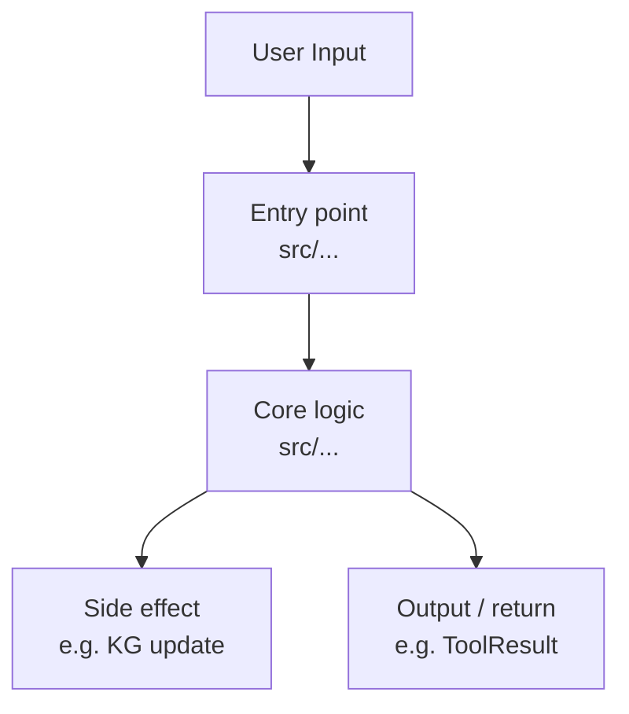

# Document a Feature

Document the feature **<feature-name>** by exploring the codebase and writing a complete, accurate feature doc.

> Replace `<feature-name>` with the name of the feature you are documenting (e.g. `named-sessions`, `parallel-tool-execution`, `workspace-file-watching`).

## 1 — Locate all relevant files

Infer source files from the feature name:

| Feature domain | Where to look |
|---|---|
| Tool (read_file, web_search, github, …) | `src/tools/<tool>.ts`, `src/tools/index.ts` |
| Slash command (/compact, /tokens, /role, …) | `src/commands/<cmd>.ts`, `src/commands/index.ts`, `src/commands/types.ts` |
| Agent / ReAct loop | `src/agent.ts`, `src/openai.ts` |
| Token tracking / Knowledge Graph | `src/knowledgeGraph.ts`, `src/agent.ts` |
| Memory / history | `src/memory.ts`, `src/index.ts` |
| Safety | `src/safety.ts`, `src/tools/index.ts` |
| UI / display | `src/ui.ts` |
| Config / startup | `src/config.ts`, `src/index.ts` |
| Role / KB system | `src/prompts.ts`, `src/index.ts` |

Always also read: `src/index.ts` (wiring), the relevant registry file, and `AGENTS.md` (architecture reference).

## 2 — Read every identified file in full

Do not skim. The doc must reflect the actual implementation, not assumptions.

## 3 — Check for an existing doc

Look for `docs/features/<feature-name>.md` (normalise spaces → hyphens, lowercase).
If it exists, read it so you know what is already there and what needs updating.

## 4 — Build the doc

Write (or overwrite) `docs/features/<feature-name>.md` using the template below.
Every section must be filled from real code — no placeholder text, no invented details.

---

````markdown
# <Feature Name>

> One-sentence summary of what this feature does and why it exists.

## Table of Contents

- [Overview](#overview)
- [Architecture](#architecture)
  - [Files involved](#files-involved)
  - [Architecture flow diagram](#architecture-flow-diagram)
  - [Data flow](#data-flow)
  - [Key types / interfaces](#key-types--interfaces)
- [Core code breakdown](#core-code-breakdown)
- [Workflow](#workflow)
- [Configuration & flags](#configuration--flags)
- [Edge cases & safety](#edge-cases--safety)
- [Example usage](#example-usage)
- [Related features](#related-features)

## Overview

2–4 sentences explaining the problem it solves and how it fits into CLIC's overall design.

## Architecture

### Files involved

| File | Role in this feature |
|---|---|
| `src/...` | ... |

### Architecture flow diagram

Choose the Mermaid diagram type that best fits the feature:

- **`flowchart TD`** — for call chains and request/response flows (most common)
- **`sequenceDiagram`** — for multi-party async interactions (e.g. LLM ↔ tool ↔ user)
- **`stateDiagram-v2`** — for state machines or lifecycle flows (e.g. agent loop states)



Draw the actual diagram for this feature — replace every placeholder node with the real function/module name and source file.

### Data flow

Step-by-step numbered list tracing exactly how data moves through the system when this feature activates.

### Key types / interfaces

Paste (or describe) the TypeScript types that define this feature's public contract with a short annotation for each field that matters.

## Core code breakdown

Identify the single function or code block that is the heart of this feature. Then break it down:

### `<functionName>` — `<file>:<startLine>-<endLine>`

Paste the full source verbatim in a TypeScript code block, then add a line-by-line annotation table:

| Lines | What it does | Why it matters |
|---|---|---|
| … | … | … |

## Workflow

1. How it is triggered
2. What happens inside the core logic
3. How results are surfaced back to the user or agent loop

## Configuration & flags

List every env var, CLI flag, or runtime option that affects this feature. Include default values and where they are read from.

## Edge cases & safety

- Empty / malformed input
- API errors / timeouts
- File-system or permission failures
- Abort / cancellation behaviour if applicable

## Example usage

Show a realistic terminal session demonstrating the feature end-to-end.

## Related features

Bullet list of other features/files this feature depends on or interacts with.
````

---

## 5 — Confirm what was written

After writing the file, print:

```
✅ docs/features/<feature-name>.md written
   Sections: Overview · Architecture · Workflow · Configuration · Edge cases · Example · Related
   Files read: <comma-separated list>
```
