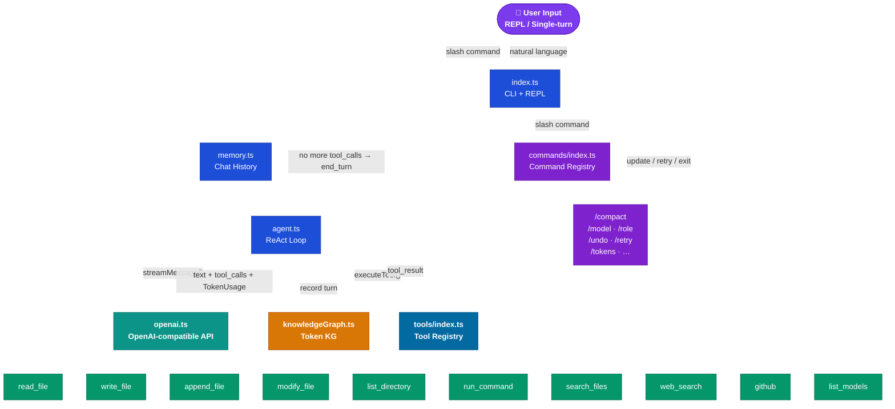
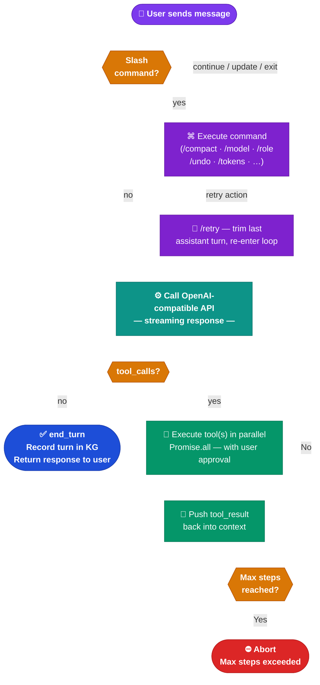

# CLIC — Command Line Intelligence Companion

> **v4.3.0** — An agentic CLI powered by any OpenAI-compatible API with streaming, function calling, user-controlled parallel tool execution, abort support, API retry with exponential backoff, cost estimation, context-window guard with auto-compact, and a modular tool system.


CLIC is a terminal-based Agentic CLI that can read/write files, run shell commands, search the web, and chain multiple steps automatically to complete complex tasks — all with human approval before every action.

---


## Table of Contents

- [Features](#features)
- [Tech Stack](#tech-stack)
- [Project Structure](#project-structure)
- [Architecture](#architecture)
  - [High-Level Flow](#high-level-flow)
  - [ReAct Agent Loop](#react-agent-loop)
  - [Tool System](#tool-system)
  - [Module Responsibilities](#module-responsibilities)
- [Getting Started](#getting-started)
- [Usage](#usage)
  - [Interactive REPL](#interactive-repl)
  - [Single-Turn Mode](#single-turn-mode)
  - [CLI Flags](#cli-flags)
  - [REPL Commands](#repl-commands)
- [Adding a New Tool](#adding-a-new-tool)
- [Adding a New Command](#adding-a-new-command)
- [Knowledge Base](#knowledge-base)
- [Persistent Agent Memory](#persistent-agent-memory)
- [Safety](#safety)
- [Environment Variables](#environment-variables)
- [Claude Code Integration](#claude-code-integration)
  - [Claude Commands](#claude-commands)
  - [Claude Skills](#claude-skills)

---

## Features

| Capability | Description |
|---|---|
| 💬 Chat / Q&A | Any topic — code, math, devops, science |
| ⚙️ Run Commands | Execute safe shell commands with approval |
| 📖 Read Files | Read and analyze file contents |
| ✏️ Write Files | Create or overwrite files |
| ➕ Append Files | Add content to existing files |
| 🔧 Modify Files | Find-and-replace text in files (with backup) |
| 📂 List Dirs | Browse directory listings |
| 🔍 Search Files | Glob-based file search |
| 🌐 Web Search | LLM-powered knowledge lookup — routes query to the active model via a fresh API call; no external search key required |
| 🐙 GitHub | Fetch any user's profile, activity streak, and public repos |
| 📋 Model Picker | Live model list fetched from API at startup; switch mid-session with `/model` |
| 🔗 Agentic Loop | Auto-chain multiple steps: plan → execute → verify |
| ⚡ Parallel Tools | When the LLM issues multiple tool calls, user is prompted once: "parallel or sequential?" — parallel runs all via `Promise.all` |
| ⛔ Abort Support | `AbortSignal` threading lets you cancel a running agent turn mid-stream with Ctrl+C |
| 🔁 API Retry | Exponential backoff (up to 4 attempts) on HTTP 429 / 500 / 502 / 503 / 504 errors |
| 💰 Cost Estimation | `/tokens` shows estimated USD cost per session and all-time using live model pricing data |
| 📚 Knowledge Base | Load role/behavior/persona from a Markdown file |
| 🧠 Persistent Memory | Chat history saved to `chat_history.json` — agent remembers across sessions |
| 🛡️ Safety Layer | Blocked commands + protected paths + human approval |
| 🪟 Context Guard | Monitors context fill % after every turn; auto-compacts at 80% to prevent cutoff |
| 🔍 Diff Preview | `write_file` and `modify_file` render a full-width unified diff before confirmation |

---

## Tech Stack

| Package | Role |
|---|---|
| **`openai`** | OpenAI-compatible API client with streaming + function calling |
| **`commander`** | CLI argument parsing (`--model`, `--kb`, `--yolo`, `--full-history`, etc.) |
| **`@clack/prompts`** | Interactive setup wizard (API key, model picker, KB file) |
| **`execa`** | Safe subprocess execution with timeout + error capture |
| **`fast-glob`** | Glob-based file search |
| **`diff`** | Unified diff generation for `write_file` / `modify_file` preview |
| **`chalk`** | Colored terminal output |
| **`ora`** | Spinner while waiting for LLM responses |
| **`dotenv`** | Load `.env` config (API keys) |
| **`tsx`** | Run TypeScript directly during development |
| **`tsup`** | Bundle for production distribution |

---

## Project Structure

```
clic/
├── src/
│   ├── index.ts              ← CLI entry point + REPL loop + context-window guard (auto-compact)
│   ├── agent.ts              ← ReAct agentic loop (runAgentTurn) + parallel/sequential tool dispatch + KG recording
│   ├── openai.ts             ← OpenAI SDK wrapper (createClient / streamMessage / withRetry / TokenUsage)
│   ├── knowledgeGraph.ts     ← Token-tracking Knowledge Graph (persisted to token_graph.json)
│   ├── pricing.ts            ← Real-time model pricing via LiteLLM proxy (getCost / formatCost / isPricingLoaded)
│   ├── prompts.ts            ← System prompt builder (buildSystemPrompt)
│   ├── memory.ts             ← Chat history management (load/save/push/pop/clear/trim)
│   ├── safety.ts             ← Blocked commands + protected paths
│   ├── config.ts             ← Env loading, constants, context limits, KB loader, getContextLimit()
│   ├── ui.ts                 ← Banner, help, status, context bar, diff view, chalk formatters
│   ├── commands/
│   │   ├── index.ts          ← Command registry + router + tab completer
│   │   ├── types.ts          ← Shared types (SlashCommand, CommandContext, CommandAction)
│   │   ├── compact.ts        ← /compact — summarize + compress history
│   │   ├── model.ts          ← /model  — switch model mid-session
│   │   ├── role.ts           ← /role   — switch KB/persona mid-session
│   │   ├── undo.ts           ← /undo   — remove last exchange
│   │   ├── retry.ts          ← /retry  — regenerate last response
│   │   ├── tokens.ts         ← /tokens — token counts + cost estimate from Knowledge Graph
│   │   ├── status.ts         ← /status — show system info
│   │   ├── history.ts        ← /history — show conversation history
│   │   ├── clear.ts          ← /clear  — clear history
│   │   ├── raw.ts            ← /raw    — toggle debug output
│   │   ├── help.ts           ← /help   — show help menu
│   │   └── exit.ts           ← /exit   — quit agent
│   └── tools/
│       ├── index.ts          ← Tool registry + router
│       ├── types.ts          ← Shared types (ConfirmFn, ToolResult, ToolDefinition)
│       ├── helpers.ts        ← Shared helpers (resolvePath, renderDiff — unified diff renderer)
│       ├── readFile.ts       ← read_file tool
│       ├── writeFile.ts      ← write_file tool (with diff preview)
│       ├── appendFile.ts     ← append_file tool
│       ├── modifyFile.ts     ← modify_file tool (with diff preview + .bak backup)
│       ├── listDir.ts        ← list_directory tool
│       ├── runCommand.ts     ← run_command tool
│       ├── searchFiles.ts    ← search_files tool
│       ├── webSearch.ts      ← web_search tool (LLM-powered; uses active model via CLIC_MODEL)
│       ├── githubExtractor.ts← github tool (profile, streak, repos)
│       └── listModelfromOpenAI.ts ← fetchAvailableModelOptions() startup helper (not in tool registry)
├── roles based Workflow/     ← Built-in role/persona files (auto-discovered)
├── .env                      ← API keys (not committed)
├── .env.example              ← Template for .env
├── .gitignore
├── package.json
├── tsconfig.json
├── setup.sh                  ← Original bash version (v4.1)
├── chat_history.json         ← Persisted conversation (auto-generated, gitignored)
└── token_graph.json          ← Token usage Knowledge Graph (auto-generated, gitignored)
```

---

## Architecture

### High-Level Flow



### ReAct Agent Loop

The core pattern is a **ReAct loop** (Reason + Act). This runs in `agent.ts`:

<div align="center">



</div>

**Key design**: The `openai` SDK's native streaming + function calling handles structured tool calls — no manual JSON parsing or `done` flag needed. When the LLM emits multiple tool calls in a single response, the user is prompted **once**: "Run all N tools in parallel?" — answering `y` executes them concurrently via `Promise.all`; answering `n` runs them one-by-one with individual confirms. A single tool call skips the prompt and runs directly. All API calls are wrapped in `withRetry()` for automatic exponential-backoff retry on transient errors.

**Parallel tool execution**: Controlled by a single user confirmation per batch — "Run all N tools in parallel?" When parallel, individual per-tool confirms are auto-approved to avoid garbled output. When sequential, each tool goes through its own confirm. The LLM issues dependent calls across separate turns naturally.

**Step limit**: Max 15 steps per user turn (configurable via `--max-steps`).

### Tool System

Every tool is a self-contained module that exports two things:

```typescript
// src/tools/myTool.ts

export const definition: ToolDefinition = {
  name: 'my_tool',
  description: '...',
  parameters: { type: 'object', properties: { ... }, required: [] },
};

export async function execute(
  input: { /* typed input */ },
  confirm: ConfirmFn,
): Promise<ToolResult> {
  // 1. Print header
  // 2. Safety check (if applicable)
  // 3. Ask for user confirmation
  // 4. Execute the action
  // 5. Return { output, isError }
}
```

The **registry** (`tools/index.ts`) auto-wires everything:

```
tools/index.ts
  ├── Imports all tool modules
  ├── Builds toolMap (name → module)
  ├── getToolDefinitions() → JSON schemas sent to the LLM
  └── executeTool(name, input, confirm) → routes to correct module
```

Registered tools:

| Tool | Module | Description |
|---|---|---|
| `read_file` | `readFile.ts` | Read file contents |
| `write_file` | `writeFile.ts` | Create or overwrite a file |
| `append_file` | `appendFile.ts` | Append to an existing file |
| `modify_file` | `modifyFile.ts` | Find-and-replace in a file |
| `list_directory` | `listDir.ts` | List directory contents |
| `run_command` | `runCommand.ts` | Execute a shell command |
| `search_files` | `searchFiles.ts` | Glob-based file search |
| `web_search` | `webSearch.ts` | Web search — routes query to the active LLM via a fresh OpenAI client call using `CLIC_MODEL`; no external search API required |
| `github` | `githubExtractor.ts` | GitHub profile, streak, and repos |

> `list_models` (`listModelfromOpenAI.ts`) is a startup-only helper — it powers the interactive model picker but is **not** registered in the LLM tool registry.

### Module Responsibilities

| Module | Purpose |
|---|---|
| **`index.ts`** | CLI parsing, setup wizard, live model picker, REPL loop, context-window guard (renders `printContextBar` + triggers `runCompact` at 80% fill). Passes extended `CommandContext` (with `callLLM`, `systemPrompt`, `sessionId`) to commands; handles `retry` and `update` actions (recreates OpenAI client on model swap) |
| **`agent.ts`** | The ReAct loop — calls the API via `openai.ts`, handles streaming. When >1 tool call arrives, shows a queue preview and asks "parallel or sequential?" — parallel uses `Promise.all` with auto-approved per-tool confirms; sequential runs each with its own confirm. After each turn records session/turn/model/tool/usage nodes in the Knowledge Graph |
| **`openai.ts`** | Thin wrapper around `openai` — `createClient()` + `streamMessage()` with tool-call chunk assembly. Wraps the API call in `withRetry()` (exponential backoff on 429/5xx, up to 4 attempts). Accepts an optional `AbortSignal` passed through to the SDK's `create()` call. Returns `LLMResponse` including `TokenUsage` (actual from `stream_options.include_usage`) |
| **`knowledgeGraph.ts`** | In-memory graph with `addNode()` / `addEdge()` / query helpers (`getSessionTokenSummary`, `getGlobalTokenSummary`, `getSessionToolUsage`, `getSessionTokensByModel`, `getGlobalTokensByModel`). Persisted to `token_graph.json` |
| **`pricing.ts`** | Real-time pricing from LiteLLM proxy `/model/info` — `loadPricing()` (called at startup), `getCost()`, `getPricing()`, `formatCost()`, `isPricingLoaded()`. Used by `/tokens` to compute estimated USD spend |
| **`prompts.ts`** | Builds the system prompt with live system context (OS, user, CWD, date) + optional knowledge base |
| **`memory.ts`** | Manages `ChatMessage[]` in memory (OpenAI format) — `pushMessage()`, `popMessage()`, `getMessages()`, `clearMessages()`, `messageCount()`, `loadHistory(limit?)`, `saveHistory()`, `trimToLastUserMessage()` |
| **`config.ts`** | Loads `.env` via dotenv; exports `DEFAULT_MODEL`, `DEFAULT_MAX_STEPS`, `HISTORY_FILE`, `TOKEN_GRAPH_FILE`, `MODEL_CONTEXT_LIMITS`, `DEFAULT_CONTEXT_LIMIT`, `CONTEXT_GUARD_THRESHOLD`, `HISTORY_LOAD_LIMIT`, `AppConfig` interface, `loadKnowledgeBase()`, `getContextLimit()` |
| **`safety.ts`** | `isCommandSafe()` checks against blocked patterns, `isPathSafe()` checks against protected paths |
| **`ui.ts`** | `printBanner()`, `printHelp()`, `printStatus()`, `printStepHeader()`, `printSeparator()`, `promptPrintSeperator()`, `printToolHeader()`, `printToolSuccess()`, `printToolError()`, `printToolBlocked()`, `printRejected()`, `printDimOutput()`, `printContextBar()`, `actionLabel()` |
| **`commands/types.ts`** | Shared types: `SlashCommand`, `CommandContext` (with `callLLM` + `sessionId`), `CommandAction` (`continue`/`exit`/`retry`/`update`) |
| **`commands/index.ts`** | Registry: imports all commands, supports `args` parsing (e.g. `/model gpt-4o`), exports `executeCommand()`, `isSlashedCommand()`, `getSlashCommands()`, `slashCompleter()` |
| **`tools/types.ts`** | Shared types: `ConfirmFn`, `ToolResult`, `ToolDefinition` |
| **`tools/helpers.ts`** | Shared utilities: `resolvePath()` (handles `~` expansion + `path.resolve`), `renderDiff()` (full-width unified diff renderer using `diff` package) |
| **`tools/index.ts`** | Registry: imports all tools, builds lookup map, exports `getToolDefinitions()`, `executeTool()`, `getToolNames()` |

---

## Getting Started

### Prerequisites

- **Node.js** >= 18
- **pnpm** (recommended) or npm

### Install

```bash
git clone <repo-url> clic
cd clic
pnpm install
```

### Configure

```bash
cp .env.example .env
```

Edit `.env` and add your API key:

```env
API_KEY=sk-...

# Optional: point at any OpenAI-compatible endpoint
BASE_URL=https://api.openai.com/v1
```

If you don't set `API_KEY` in `.env`, the setup wizard will prompt you interactively.

### Run

```bash
# Development (with hot reload via tsx)
pnpm dev

# Build for production
pnpm build

# Run production build
pnpm start
```

---

## Usage

### Interactive REPL

```bash
pnpm dev
```

This launches the setup wizard (API key + optional knowledge base), then drops you into the REPL:

```
  🧑 You:
  > create a hello.ts file, make it executable, and run it
```

The agent will chain multiple steps automatically:
1. `write_file` → create hello.ts
2. `run_command` → chmod +x hello.ts
3. `run_command` → ./hello.ts
4. `respond` → summarize what was done

Every action requires **your approval** before execution.

### Single-Turn Mode

```bash
pnpm dev -- "list all TypeScript files in src/"
```

Runs the prompt, outputs the result, and exits.

### CLI Flags

| Flag | Default | Description |
|---|---|---|
| `--model <model>` | `gpt-4o` | Model to use (see live picker at startup) |
| `--kb <path>` | — | Path to a knowledge base / role file |
| `--max-steps <n>` | `15` | Max agent steps per user turn |
| `--yolo` | `false` | Auto-approve all actions (skip confirmations) |
| `--full-history` | `false` | Load entire chat history (default: last 10 messages) |
| `-p, --paste` | `false` | Read prompt from stdin until EOF (Ctrl+D) and run as single-turn; works with pipes: `cat file.txt \| pnpm dev --paste` |

#### Available Models

Models are fetched live from your configured API endpoint at startup and presented as an interactive picker. Pass `--model <name>` to bypass it. Use `/model` mid-session to switch without restarting.

| Model ID | Provider |
|---|---|
| `anthropic--claude-4-sonnet` | Anthropic |
| `anthropic--claude-4.5-haiku` | Anthropic |
| `anthropic--claude-4.5-opus` | Anthropic |
| `anthropic--claude-4.5-sonnet` | Anthropic |
| `anthropic--claude-4.6-opus` | Anthropic |
| `anthropic--claude-4.6-sonnet` | Anthropic |
| `gemini-2.5-flash` | Google |
| `gemini-2.5-flash-lite` | Google |
| `gemini-2.5-pro` | Google |
| `gpt-4.1` | OpenAI |
| `gpt-4.1-mini` | OpenAI |
| `gpt-5` | OpenAI |
| `gpt-5-mini` | OpenAI |
| `sonar` | Perplexity |
| `sonar-pro` | Perplexity |

```bash
# Example: use Claude Sonnet
pnpm dev -- --model anthropic--claude-4.6-sonnet

# Example: use GPT-5
pnpm dev -- --model gpt-5

# Example: use Gemini 2.5 Pro
pnpm dev -- --model gemini-2.5-pro
```

### REPL Commands

| Command | Alias | Action |
|---|---|---|
| `/compact` | — | Summarize + compress history to free up context |
| `/model [name]` | `/m` | Switch LLM model mid-session (shows picker if no name given) |
| `/role` | — | Switch knowledge base / persona without restarting |
| `/undo` | — | Remove the last user + assistant exchange from history |
| `/retry` | `/r` | Regenerate the last response (re-runs last user message) |
| `/tokens` | — | Show actual token usage (from Knowledge Graph) + context size estimate |
| `/status` | — | Show system info (OS, model, history count, etc.) |
| `/history` | — | Show conversation history |
| `/clear` | — | Clear conversation history |
| `/raw` | — | Toggle raw JSON debug output |
| `/help` | — | Show capabilities and example prompts |
| `/exit` / `/quit` | — | Save history and exit |

---

## Adding a New Tool

The tool system is designed for easy extension. Two steps:

### Step 1: Create the tool module

Create `src/tools/myNewTool.ts`:

```typescript
import type { ToolDefinition, ConfirmFn, ToolResult } from './types.js';

// 1. Define the JSON schema (sent to the LLM)
export const definition: ToolDefinition = {
  name: 'my_new_tool',
  description: 'What this tool does — the LLM reads this to decide when to use it.',
  parameters: {
    type: 'object',
    properties: {
      param1: { type: 'string', description: 'Description for the model' },
      param2: { type: 'number', description: 'Another param' },
    },
    required: ['param1'],
  },
};

// 2. Implement the executor
export async function execute(
  input: { param1: string; param2?: number },
  confirm: ConfirmFn,
): Promise<ToolResult> {
  // Ask for approval
  if (!await confirm(`Run my_new_tool with '${input.param1}'?`)) {
    return { output: 'User rejected.', isError: true };
  }

  // Do the work
  const result = `Did something with ${input.param1}`;

  return { output: result, isError: false };
}
```

### Step 2: Register it

In `src/tools/index.ts`, add two lines:

```typescript
import * as myNewTool from './myNewTool.js';    // ← add import

const tools: ToolModule[] = [
  readFile,
  writeFile,
  // ... existing tools ...
  myNewTool,                                     // ← add to array
];
```

That's it. The registry auto-wires the definition (sent to the LLM) and the executor (called when the LLM uses it).

---

## Adding a New Command

Slash commands are self-contained modules. Two steps:

### Step 1: Create the command module

Create `src/commands/myCmd.ts`:

```typescript
import chalk from 'chalk';
import type { SlashCommand } from './types.js';

export const command: SlashCommand = {
  name: '/mycmd',
  aliases: ['/mc'],            // optional
  description: 'What this command does',
  usage: '/mycmd [optional-arg]',
  execute: async (ctx, args) => {
    // ctx: { model, maxSteps, showRaw, kbFile, systemPrompt, yolo, callLLM }
    // args: everything after the command name (e.g. "gpt-4o" from "/mycmd gpt-4o")

    console.log(chalk.green(`  ✅ Running mycmd, current model: ${ctx.model}`));
    console.log();

    // Return one of:
    //   { type: 'continue' }                           — nothing changes
    //   { type: 'exit' }                               — quit the REPL
    //   { type: 'retry' }                              — re-run last user message
    //   { type: 'update', updates: { model: '...' } }  — mutate session state
    return { type: 'continue' };
  },
};
```

### Step 2: Register it

In `src/commands/index.ts`, add two lines:

```typescript
import { command as myCmdCmd } from './myCmd.js';  // ← add import

const commands: SlashCommand[] = [
  // ... existing commands ...
  myCmdCmd,                                         // ← add to array
];
```

Tab-completion, routing, and `/help` all pick it up automatically.

---

## Knowledge Base

You can customize the agent's persona by loading a knowledge base file:

```bash
pnpm dev -- --kb "./roles based Workflow/devops-expert.md"
```

Or select a role during the setup wizard — CLIC auto-discovers any `.md` files in the `roles based Workflow/` folder and presents them as a menu.

Built-in roles available:

| File | Persona |
|---|---|
| `AI_Engineer.md` | AI Engineer |
| `Forward_Deployed_Engineer.md` | Forward Deployed Engineer |
| `Gen_AI_Engineer.md` | Generative AI Engineer |
| `genz_workflow.md` | Gen-Z Communication Style |
| `Legal_Software_Advocate.md` | Legal Software Advocate |
| `Machine_Learning_Engineer.md` | Machine Learning Engineer |
| `Multi_Language_Teacher.md` | Multi-Language Teacher |
| `Senior_Devops_Engineer.md` | Senior DevOps Engineer |
| `SRE_Engineer.md` | Site Reliability Engineer |
| `TestCase_Fixer_&_Error_Resolution_Specialist.md` | Test Case Fixer & Error Resolution Specialist |

The file contents are appended to the system prompt as a "ROLE & KNOWLEDGE BASE" section. The agent will adopt the role while retaining all tool capabilities.

Example KB file (`roles based Workflow/devops-expert.md`):

```markdown
You are a senior DevOps engineer specializing in AWS, Kubernetes, and CI/CD.
Always suggest infrastructure-as-code approaches.
Prefer Terraform over CloudFormation.
When troubleshooting, check logs first, then configs.
```

---

## Persistent Agent Memory

CLIC maintains two independent persistence stores — both built without any third-party memory or vector-store library.

### Chat History (`chat_history.json`)

Every conversation turn (user message + assistant response + tool calls/results) is serialised and saved as a flat array of **OpenAI-compatible messages**. On the next session, the agent loads this array and injects it into the context window before processing your first message.

```
chat_history.json  ←  OpenAI ChatMessage[]
[
  { role: "user",      content: "..." },
  { role: "assistant", content: "...", tool_calls: [...] },
  { role: "tool",      content: "...", tool_call_id: "..." },
  ...
]
```

### Token Knowledge Graph (`token_graph.json`)

After every agent turn, CLIC writes a structured graph of what happened — which model was used, which tools were called, and how many tokens were consumed. This powers the `/tokens` command with accurate per-session and all-time totals.

```
token_graph.json  ←  Knowledge Graph
Session -[HAS_TURN]->   Turn
Turn    -[USED_MODEL]-> Model
Turn    -[CALLED_TOOL]-> Tool
Turn    -[HAS_USAGE]->  TokenUsage  { promptTokens, completionTokens, source: "actual"|"estimated" }
```

Token counts come directly from `stream_options: { include_usage: true }` in the API response. If the API omits usage (some providers), CLIC estimates at ~4 chars/token and marks the record as `estimated`.

### Key properties

| Property | Detail |
|---|---|
| **Zero dependencies** | Pure Node.js `fs` + `JSON` — no LangChain, no vector DB, no external memory service |
| **Survives restarts** | Both files written to disk after every turn and on `/exit` |
| **Full context replay** | Entire message array injected back into the context window on startup |
| **Accurate token tracking** | Actual API usage when available; estimated fallback otherwise |
| **Selective clear** | Use `/clear` in the REPL to wipe chat history (token graph is preserved) |
| **Configurable paths** | `AGENT_HISTORY_FILE` and `AGENT_TOKEN_GRAPH_FILE` env vars |

### Result

The agent remembers previous tasks, code it wrote, commands it ran, and conclusions it reached — across any number of sessions — without you having to re-explain context each time.

```
Session 1:  "Create a FastAPI server in server.py"
            → agent writes server.py, saves memory + token graph

Session 2:  "Add authentication to the server"
            → agent already knows server.py exists and what's in it
            → picks up exactly where it left off
```

---

## Safety

### Blocked Commands

The following patterns are blocked and will never execute:

```
rm -rf /    rm -rf /*    mkfs          dd if=
:(){:|:&};: fork bomb    > /dev/sda    chmod -R 777 /
shutdown    reboot       halt          init 0 / init 6
kill -9 1   mv /*        curl | bash   poweroff
```

### Protected Paths

File operations are denied on:

```
/etc/passwd   /etc/shadow   /etc/sudoers   /etc/hosts
/boot/        /dev/         /proc/         /sys/
/var/log/auth
```

### Human Approval

Every tool action (read, write, command, search, etc.) requires explicit `y/n` confirmation before execution. Use `--yolo` to skip confirmations (use with caution).

---

## Environment Variables

| Variable | Required | Description |
|---|---|---|
| `API_KEY` | Yes* | Your OpenAI or compatible API key (prompted interactively if missing) |
| `BASE_URL` | No | OpenAI-compatible endpoint base URL (default: `https://api.openai.com/v1`) |
| `AGENT_HISTORY_FILE` | No | Custom path for chat history (default: `chat_history.json`) |
| `AGENT_TOKEN_GRAPH_FILE` | No | Custom path for token Knowledge Graph (default: `token_graph.json`) |
| `CLIC_MODEL` | No | Set automatically at startup to the active model; read by `web_search` and other tools at call time |

---

## Claude Code Integration

CLIC ships a set of **Claude Code slash commands** and **skills** under `.claude/` that let Claude Code work on this repo more effectively — running the app, reviewing code, documenting features, and keeping configuration in sync.

### Claude Commands

Slash commands are stored in [.claude/commands/](.claude/commands/) and are invoked inside a Claude Code session with `/command-name`. Each command is a markdown prompt file that is injected as instructions when you run it.

| Command | Invoke | What it does |
|---|---|---|
| **`run`** | `/run` | Run CLIC with `pnpm dev` (or `pnpm build && pnpm start` for production). Documents all CLI flags and reports what was observed in the terminal output. |
| **`verify`** | `/verify` | End-to-end smoke test after a code change — runs CLIC in single-turn mode, checks that tool calls complete, confirms `token_graph.json` is updated, and reports pass/fail. |
| **`code-review`** | `/code-review` | Reviews the current `git diff` for correctness bugs and simplification opportunities across all key files (`agent.ts`, `openai.ts`, `tools/`, `commands/`, `safety.ts`, `memory.ts`). |
| **`security-review`** | `/security-review` | Audits pending changes for security issues — command injection in `runCommand.ts`, path traversal in file tools, API key exposure in logs, prompt injection via `readFile`, and safety bypass patterns in `safety.ts`. |
| **`feature-review-for-specific`** | `/feature-review-for-specific <feature>` | Deep review of a named feature — reads every relevant file, then scores it across correctness, types, loop integration, safety, edge cases, and output. Reports findings by severity with file:line references. |
| **`clic-features-doc`** | `/clic-features-doc <feature-name>` | Explores the codebase and writes (or updates) a complete feature doc to `docs/features/<feature-name>.md` — covering architecture, data flow, key types, a core code breakdown with annotated source, workflow, configuration, edge cases, example usage, and related features. |
| **`update-context-for-future`** | `/update-context-for-future` | Scans the codebase for drift since the last doc update and rewrites `README.md` + `CLAUDE.md` to match the current source — key files, registered tools/commands, exported functions, env vars, version number. |
| **`claude-api`** | `/claude-api` | Looks up the Claude / Anthropic API reference for the current task — model IDs, tool-use schemas, streaming delta shapes, token counting fields, pricing. |
| **`update-config`** | `/update-config` | Reads and merges changes into `.claude/settings.json` — adding allowed Bash patterns, hooks, or environment variables. Never overwrites the file wholesale. |
| **`fewer-permission-prompts`** | `/fewer-permission-prompts` | Scans this project's common dev-loop commands and adds precise `Bash(...)` / `Read(...)` allow rules to `.claude/settings.json` to reduce repetitive permission prompts. |

#### Usage examples

```
# In a Claude Code session:
/run
/verify
/code-review
/security-review
/feature-review-for-specific parallel-tool-execution
/clic-features-doc api-retry
/update-context-for-future
/claude-api streaming tool_calls delta format
/update-config add pnpm lint to allowed commands
/fewer-permission-prompts
```

> All commands read from source before acting — they never guess or use stale assumptions. Pass `$ARGUMENTS` after the command name where shown to scope the output.

---

### Claude Skills

Skills live in [.claude/skills/](.claude/skills/) and provide reusable, stateful capabilities — unlike one-shot commands, a skill can launch a process, interact with it, and report back.

#### `run-clic` skill

The `run-clic` skill wraps CLIC in a **tmux session** via a Node.js driver script, solving the core problem that `@clack/prompts` requires a real TTY — you cannot run `pnpm dev` from a backgrounded shell command. The driver provides a programmable interface for Claude Code subagents to launch, interact with, and observe the running CLIC instance.

**Prerequisite:** `brew install tmux`

**Driver commands** (`node .claude/skills/run-clic/driver.mjs <command>`):

| Command | What it does |
|---|---|
| `single <prompt>` | Full single-turn run — launches CLIC, selects the first model, sends the prompt, waits for `✔ Task complete`, prints full output, exits |
| `launch [model]` | Start an interactive REPL session in the background tmux session `clic-driver` |
| `send <text>` | Send text + Enter to the running REPL |
| `slash <cmd>` | Send a slash command (e.g. `/status`, `/tokens`) and print the pane output |
| `capture` | Print current tmux pane contents |
| `wait <marker>` | Poll until a marker string appears in the pane (30 s timeout) |
| `quit` | Send `/exit` to save history cleanly, then kill the tmux session |
| `kill` | Force-kill the tmux session without saving |

**Example — verify a code change end-to-end:**

```bash
# Single-turn smoke test (most common)
node .claude/skills/run-clic/driver.mjs single "list the TypeScript files in src/"

# Interactive session — send a slash command
node .claude/skills/run-clic/driver.mjs launch
node .claude/skills/run-clic/driver.mjs slash /tokens
node .claude/skills/run-clic/driver.mjs quit
```

**Key gotchas the skill documents:**

- `--model gpt-4o` does **not** skip the model picker — `gpt-4o` is `DEFAULT_MODEL`, so `src/index.ts` treats it as unset and shows the picker anyway. Pass a different model name or let the driver press Enter on the highlighted default.
- Paths with spaces in the project root are handled by the driver passing paths through tmux environment variables (`CLIC_ROOT`, `CLIC_TSX`) rather than embedding them in shell strings.
- `chat_history.json` accumulates across driver runs — run `echo "[]" > chat_history.json` to reset context before a clean test.

---

## Evolution

CLIC started as a pure Bash script (`setup.sh`) powered by Google Gemini, then migrated to SAP AI Core Orchestration Service, and is now a provider-agnostic OpenAI-compatible client:

| Bash v4.1 (Gemini) | TypeScript v4.2 (SAP AI Core) | TypeScript v4.3 (OpenAI-compatible) |
|---|---|---|
| Manual JSON parsing + `done` flag | Native SAP SDK function calling | Native `openai` SDK streaming + tool calls |
| `jq` + `curl` for API calls | `@sap-ai-sdk/orchestration` | `openai` npm package |
| Hardcoded Gemini endpoint | SAP AI Core Orchestration | Any OpenAI-compatible endpoint |
| `eval` for shell commands | `execa` with timeout | `execa` with timeout |
| No token tracking | No token tracking | Knowledge Graph — actual token counts per session |
| Monolithic single file | 18-file modular architecture | 37-file modular architecture + KG + pricing + context guard + diff preview |
| Google Search grounding | Brave / Tavily web search | LLM-powered web_search + GitHub + pricing + retry + auto-compact |

---

## License

MIT

---

## Owner

**Uday Sharma** — [github.com/UdaySharmaGitHub](https://github.com/UdaySharmaGitHub)
