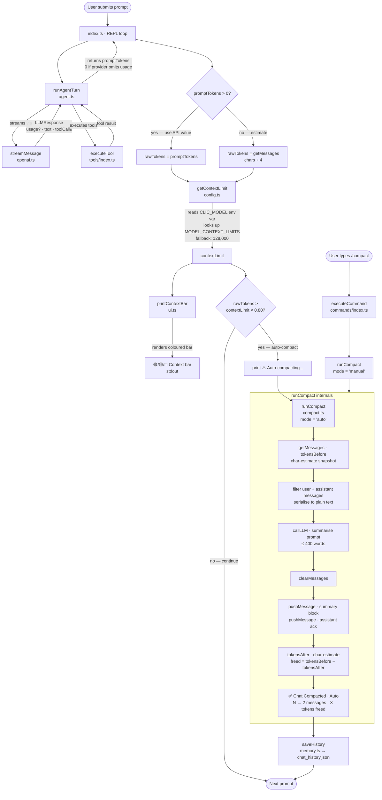

# Auto Context Window Guard + Auto-Compact

> Monitors token usage after every agent turn, renders a live progress bar, and automatically compacts the conversation history when usage crosses a configurable threshold — preventing context-overflow errors without manual intervention.

---

## Table of Contents

1. [Overview](#overview)
2. [Architecture](#architecture)
   - [Files involved](#files-involved)
   - [Data flow](#data-flow)
   - [Architecture flow diagram](#architecture-flow-diagram)
   - [Key types / interfaces](#key-types--interfaces)
3. [Core code breakdown](#core-code-breakdown)
   - [`runCompact`](#runcompact--srccommandscompactts15-66)
   - [`printContextBar`](#printcontextbar--srcuits339-360)
4. [Workflow](#workflow)
   - [1. Triggered after every agent turn](#1-triggered-after-every-agent-turn)
   - [2. Triggered manually via /compact](#2-triggered-manually-via-compact)
   - [3. What happens inside runCompact](#3-what-happens-inside-runcompact)
   - [4. Surface back to the user](#4-surface-back-to-the-user)
5. [Configuration & flags](#configuration--flags)
6. [Edge cases & safety](#edge-cases--safety)
7. [Example usage](#example-usage)
8. [Related features](#related-features)

---

## Overview

Large multi-turn conversations can silently exceed a model's context window, causing truncation or API errors. This feature measures prompt token consumption after each agent turn (using actual API usage data when available, or a `chars ÷ 4` character-based estimate when the provider does not return usage), renders a colour-coded bar in the terminal, and triggers `/compact` automatically when usage exceeds 80% of the model's limit. The user can also invoke `/compact` manually at any time. Both paths share the same `runCompact()` function and produce a labelled summary line distinguishing _Manual_ from _Auto_ compaction.

---

## Architecture

### Files involved

| File | Role in this feature |
|---|---|
| `src/config.ts` | Defines `MODEL_CONTEXT_LIMITS`, `DEFAULT_CONTEXT_LIMIT`, `CONTEXT_GUARD_THRESHOLD` (0.80), `HISTORY_LOAD_LIMIT`, and `getContextLimit()` |
| `src/commands/compact.ts` | `runCompact(callLLM, mode)` — summarises history via LLM, replaces messages, prints freed-token count; also exports the `/compact` slash command |
| `src/ui.ts` | `printContextBar(promptTokens, contextLimit, threshold)` — renders the coloured progress bar |
| `src/index.ts` | Calls `getContextLimit()` + `printContextBar()` + guard `if` after every agent turn (both the normal path and the `/retry` path) |
| `src/agent.ts` | Returns `{ promptTokens }` from `runAgentTurn()`; this value is 0 when the provider omits usage |
| `src/memory.ts` | `getMessages()` — read to estimate tokens from raw char count when API usage is absent; `clearMessages()` + `pushMessage()` — used by `runCompact()` to replace history with a compact summary |
| `src/openai.ts` | `streamMessage()` — returns `LLMResponse.usage` (may be `undefined`); `callLLM` wrapper in `index.ts` calls this for the compaction summary |

### Data flow

1. User submits a prompt in the REPL. `index.ts` calls `runAgentTurn()`.
2. `runAgentTurn()` returns `{ promptTokens }`. The value is the sum of `usage.promptTokens` across all steps; it is **0** when the provider (e.g. SAP AI Core / Anthropic proxy) does not include usage data.
3. `index.ts` calls `getContextLimit()`, which reads `process.env.CLIC_MODEL` and looks it up in `MODEL_CONTEXT_LIMITS`, falling back to `DEFAULT_CONTEXT_LIMIT` (128,000).
4. `index.ts` computes `rawTokens`:
   - If `turnResult.promptTokens > 0` → use it directly.
   - Otherwise → estimate from `getMessages()` character lengths divided by 4.
5. `printContextBar(rawTokens, contextLimit, CONTEXT_GUARD_THRESHOLD)` is called; it renders the bar to stdout.
6. If `rawTokens > contextLimit * CONTEXT_GUARD_THRESHOLD`:
   - Prints `⚠️  Auto-compacting...`
   - Calls `runCompact(callLLM, 'auto')`.
7. `runCompact()`:
   a. Captures `msgs = getMessages()` and `tokensBefore` (char-based estimate).
   b. Formats user + assistant messages as plain text.
   c. Calls `callLLM([{ role: 'user', content: summarise-prompt }])` to get a ≤400-word summary.
   d. `clearMessages()` then `pushMessage()` ×2 (summary context message + ack assistant message).
   e. Computes `tokensAfter` and `freed = tokensBefore − tokensAfter`.
   f. Prints `✅ Chat Compacted · Auto · N → 2 messages · X tokens freed`.
8. `saveHistory()` is called to persist the compacted state to `chat_history.json`.

### Architecture flow diagram



> **Tip:** this diagram renders natively in VS Code (with the Markdown Preview Mermaid Support extension), GitHub, and any Mermaid-aware viewer.

### Key types / interfaces

```typescript
// src/openai.ts
export interface TokenUsage {
  promptTokens: number;       // tokens consumed by the input context
  completionTokens: number;   // tokens in the model's reply
  totalTokens: number;        // sum of the above
}

export interface LLMResponse {
  text: string;
  toolCalls: ToolCall[];
  usage?: TokenUsage;         // undefined when provider omits it
}

// src/agent.ts
export interface AgentOptions {
  model: string;
  maxSteps: number;
  confirm: ConfirmFn;
  showRaw: boolean;
  sessionId?: string;
  signal?: AbortSignal;       // AbortController signal for mid-turn cancellation
}
// runAgentTurn() return value
// { promptTokens: number }   // 0 when provider returns no usage
```

---

## Core code breakdown

### `runCompact` — `src/commands/compact.ts:15-66`

```typescript
export async function runCompact(
  callLLM: (msgs: ChatMessage[]) => Promise<string>,
  mode: 'manual' | 'auto' = 'manual',
): Promise<void> {
  const msgs = getMessages();
  if (msgs.length === 0) return;

  const before = msgs.length;

  const estimateTokens = (ms: ChatMessage[]) =>
    Math.ceil(ms.reduce((sum, m) =>
      sum + ('content' in m && typeof m.content === 'string' ? m.content.length : 0), 0) / 4);

  const tokensBefore = estimateTokens(msgs);

  const spinner = ora({ text: chalk.dim('  Compacting...'), color: 'cyan' }).start();

  try {
    const historyText = msgs
      .filter(m => m.role === 'user' || m.role === 'assistant')
      .map(m => {
        const role = m.role === 'user' ? 'User' : 'Assistant';
        const content = 'content' in m && typeof m.content === 'string' ? m.content : '[tool interaction]';
        return `${role}: ${content}`;
      })
      .join('\n\n');

    const summary = await callLLM([{
      role: 'user',
      content: `Summarize the following conversation into a concise context block (max 400 words). Preserve: key decisions, code written, file paths mentioned, current task state, and any important facts established.\n\n${historyText}`,
    }]);

    clearMessages();
    pushMessage({
      role: 'user',
      content: `[Conversation compacted — summary of prior context]\n\n${summary}`,
    });
    pushMessage({
      role: 'assistant',
      content: 'Understood. I have the context from our previous conversation. How can I continue helping you?',
    });

    spinner.stop();
    const tokensAfter = estimateTokens(getMessages());
    const freed = Math.max(0, tokensBefore - tokensAfter);
    const modeLabel = mode === 'auto' ? 'Auto' : 'Manual';
    console.log(chalk.green(`  ✅ Chat Compacted · ${modeLabel} · ${before} → 2 messages · ${chalk.bold(freed.toLocaleString())} tokens freed`));
  } catch (err) {
    spinner.stop();
    console.log(chalk.red(`  ❌ Auto-compact failed: ${err instanceof Error ? err.message : String(err)}`));
  }
  console.log();
}
```

| Lines | What it does | Why it matters |
|---|---|---|
| 19–20 | Reads current messages; early-returns if none | Prevents a no-op LLM call |
| 22 | Captures `before` message count | Used in the final summary line (`N → 2`) |
| 24–27 | Defines `estimateTokens` — sums `content.length / 4` across all messages | Provides a token estimate without requiring API data; same formula used in `agent.ts` KG recording |
| 28 | Captures `tokensBefore` _before_ the LLM call | The LLM call itself adds messages temporarily; snapshot here gives the pre-compact baseline |
| 30 | Starts `ora` spinner | Gives visual feedback during the potentially slow LLM summarisation call |
| 33–40 | Filters to only `user`/`assistant` messages, serialises as `"User: …"` / `"Assistant: …"` text | Tool messages contain JSON blobs that would bloat the summarisation prompt; stripping them keeps the summary focused |
| 42–45 | Calls `callLLM` with a single-message summarisation prompt (≤400 words constraint) | Outsources the summarisation to the active model; `callLLM` is a thin `streamMessage` wrapper injected from `index.ts` |
| 47–55 | `clearMessages()` then two `pushMessage()` calls | Replaces the entire history with exactly 2 messages: a user-role summary block and an assistant ack; this is the minimal valid history for continuing the conversation |
| 57–61 | Computes `tokensAfter` and `freed`; prints labelled success line | `freed = tokensBefore − tokensAfter` gives the user a concrete sense of how much context was recovered |
| 63–64 | Catches and prints LLM errors without crashing the REPL | A failed compact must not terminate the session; the old messages remain intact if an error is thrown before `clearMessages()` |

**What makes this the core:** `runCompact` is the single function that actually reduces context pressure — it converts an arbitrarily long message array into exactly 2 messages. Without it, token accumulation is unbounded and context-overflow errors are inevitable. Every other part of the feature (the bar, the guard, the mode label) either triggers or decorates this function.

---

### `printContextBar` — `src/ui.ts:339-360`

```typescript
export function printContextBar(promptTokens: number, contextLimit: number, threshold = 0.80): void {
  if (promptTokens <= 0 || contextLimit <= 0) return;

  const pct    = promptTokens / contextLimit;
  const pctInt = Math.round(pct * 100);
  const BAR_W  = 30;
  const filled = Math.min(BAR_W, Math.round(pct * BAR_W));
  const empty  = BAR_W - filled;

  let barColor: (s: string) => string;
  let pctColor: (s: string) => string;
  if (pct < 0.60)           { barColor = chalk.green;  pctColor = chalk.green.bold;  }
  else if (pct < threshold) { barColor = chalk.yellow; pctColor = chalk.yellow.bold; }
  else                      { barColor = chalk.red;    pctColor = chalk.red.bold;    }

  const bar    = barColor('█'.repeat(filled)) + chalk.dim('░'.repeat(empty));
  const label  = pctColor(`${pctInt}%`);
  const detail = chalk.dim(`${promptTokens.toLocaleString()} / ${contextLimit.toLocaleString()} tokens`);
  const prefix = pct >= threshold ? chalk.red('🔴') : pct >= 0.60 ? chalk.yellow('🟡') : chalk.green('🟢');

  console.log(`  ${prefix} ${chalk.dim('Context')}  ${chalk.dim('[')}${bar}${chalk.dim(']')}  ${label}  ${detail}`);
}
```

| Lines | What it does | Why it matters |
|---|---|---|
| 340 | Guards against zero/negative inputs | Prevents a meaningless 0% bar when the API returned no token data (guard in `index.ts` provides a char-estimate, so this guard is a safety net) |
| 342–347 | Computes `pct`, integer percentage, and number of filled vs empty bar segments | Maps the continuous ratio onto a discrete 30-char bar |
| 349–352 | Selects green / yellow / red colour scheme based on thresholds (< 60%, < 80%, ≥ 80%) | Gives an instant visual signal without reading numbers |
| 354–358 | Constructs bar string, percentage label, raw token detail, and leading emoji indicator | The emoji prefix (`🟢`/`🟡`/`🔴`) is visible even in terminals that strip ANSI colour |
| 360 | Prints the single-line bar | One line keeps the output compact; it appears after every turn without dominating the conversation |

---

## Workflow

### 1. Triggered after every agent turn

After `runAgentTurn()` returns in the REPL loop (`src/index.ts:370–385`), the guard block runs unconditionally:

```
turnResult = await runAgentTurn(...)
→ getContextLimit()        reads CLIC_MODEL env var → MODEL_CONTEXT_LIMITS lookup
→ rawTokens computation    API value OR char-estimate from getMessages()
→ printContextBar(...)     renders bar to stdout
→ if rawTokens > limit * 0.80
    → console.log '⚠️ Auto-compacting...'
    → runCompact(callLLM, 'auto')
    → saveHistory()
```

The same block runs in the `/retry` path (`src/index.ts:331–341`).

### 2. Triggered manually via `/compact`

When the user types `/compact`, `executeCommand()` calls `command.execute(ctx)` in `compact.ts:72–85`, which calls `runCompact(ctx.callLLM)` with the default `'manual'` mode. The success line shows `Manual` instead of `Auto`.

### 3. What happens inside `runCompact`

- History is serialised to plain text (tool messages replaced with `[tool interaction]`).
- The LLM produces a ≤400-word summary via `callLLM`.
- All existing messages are wiped and replaced with exactly 2 new messages.
- A freed-token count is printed along with the message count delta.

### 4. Surface back to the user

| Signal | Where it appears |
|---|---|
| `🟢/🟡/🔴 Context [████░░░] 42% 53,760 / 128,000 tokens` | After every agent turn and after `/retry` |
| `⚠️  Auto-compacting...` | Immediately before auto-compact runs |
| `✅ Chat Compacted · Auto · 12 → 2 messages · 8,240 tokens freed` | After auto-compact completes |
| `✅ Chat Compacted · Manual · 8 → 2 messages · 5,100 tokens freed` | After `/compact` completes |

---

## Configuration & flags

| Setting | Default | Source | Effect |
|---|---|---|---|
| `MODEL_CONTEXT_LIMITS[model]` | see table in `config.ts` | `src/config.ts:46-80` | Per-model context window size used as denominator in the bar |
| `DEFAULT_CONTEXT_LIMIT` | `128_000` | `src/config.ts:83` | Fallback when active model is not in the lookup table |
| `CONTEXT_GUARD_THRESHOLD` | `0.80` | `src/config.ts:84` | Fraction of context limit at which auto-compact fires and bar turns red |
| `HISTORY_LOAD_LIMIT` | `10` | `src/config.ts:88` | Max messages loaded from `chat_history.json` on startup (reduces initial token load) |
| `process.env.CLIC_MODEL` | set at startup | `src/index.ts:129` | Read by `getContextLimit()` to select the correct limit |
| `--full-history` CLI flag | off | `src/index.ts:47` | Bypasses `HISTORY_LOAD_LIMIT`; loads entire history |

---

## Edge cases & safety

| Scenario | How it is handled |
|---|---|
| Provider returns no token usage (e.g. SAP AI Core / Anthropic proxy) | `turnResult.promptTokens` is 0; `index.ts` falls back to `getMessages().reduce(chars/4)` — the bar still renders |
| Empty conversation (`msgs.length === 0`) | `runCompact` returns immediately without calling the LLM or clearing messages |
| LLM call fails during compaction | `try/catch` in `runCompact` stops the spinner and prints `❌ Auto-compact failed: …`; no `clearMessages()` has run yet so history is intact |
| `tokensAfter > tokensBefore` (LLM produces a very verbose summary) | `Math.max(0, tokensBefore - tokensAfter)` clamps `freed` to 0; no negative display |
| Model not in `MODEL_CONTEXT_LIMITS` | `getContextLimit()` returns `DEFAULT_CONTEXT_LIMIT` (128,000) — a safe conservative fallback |
| `promptTokens <= 0` passed to `printContextBar` | Guard at line 340 skips rendering entirely |
| User aborts mid-turn (Ctrl+C) | `AbortController` signal cancels `streamMessage`; the guard block is inside `try`/`catch` in `index.ts` so the REPL continues cleanly |
| Auto-compact fires but `saveHistory` is missing on `/retry` path | The retry path (lines 331–341) does not call `saveHistory()` inside the guard — `saveHistory()` is called at line 352 after all command handling, so history is still persisted |

**Important constraint:** `agent.ts` and `openai.ts` are intentionally left unmodified by this feature. Earlier attempts to add char-estimation inside those files caused `❌ API Error: 400 status code (no body)` from the SAP AI Core proxy (sensitive to `content: null` on assistant messages). All estimation logic lives exclusively in `index.ts` and `compact.ts`.

---

## Example usage

```
  ❯  explain the difference between TCP and UDP

  🤖 Agent:

  TCP (Transmission Control Protocol) is connection-oriented...
  ...

  ✔ Task complete after 1 step(s).

  🟢 Context  [████░░░░░░░░░░░░░░░░░░░░░░░░░░]  14%  17,920 / 128,000 tokens

  ❯  /compact

  ✅ Chat Compacted · Manual · 6 → 2 messages · 3,480 tokens freed

  🟢 Context  [█░░░░░░░░░░░░░░░░░░░░░░░░░░░░░]  3%  3,840 / 128,000 tokens
```

Auto-compact triggered example:

```
  🔴 Context  [████████████████████████████░░]  92%  117,760 / 128,000 tokens
  ⚠️  Auto-compacting...
  ✅ Chat Compacted · Auto · 38 → 2 messages · 112,640 tokens freed
```

---

## Related features

- **`/compact` slash command** (`src/commands/compact.ts`) — the manual entry point for the same `runCompact()` function
- **Token tracking / Knowledge Graph** (`src/knowledgeGraph.ts`, `src/agent.ts`) — records per-turn token usage for `/tokens` reporting; uses the same `chars ÷ 4` estimation strategy when the API omits usage
- **`/tokens` command** (`src/commands/tokens.ts`) — displays cumulative session and all-time token spend; complements the per-turn bar by showing historical totals
- **Chat history persistence** (`src/memory.ts`) — `saveHistory()` is called after auto-compact to persist the compacted 2-message state to `chat_history.json`
- **API retry / `withRetry`** (`src/openai.ts`) — the `callLLM` call inside `runCompact` benefits from exponential backoff on transient 429/5xx errors
- **`HISTORY_LOAD_LIMIT`** (`src/config.ts`) — caps messages loaded at startup to 10, reducing the initial token footprint before the guard has a chance to run
