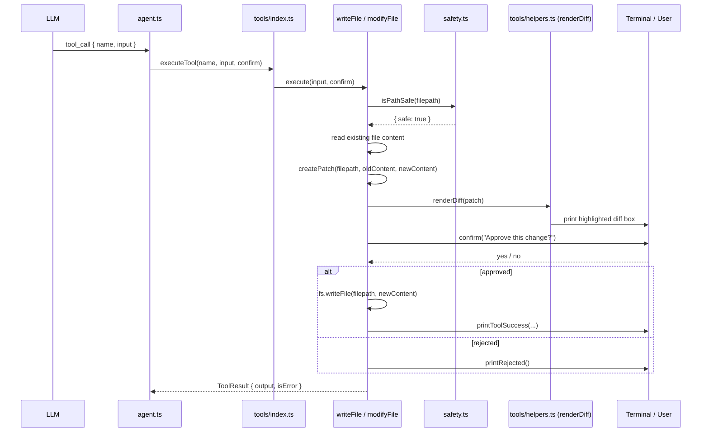

# Diff Display for File Writes (write_file / modify_file)

> Before any destructive file operation CLIC renders a full, background-highlighted unified diff in the terminal so the user can review exactly what will change before approving or rejecting the write.

## Table of Contents

- [Overview](#overview)
- [Architecture](#architecture)
  - [Files involved](#files-involved)
  - [Architecture flow diagram](#architecture-flow-diagram)
  - [Data flow](#data-flow)
  - [Key types / interfaces](#key-types--interfaces)
- [Core code breakdown](#core-code-breakdown)
- [Workflow](#workflow)
- [Configuration & flags](#configuration--flags)
- [Edge cases & safety](#edge-cases--safety)
- [Example usage](#example-usage)
- [Related features](#related-features)

---

## Overview

Both `write_file` and `modify_file` are destructive — they overwrite bytes on disk. To prevent accidental data loss, CLIC always shows a diff of what will change before asking the user to confirm. The diff is rendered in the terminal using a Claude Code CLI-inspired style: full-width background highlights (dark green for additions, dark red for deletions), a line-number gutter, and cyan hunk dividers — all inside a box that adapts to the current terminal width. The feature is implemented in the shared helper `renderDiff()` in `src/tools/helpers.ts` and called by both tool modules before their `confirm()` prompt.

---

## Architecture

### Files involved

| File | Role in this feature |
|---|---|
| `src/tools/helpers.ts` | Houses `renderDiff(patch)` — the entire visual diff engine |
| `src/tools/modifyFile.ts` | Calls `createPatch()` then `renderDiff()`, then `confirm()` |
| `src/tools/writeFile.ts` | Same pattern: reads old content (if file exists), calls `createPatch()` then `renderDiff()`, then `confirm()` |
| `src/tools/index.ts` | Tool registry — routes `write_file` / `modify_file` LLM calls to the correct module |
| `src/safety.ts` | `isPathSafe()` — checked before the diff is shown; blocks protected paths before any preview |
| `src/ui.ts` | Provides `printToolHeader`, `printToolSuccess`, `printToolError`, `printToolBlocked`, `printRejected`, `printSeparator` — the surrounding chrome that frames the diff output |
| `diff` (npm) | `createPatch()` — generates the raw unified-diff string consumed by `renderDiff()` |

### Architecture flow diagram



### Data flow

1. The LLM emits a `tool_call` for `write_file` or `modify_file` with `filepath`, and either `content` (write) or `find`+`replace` (modify).
2. `agent.ts` calls `executeTool(name, input, confirmFn)` via the tool registry.
3. The tool module resolves the filepath with `resolvePath()` (handles `~` expansion).
4. `isPathSafe(filepath)` is checked — if blocked, the function returns early with an error; no diff is shown.
5. The existing file content is read from disk (`fs.readFile`). For `write_file` on a new file, `oldContent` is an empty string.
6. For `modify_file`, the patched string is constructed by splicing `input.replace` over the `input.find` substring.
7. `createPatch(filepath, oldContent, newContent)` (from the `diff` npm package) produces a standard unified-diff string.
8. `renderDiff(patch)` is called — it reads `process.stdout.columns` at that instant, builds a full-width highlighted box, and prints it to stdout.
9. `confirm("Approve this change?")` is awaited. In `--yolo` mode the `confirmFn` auto-approves; otherwise it prompts the user interactively.
10. On approval, `fs.writeFile` commits the change. On rejection, `printRejected()` is displayed and a `ToolResult { isError: true }` is returned.

### Key types / interfaces

```typescript
// src/tools/types.ts
type ConfirmFn = (message: string) => Promise<boolean>;
// Passed from agent.ts into every tool execute(); controls whether the user
// is actually prompted (normal mode) or auto-approved (--yolo mode).

interface ToolResult {
  output: string;   // Human-readable result string returned to the LLM as tool output
  isError: boolean; // When true, the agent loop surfaces the message as a tool error
}

interface ToolDefinition {
  name: string;
  description: string;
  parameters: object; // JSON Schema; sent verbatim to the LLM as the tool's parameter spec
}
```

---

## Core code breakdown

### `renderDiff` — `src/tools/helpers.ts:15-115`

```typescript
export function renderDiff(patch: string): void {
  const termWidth = process.stdout.columns || 100;
  const fillWidth = termWidth - 2;

  // colour tokens
  const addBg     = chalk.bgHex('#0d2b0d');
  const addFg     = chalk.hex('#4ade80').bold;
  const addGutter = chalk.bgHex('#14521e').hex('#4ade80').bold;
  const delBg     = chalk.bgHex('#2b0d0d');
  const delFg     = chalk.hex('#f87171').bold;
  const delGutter = chalk.bgHex('#521414').hex('#f87171').bold;
  const ctxFg     = chalk.dim;
  const ctxGutter = chalk.dim;
  const hunkColor = chalk.hex('#38bdf8');

  const borderTop    = chalk.dim(`  ╭${'─'.repeat(fillWidth - 2)}╮`);
  const borderBottom = chalk.dim(`  ╰${'─'.repeat(fillWidth - 2)}╯`);

  const hunkDivider = (hunk: string) => {
    const inner = ` ${hunkColor(hunk)} `;
    const pad   = Math.max(0, fillWidth - 4 - visLen(inner));
    return chalk.dim('  ├') + inner + chalk.dim('─'.repeat(pad)) + chalk.dim('┤');
  };

  const renderLine = (
    sigil:    string,
    lineNum:  string,
    code:     string,
    gutterFn: (s: string) => string,
    fgFn:     (s: string) => string,
    bgFn:     (s: string) => string,
  ) => {
    const gutterCell = gutterFn(` ${sigil} ${lineNum.padStart(4)} `);
    const codeFilled = bgFn(
      fgFn(code) + ' '.repeat(Math.max(0, fillWidth - 9 - 4 - visLen(code))),
    );
    console.log(`  ${gutterCell}  ${codeFilled}`);
  };

  const lines  = patch.split('\n');
  let oldLine  = 0;
  let newLine  = 0;
  let inHeader = true;
  let hasDiff  = false;

  console.log();
  console.log(borderTop);

  const label    = chalk.bold.white('  Changes');
  const labelPad = ' '.repeat(Math.max(0, fillWidth - 4 - visLen(label)));
  console.log(`  ${chalk.dim('│')} ${label}${labelPad} ${chalk.dim('│')}`);

  for (const raw of lines) {
    if (raw.startsWith('---') || raw.startsWith('+++') || raw.startsWith('Index:') || raw.startsWith('=====')) {
      inHeader = false;
      continue;
    }

    if (raw.startsWith('@@')) {
      inHeader = false;
      hasDiff  = true;
      const m = raw.match(/@@ -(\d+)(?:,\d+)? \+(\d+)(?:,\d+)? @@/);
      if (m) { oldLine = parseInt(m[1], 10); newLine = parseInt(m[2], 10); }
      console.log(hunkDivider(raw));
      continue;
    }

    if (inHeader || raw === '') continue;

    const sigil = raw[0];
    const code  = raw.slice(1);

    if (sigil === '+') {
      renderLine('+', String(newLine), code, addGutter, addFg, addBg);
      newLine++;
    } else if (sigil === '-') {
      renderLine('−', String(oldLine), code, delGutter, delFg, delBg);
      oldLine++;
    } else {
      renderLine(' ', String(newLine), code, ctxGutter, ctxFg, ctxFg);
      oldLine++;
      newLine++;
    }
  }

  if (!hasDiff) {
    const msg = chalk.dim('  (no changes)');
    const pad = ' '.repeat(Math.max(0, fillWidth - 4 - visLen(msg)));
    console.log(`  ${chalk.dim('│')} ${msg}${pad} ${chalk.dim('│')}`);
  }

  console.log(borderBottom);
  console.log();
}
```

#### Line-by-line annotation

| Lines | What it does | Why it matters |
|---|---|---|
| `termWidth / fillWidth` | Reads `process.stdout.columns` at call time and derives `fillWidth` | Makes every box border, background fill, and padding fully responsive to the current terminal width |
| Colour token block | Defines separate chalk functions for add/delete/context backgrounds, foregrounds, and gutters using hex values | Separating colour roles from rendering logic keeps the visual system easy to adjust without touching layout math |
| `borderTop / borderBottom` | Builds `╭─…─╮` / `╰─…─╯` strings of exactly `fillWidth - 2` dashes | Frames the entire diff inside a box consistent with CLIC's `ui.ts` box-drawing system |
| `hunkDivider()` | Renders `@@ -a,b +c,d @@` as a `├──` separator with the hunk text in cyan | Replaces the raw unified-diff hunk header with a visually separated section break, making multi-hunk diffs scannable |
| `renderLine()` | Computes `gutterCell` (sigil + right-aligned line number) and `codeFilled` (text + trailing spaces padded to `fillWidth`) | The trailing space-fill is what extends the background colour all the way to the terminal edge — without it the bg highlight would end at the last code character |
| Header-skip block (`---` / `+++` / `Index:`) | Skips unified-diff file header lines | The filepath is already shown in `printToolHeader` above the diff; repeating it would be noisy |
| `@@` branch | Parses `oldLine` / `newLine` starting positions and sets `hasDiff = true` | Seeds the per-line counters so the gutter shows accurate source line numbers |
| `+` / `-` / context branches | Dispatches each line to `renderLine` with the appropriate colour functions and increments the correct line counter | Correct counter management ensures line numbers in the gutter always match the actual file, not a monotonic index |
| `!hasDiff` guard | Prints `(no changes)` inside the box if the patch contained no hunks | Prevents a visually broken empty box when `createPatch` produces a no-op diff |

**What makes this the core:** `renderDiff` is the only place where the raw unified-diff string is translated into something the user can actually read and reason about. Without it, both `write_file` and `modify_file` would show the user nothing before asking for confirmation, making the confirm prompt meaningless. Every visual decision — the background-fill width, the gutter format, the colour scheme, the box framing — lives here, so changing the diff presentation means changing only this function.

---

### `execute` (modify_file) — `src/tools/modifyFile.ts:30-90`

The second critical function — it constructs the patched content and decides when to call `renderDiff`.

| Lines | What it does | Why it matters |
|---|---|---|
| `resolvePath(input.filepath)` | Normalises `~` and relative paths to absolute | Ensures `isPathSafe` and `fs` calls all operate on the same canonical path |
| `isPathSafe(filepath)` | Guards against writes to `/etc/passwd`, `/boot/`, `/dev/`, etc. | Short-circuits the entire flow before any file read or diff display; prevents the diff from being shown for a write that would be blocked anyway |
| `content.includes(input.find)` check | Verifies the exact find-text exists before computing any patch | `createPatch` on non-matching content would produce a misleading diff; this error is returned to the LLM so it can re-read the file |
| `patched = content.substring(0, idx) + input.replace + content.substring(idx + input.find.length)` | Builds the new file content by splicing the replacement in at the exact match position | A single `indexOf`-based splice (not a global replace) ensures only the first occurrence is changed — deterministic and predictable |
| `createPatch(filepath, content, patched)` | Generates a unified diff between old and new content | This is the string handed to `renderDiff`; the filepath argument appears in the `---`/`+++` header lines (which `renderDiff` skips) |
| `renderDiff(patch)` | Displays the visual diff | The only moment the user sees what will change |
| `confirm(...)` | Awaits user approval | In `--yolo` mode this resolves immediately to `true` |
| `fs.writeFile(filepath + '.bak', content)` then `fs.writeFile(filepath, patched)` | Writes a `.bak` backup before overwriting | Provides a manual recovery path if the user later regrets the change |

---

## Workflow

### Trigger
The LLM emits a `tool_call` whose `name` is `write_file` or `modify_file`. `agent.ts` receives this in its ReAct loop and calls `executeTool()` via the tool registry.

### Inside the tool
1. **Path resolution & safety check** — `resolvePath()` canonicalises the path, then `isPathSafe()` rejects any write targeting a protected system path. If blocked, the function returns immediately and no diff is ever shown.
2. **Content preparation**
   - `write_file`: reads the existing file if it exists (empty string otherwise), uses the LLM-provided content as the new version, and logs a warning if the file will be overwritten.
   - `modify_file`: reads the file, verifies the exact `find` text is present, then computes `patched` by splicing in `replace`.
3. **Diff generation** — `createPatch(filepath, oldContent, newContent)` (from the `diff` npm package) returns a unified-diff string.
4. **Diff rendering** — `renderDiff(patch)` prints the formatted diff box to stdout. The user sees green-highlighted additions, red-highlighted deletions, dimmed context lines, a line-number gutter, and cyan hunk separators — all within a full-width box.
5. **Confirmation** — `confirm("Approve this change?")` is awaited. The `ConfirmFn` is supplied by `agent.ts`: in normal mode it interactively prompts the user; in `--yolo` mode it auto-approves.
6. **Write or reject**
   - Approved: `modify_file` writes a `.bak` backup, then writes the patched file. `write_file` writes the file directly (no backup). `printToolSuccess` is displayed.
   - Rejected: `printRejected()` is shown and `ToolResult { isError: true }` is returned to the agent loop, which forwards the rejection back to the LLM.

---

## Configuration & flags

| Flag / env var | Default | Effect on this feature |
|---|---|---|
| `--yolo` CLI flag | `false` | When set, the `ConfirmFn` in `agent.ts` auto-approves every confirm prompt — including the diff confirmation — without user interaction |
| `process.stdout.columns` | `100` (fallback) | Controls the terminal width used to size the diff box and background fill. Read at call time so it reflects the current terminal even if the window was resized mid-session |

There are no env vars that disable or alter the diff display itself. The diff is always shown before any confirmed write.

---

## Edge cases & safety

| Scenario | How it is handled |
|---|---|
| **Protected path** (`/etc/passwd`, `/boot/`, etc.) | `isPathSafe()` returns `{ safe: false }` → `printToolBlocked()` is shown and the function returns with `isError: true` before the file is read or the diff displayed |
| **File not found** (modify_file) | `fs.readFile` throws → `printToolError("File not found")` and early return; no diff shown |
| **find text not in file** (modify_file) | `content.includes(input.find)` is `false` → error returned to LLM with a prompt to re-read the file first |
| **New file creation** (write_file) | `oldContent` is set to `""` → `createPatch` produces an all-addition diff, showing all lines as green |
| **File exists and will be overwritten** (write_file) | A yellow `⚠️ WARNING: File already exists — will be OVERWRITTEN` line is printed above the diff |
| **No changes** (identical content) | `createPatch` emits no `@@` hunks → `hasDiff` stays `false` → `(no changes)` is rendered inside the box |
| **User rejects** | `confirm()` resolves to `false` → `printRejected()` shown, `ToolResult { isError: true }` returned; no bytes written |
| **`--yolo` mode** | `confirm()` always resolves `true`; the diff is still rendered (the user can still see it), only the interactive pause is skipped |
| **Write fails** (permissions, disk full) | `fs.writeFile` throws → caught, `printToolError(msg)` shown, `isError: true` returned |
| **Narrow terminal** (`columns < 20`) | `Math.max(0, ...)` guards prevent negative repeat counts; output will be cramped but will not crash |

---

## Example usage

### modify_file — patch a config value

```
  ╭──────────────────────────────────────────────────────────────────────────────╮
  │ 🔧 MODIFY FILE                                                               │
  ├──────────────────────────────────────────────────────────────────────────────┤
  │ 📝 Modifying /home/user/project/config.json                                  │
  ╰──────────────────────────────────────────────────────────────────────────────╯

  ╭──────────────────────────────────────────────────────────────────────────────╮
  │   Changes                                                                    │
  ├── @@ -3,7 +3,7 @@ ─────────────────────────────────────────────────────────┤
    3    "name": "my-app",                                                        
  − 4    "port": 3000,                                                            
  + 4    "port": 9000,                                                            
    5    "debug": false                                                            
  ╰──────────────────────────────────────────────────────────────────────────────╯

? Approve this change to 'config.json'? › yes
  ✅ File modified: /home/user/project/config.json
```

*(Red background on the deletion line, green background on the addition line, dimmed context — all spanning the full terminal width.)*

### write_file — create a new file

```
  ╭──────────────────────────────────────────────────────────────────────────────╮
  │ ✏️  WRITE FILE                                                               │
  ├──────────────────────────────────────────────────────────────────────────────┤
  │ 📝 Writing to /home/user/project/hello.sh                                    │
  ╰──────────────────────────────────────────────────────────────────────────────╯

  ╭──────────────────────────────────────────────────────────────────────────────╮
  │   Changes                                                                    │
  ├── @@ -0,0 +1,3 @@ ──────────────────────────────────────────────────────────┤
  + 1  #!/usr/bin/env bash                                                        
  + 2  echo "Hello, world!"                                                       
  + 3                                                                             
  ╰──────────────────────────────────────────────────────────────────────────────╯

? Approve write to 'hello.sh'? › yes
  ✅ File written: /home/user/project/hello.sh (3 lines)
```

---

## Related features

- **`read_file` tool** — The LLM is instructed (and sometimes forced by `modify_file`'s error message) to read a file before modifying it, so the exact find-text is known.
- **`append_file` tool** (`src/tools/appendFile.ts`) — Also writes to disk but appends rather than overwrites; currently does not call `renderDiff` (no preview shown).
- **Safety system** (`src/safety.ts`) — `isPathSafe()` is the first gate; if it fires, `renderDiff` is never reached.
- **`--yolo` flag** (`src/index.ts`) — Controls the `ConfirmFn` passed through `agent.ts` → `executeTool`; determines whether the confirmation step after the diff is interactive or auto-approved.
- **`printToolHeader` / `printToolSuccess` / `printToolError`** (`src/ui.ts`) — Provide the tool chrome (the named box above the diff, the success/error lines below it) that frames the diff output.
- **`diff` npm package** — `createPatch()` generates the raw unified-diff string that `renderDiff` consumes; the quality of the diff (context lines, hunk positions) is determined by this library.
