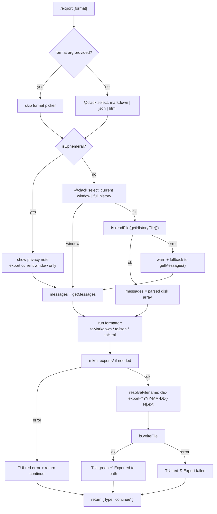

# Conversation Export

> Serialises the active CLIC session to a file in three formats (Markdown, JSON, HTML) via the `/export` slash command, enabling users to archive, share, or process conversations outside the CLI.

## Table of Contents

- [Overview](#overview)
- [Architecture](#architecture)
  - [Files involved](#files-involved)
  - [Architecture flow diagram](#architecture-flow-diagram)
  - [Data flow](#data-flow)
  - [Key types / interfaces](#key-types--interfaces)
- [Core code breakdown](#core-code-breakdown)
- [Workflow](#workflow)
- [Configuration & flags](#configuration--flags)
- [Edge cases & safety](#edge-cases--safety)
- [Example usage](#example-usage)
- [Related features](#related-features)

## Overview

CLIC stores conversations in memory and on disk, but had no way to produce a portable, human-readable snapshot. The `/export` command fills that gap: it reads either the current in-memory message window or the full on-disk history, runs it through one of three pure formatter functions, and writes the result to an `exports/` folder in the current working directory. The command integrates with the existing `@clack/prompts` picker pattern and respects privacy mode (ephemeral sessions cannot export the full disk history).

## Architecture

### Files involved

| File | Role in this feature |
|---|---|
| `src/commands/export.ts` | Core implementation — formatters, `resolveFilename`, and the `SlashCommand` |
| `src/commands/index.ts` | Registers `exportCmd` in the command registry |
| `src/commands/types.ts` | Defines `SlashCommand`, `CommandContext`, `CommandAction` |
| `src/memory.ts` | Provides `getMessages()` (in-memory window), `getHistoryFile()` (active session file path), and the `ChatMessage` / `ToolCall` types |
| `src/privacy.ts` | Provides `isEphemeral()` — hides the full-history option in ephemeral sessions |
| `test/export.test.ts` | 23-assertion unit test suite for all three formatters |

### Architecture flow diagram



### Data flow

1. User types `/export` (optionally with a format argument like `/export markdown`).
2. `executeCommand` in `src/commands/index.ts` routes to `export.command.execute(ctx, args)`.
3. **Format resolution:** if `args` is a valid format string (`markdown`, `json`, `html`), it is used directly; otherwise a `@clack/prompts select` picker is presented.
4. **Scope resolution:** `isEphemeral()` is checked. In privacy mode, scope is forced to `window`. Otherwise a second picker offers `current window` or `full history`.
   - `window` → `getMessages()` returns the in-memory `ChatMessage[]`
   - `full` → `fs.readFile(getHistoryFile())` reads the active session's JSON file and `JSON.parse`s it; on any error, falls back to `getMessages()` with a warning
5. The chosen messages array is passed to the selected formatter (`toMarkdown`, `toJson`, or `toHtml`), along with `ctx.sessionName ?? 'default'` and `ctx.model`.
6. `fs.mkdir('exports/', { recursive: true })` ensures the output directory exists.
7. `resolveFilename` computes the output path: `exports/clic-export-YYYY-MM-DD.<ext>`, appending `-2`, `-3`, … if the file already exists.
8. `fs.writeFile` writes the formatted string to disk.
9. Success or failure is printed to the terminal; `{ type: 'continue' }` is returned so the REPL stays open.

### Key types / interfaces

```typescript
// From src/memory.ts
export interface ToolCall {
  id: string;
  type: 'function';
  function: { name: string; arguments: string };  // arguments is a JSON string
}

export type ChatMessage =
  | { role: 'system'; content: string }
  | { role: 'user'; content: string }
  | { role: 'assistant'; content?: string; tool_calls?: ToolCall[] }
  | { role: 'tool'; content: string; tool_call_id: string };

// From src/commands/types.ts
export interface CommandContext {
  model: string;          // used in formatter headers
  sessionName?: string;   // used in formatter headers and as filename hint
  // ... other fields not used by /export
}

export type CommandAction =
  | { type: 'continue' }  // /export always returns this
  | { type: 'exit' }
  | { type: 'retry' }
  | { type: 'update'; updates: Partial<CommandContext> };

export interface SlashCommand {
  name: string;
  aliases?: string[];
  description: string;
  usage?: string;
  execute: (ctx: CommandContext, args?: string) => Promise<CommandAction>;
}
```

## Core code breakdown

### `execute` — `src/commands/export.ts:169-255`

```typescript
export const command: SlashCommand = {
  name: '/export',
  description: 'Export conversation to a file',
  usage: '/export [markdown|json|html]',
  execute: async (ctx, args) => {
    // Step 1: resolve format
    let format: Format;
    if (args && (VALID_FORMATS as readonly string[]).includes(args)) {
      format = args as Format;
    } else {
      const picked = await select({
        message: 'Export format:',
        options: [
          { value: 'markdown', label: 'Markdown', hint: 'Human-readable .md file' },
          { value: 'json',     label: 'JSON',     hint: 'Raw message array with metadata' },
          { value: 'html',     label: 'HTML',     hint: 'Self-contained styled page' },
        ],
      });
      if (isCancel(picked)) {
        console.log(chalk.dim('  Export cancelled.'));
        console.log();
        return { type: 'continue' };
      }
      format = picked as Format;
    }

    // Step 2: resolve scope
    let messages: ChatMessage[];
    const ephemeral = isEphemeral();

    if (ephemeral) {
      console.log(chalk.dim('  Running in privacy mode — exporting current window only.'));
      messages = getMessages();
    } else {
      const scopeOptions = [
        { value: 'window', label: 'Current window', hint: `${getMessages().length} messages in memory` },
        { value: 'full',   label: 'Full history',   hint: 'Load complete history from disk' },
      ];
      const pickedScope = await select({ message: 'Export scope:', options: scopeOptions });
      if (isCancel(pickedScope)) {
        console.log(chalk.dim('  Export cancelled.'));
        console.log();
        return { type: 'continue' };
      }

      if (pickedScope === 'full') {
        try {
          const raw = await fs.readFile(getHistoryFile(), 'utf-8');
          messages = JSON.parse(raw) as ChatMessage[];
        } catch (err) {
          console.log(chalk.yellow(`  ⚠️  Could not read history file — falling back to current window. (${(err as Error).message})`));
          messages = getMessages();
        }
      } else {
        messages = getMessages();
      }
    }

    // Step 3: build content
    const session = ctx.sessionName ?? 'default';
    const extMap: Record<Format, string> = { markdown: 'md', json: 'json', html: 'html' };
    const dateStr = new Date().toISOString().slice(0, 10);
    const base = `clic-export-${dateStr}`;
    const exportDir = path.join(process.cwd(), 'exports');
    try {
      await fs.mkdir(exportDir, { recursive: true });
    } catch (err) {
      console.log(chalk.red(`  ✗ Could not create exports/ directory: ${(err as Error).message}`));
      console.log();
      return { type: 'continue' };
    }
    const filePath = await resolveFilename(exportDir, base, extMap[format]);

    let content: string;
    if (format === 'markdown')  content = toMarkdown(messages, session, ctx.model);
    else if (format === 'json') content = toJson(messages, session, ctx.model);
    else                        content = toHtml(messages, session, ctx.model);

    try {
      await fs.writeFile(filePath, content, 'utf-8');
      console.log(chalk.green(`  ✅ Exported to ${filePath}`));
    } catch (err) {
      console.log(chalk.red(`  ✗ Export failed: ${(err as Error).message}`));
    }

    console.log();
    return { type: 'continue' };
  },
};
```

| Lines | What it does | Why it matters |
|---|---|---|
| format check (args guard) | Validates `args` against `VALID_FORMATS` before using it as a type | Prevents invalid format strings from reaching the formatter dispatch |
| format picker | `@clack/prompts select` with three options | Consistent UX with `/model` and `/role` pickers |
| `isCancel` after each picker | Detects ESC/Ctrl+C from `@clack` and returns `continue` | Prevents `null` leaking into downstream format/scope logic |
| `isEphemeral()` check | In privacy mode, skips the scope picker entirely | Ephemeral sessions have no history file to read — exposing the option would silently fail or mislead |
| full history branch | `fs.readFile(getHistoryFile())` read-only load | Does not call `setHistoryFile` or mutate the in-memory array — export is non-destructive |
| `mkdir` with try/catch | Creates `exports/` if it doesn't exist; hard-fails with a message if the directory cannot be created | Permission errors should be surfaced, not silently swallowed |
| `resolveFilename` | Finds the first available filename with collision avoidance | Prevents overwriting a previous export on the same day |
| `writeFile` in try/catch | Catches disk-full, permission, and I/O errors | REPL must not crash on export failure |
| always returns `{ type: 'continue' }` | Every path — success, error, cancel — returns `continue` | Required by `CommandAction` contract; keeps the REPL running |

**What makes this the core:** `execute` is the only function that coordinates all moving parts — format selection, scope selection, privacy enforcement, disk I/O, and error recovery. The formatters are pure functions; without `execute` orchestrating them with user input and file-system operations, the feature simply does not exist as a command.

---

### `toMarkdown` — `src/commands/export.ts:18-62`

```typescript
export function toMarkdown(messages: ChatMessage[], session: string, model: string): string {
  const now = new Date().toISOString();
  const lines: string[] = [
    '# CLIC Conversation Export',
    '',
    `- **Session:** ${session}`,
    `- **Model:** ${model}`,
    `- **Exported:** ${now}`,
    `- **Messages:** ${messages.length}`,
    '',
    '---',
    '',
  ];

  for (const msg of messages) {
    if (msg.role === 'system' || msg.role === 'tool') continue;

    if (msg.role === 'user') {
      lines.push('## You', '', msg.content, '', '---', '');
    } else if (msg.role === 'assistant') {
      lines.push('## Assistant', '');
      if (msg.content) lines.push(msg.content, '');
      if (msg.tool_calls) {
        for (const tc of msg.tool_calls) {
          let args = tc.function.arguments;
          try { args = JSON.stringify(JSON.parse(args), null, 2); } catch { /* use raw */ }
          lines.push(
            '<details>',
            `<summary>🔧 Tool: ${tc.function.name}</summary>`,
            '',
            '```json',
            args,
            '```',
            '',
            '</details>',
            '',
          );
        }
      }
      lines.push('---', '');
    }
  }

  return lines.join('\n');
}
```

| Lines | What it does | Why it matters |
|---|---|---|
| Header block | Builds metadata lines: session, model, ISO timestamp, message count | Gives the exported file provenance without opening it in a chat client |
| `role === 'system' \|\| role === 'tool'` skip | Filters out system prompt and raw tool responses | These are implementation noise; a human reader only cares about the conversation turns |
| `## You` / `## Assistant` headings | Renders role as an H2 section | Makes the markdown scannable in any Markdown viewer |
| `<details>` block per tool call | Collapses tool calls behind a toggle | Keeps the readable flow intact while preserving full tool call data for inspection |
| `JSON.parse` + `JSON.stringify` with try/catch | Pretty-prints tool arguments; falls back to raw string on malformed JSON | Tool argument strings are model-generated and may be malformed; the fallback prevents data loss |

## Workflow

**Trigger:** The user types `/export`, `/export markdown`, `/export json`, or `/export html` at the REPL prompt. `isSlashedCommand()` matches the command name and `executeCommand()` calls `export.command.execute(ctx, args)`.

**Format selection:** If a valid format is passed as an argument, it is used directly, skipping the first picker. Otherwise a three-option `@clack/prompts select` is presented. Cancellation at this step prints "Export cancelled." and returns immediately.

**Scope selection:** If the session is ephemeral (`--no-history` mode), the scope is locked to the current window and a note is shown. Otherwise a second picker offers two options: `current window` (calls `getMessages()` for the live in-memory array, which may be a trimmed window of the last N messages) or `full history` (reads `getHistoryFile()` from disk as a read-only load, falling back to the window with a warning on any I/O error).

**Formatting:** The chosen `ChatMessage[]` is passed to the pure formatter matching the selected format. All three formatters skip `system` and `tool` role messages. `toMarkdown` and `toHtml` collapse tool calls into `<details>` toggles. `toJson` wraps the raw array in an envelope object with `exportedAt`, `session`, and `model` metadata.

**File writing:** The `exports/` directory is created (with `{ recursive: true }` so it's idempotent). `resolveFilename` picks the first available `clic-export-YYYY-MM-DD[-N].<ext>` path. The file is written and the full path is printed in green. On any error (mkdir failure, writeFile failure), a red error message is printed and the REPL continues.

## Configuration & flags

| Flag / option | Effect | Where read |
|---|---|---|
| `--no-history` | Locks export scope to current window; hides the full-history option | `src/privacy.ts` via `isEphemeral()` |
| `--session <name>` | Sets the active session; `getHistoryFile()` resolves to `sessions/<name>/chat_history.json` | `src/memory.ts` via `setHistoryFile()` called at startup |
| `args` to `/export` | Skips the format picker if a valid format is provided | Parsed in `execute()` directly |

No environment variables affect this feature.

## Edge cases & safety

| Scenario | Handling |
|---|---|
| Empty message array | All three formatters produce a valid document (header-only for markdown/html, `{ messages: [] }` for json) |
| Tool call with malformed JSON arguments | `try/catch` around `JSON.parse(args)` falls back to the raw argument string in both `toMarkdown` and `toHtml` |
| `getHistoryFile()` path does not exist (new or ephemeral session) | `fs.readFile` throws, caught by the full-history try/catch; falls back to in-memory window with a warning |
| `exports/` directory not writable | `fs.mkdir` throws, caught, prints a red error, returns `{ type: 'continue' }` — REPL is unaffected |
| `fs.writeFile` failure (disk full, permission) | Caught by the inner try/catch, prints a red error, REPL continues |
| ESC / Ctrl+C in either picker | `isCancel(picked)` / `isCancel(pickedScope)` detected, prints "Export cancelled.", returns `{ type: 'continue' }` |
| Filename collision (same date, multiple exports) | `resolveFilename` tries `clic-export-YYYY-MM-DD.ext`, then `-2`, `-3`, … until it finds a free slot |
| Privacy mode + `/export` | Scope picker is skipped; only the current in-memory window is available for export |
| `--no-history` combined with `--session` | Privacy check (`isEphemeral()`) takes precedence — session file is not read |

No user-provided file paths are accepted; the output path is computed entirely from `process.cwd()`, the date, and a counter — `isPathSafe()` is not needed.

## Example usage

```
> /export

◆  Export format:
│  ● Markdown  Human-readable .md file
│  ○ JSON      Raw message array with metadata
│  ○ HTML      Self-contained styled page
└

◆  Export scope:
│  ● Current window  12 messages in memory
│  ○ Full history    Load complete history from disk
└

  ✅ Exported to /Users/you/myproject/exports/clic-export-2026-08-25.md

> /export json
◆  Export scope:
│  ● Current window  12 messages in memory
│  ○ Full history    Load complete history from disk
└

  ✅ Exported to /Users/you/myproject/exports/clic-export-2026-08-25.json

> /export html
◆  Export scope:
...
  ✅ Exported to /Users/you/myproject/exports/clic-export-2026-08-25.html

# Second html export on the same day — collision avoidance kicks in
> /export html
...
  ✅ Exported to /Users/you/myproject/exports/clic-export-2026-08-25-2.html
```

**In privacy mode:**

```
> pnpm dev -- --no-history
  🔒 Privacy mode — nothing will be written to disk.

> /export markdown
  Running in privacy mode — exporting current window only.
◆  Export format:
│  ● Markdown ...
└
  ✅ Exported to /Users/you/myproject/exports/clic-export-2026-08-25.md
```

## Related features

- **Named Sessions** (`src/session.ts`, `src/commands/session.ts`) — `/export full history` reads `getHistoryFile()`, which is set by the session system to `sessions/<name>/chat_history.json`; switching sessions changes what "full history" exports.
- **Privacy / `--no-history`** (`src/privacy.ts`, `src/commands/privacy.ts`) — `isEphemeral()` controls whether the full-history scope option is shown; the `/privacy` command can toggle this mid-session, affecting subsequent `/export` calls.
- **Memory** (`src/memory.ts`) — provides both `getMessages()` (window export) and `getHistoryFile()` (full-history export), and defines the `ChatMessage` and `ToolCall` types that all three formatters consume.
- **Command Registry** (`src/commands/index.ts`) — registers `exportCmd` so it is discoverable via `/help` and tab-completion.
