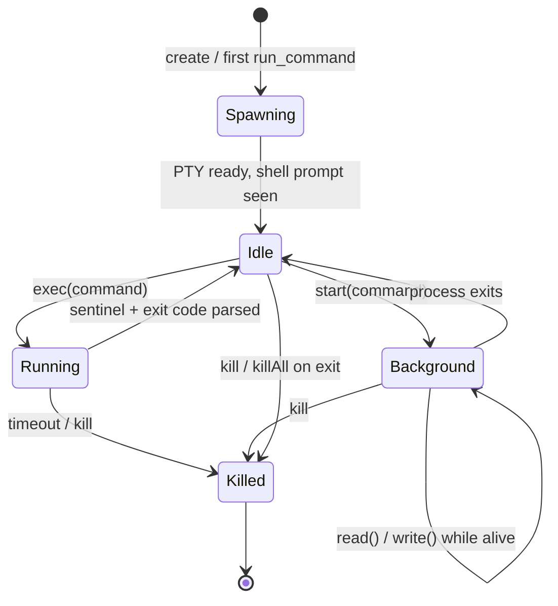
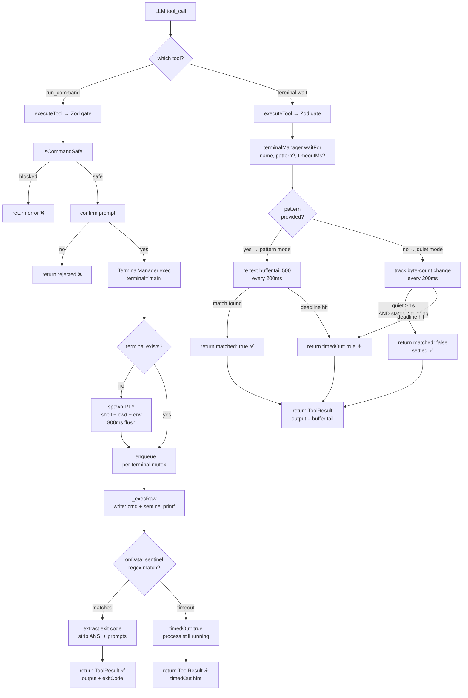
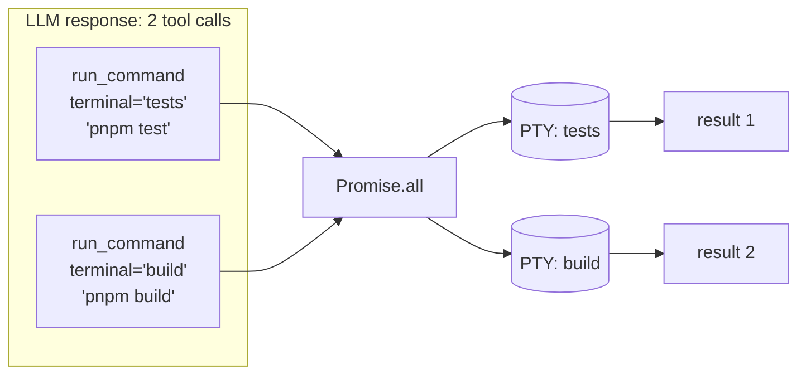
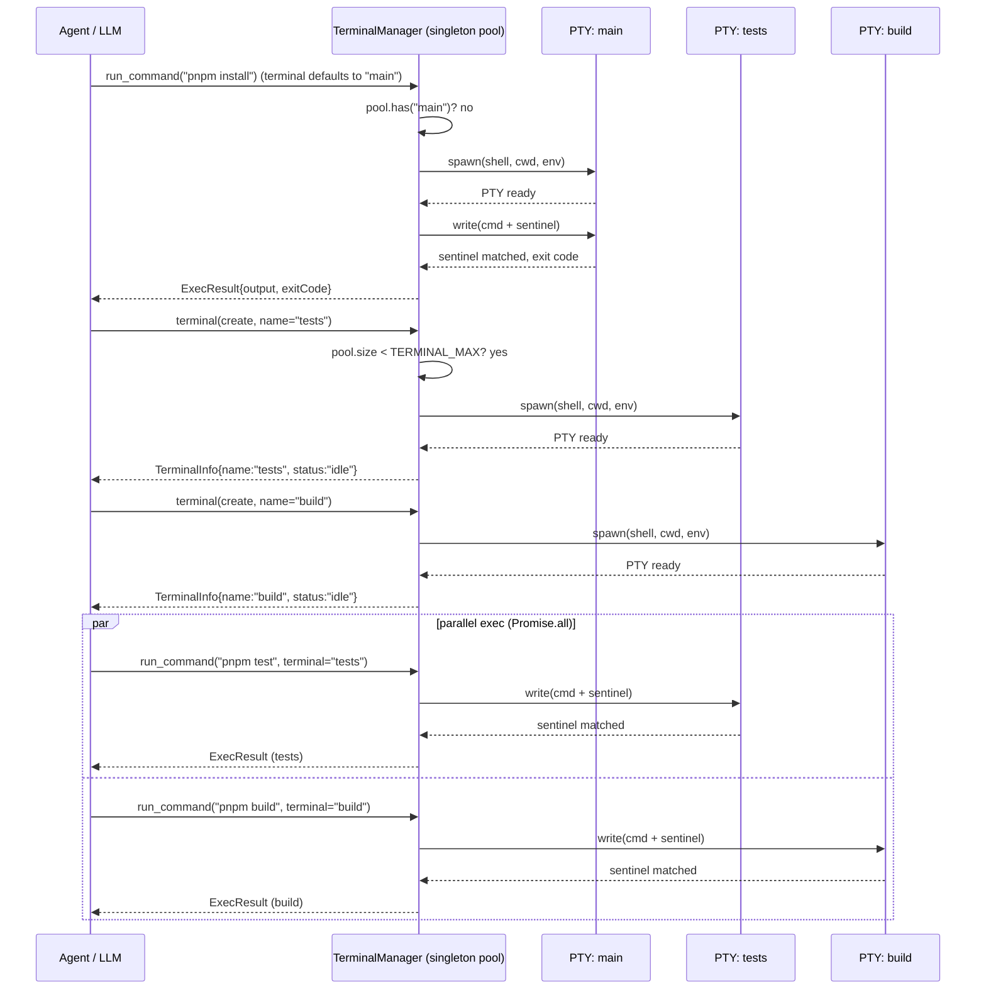
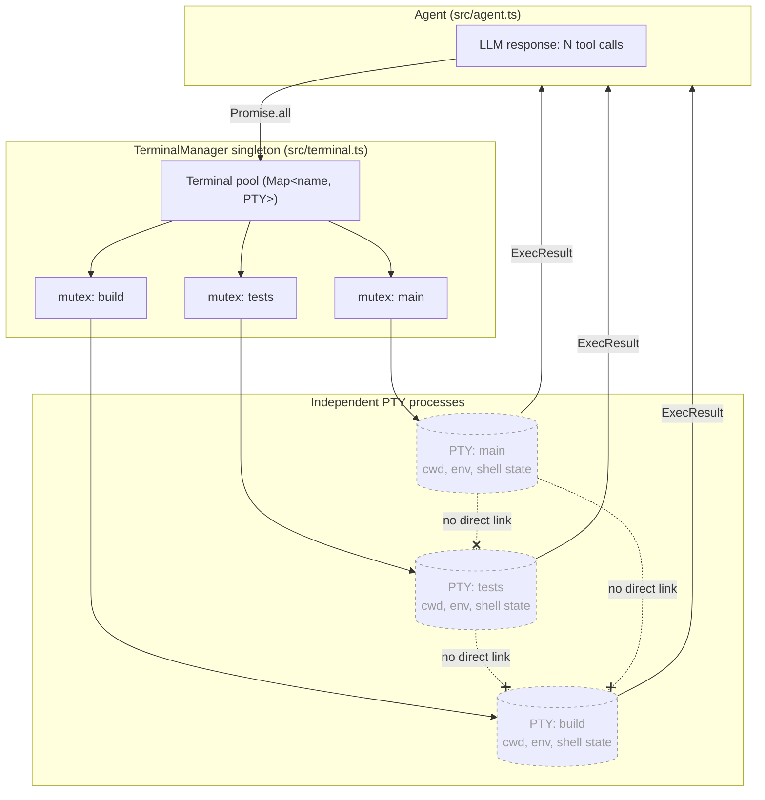

# Multi-Terminal Parallel Processing (node-pty)

> **Status: ✅ IMPLEMENTED.** The design and implementation are complete. `src/terminal.ts`, `src/tools/terminal.ts`, and the updated `src/tools/runCommand.ts` are all landed. This document is the living reference for the feature.

## Table of Contents

- [Overview](#overview)
  - [What is a PTY?](#what-is-a-pty)
- [Motivation](#motivation)
- [Design decisions (locked)](#design-decisions-locked)
- [Architecture](#architecture)
  - [Files involved](#files-involved)
  - [Terminal lifecycle diagram](#terminal-lifecycle-diagram)
  - [Command execution flow](#command-execution-flow)
  - [Parallel execution across terminals](#parallel-execution-across-terminals)
  - [Terminal pool creation & parallel exec (sequence)](#terminal-pool-creation--parallel-exec-sequence)
  - [Terminal isolation model (no inter-terminal communication)](#terminal-isolation-model-no-inter-terminal-communication)
  - [Key types / interfaces](#key-types--interfaces)
- [The sentinel completion protocol](#the-sentinel-completion-protocol)
- [Tool surface](#tool-surface)
  - [`run_command` (enhanced, persistent)](#run_command-enhanced-persistent)
  - [`terminal` (new, multiplexed)](#terminal-new-multiplexed)
- [Core code breakdown](#core-code-breakdown)
  - [`_execRaw`](#_execraw----srcterminalts-inside-terminalmanager)
  - [`waitFor`](#waitfor----srcterminalts-inside-terminalmanager)
- [Configuration & flags](#configuration--flags)
- [Safety model](#safety-model)
- [Lifecycle & teardown](#lifecycle--teardown)
- [Edge cases & risks](#edge-cases--risks)
- [Implementation plan (phased)](#implementation-plan-phased)
- [Testing strategy](#testing-strategy)
- [Rollback plan](#rollback-plan)
- [Related features](#related-features)

## Overview

### What is a PTY?

**PTY** stands for **Pseudo-Terminal** (or Pseudo-TTY). It is a software construct provided by the OS kernel that emulates a real hardware terminal — the kind of serial text terminal that was physically connected to mainframes in the 1970s. Today a PTY is a two-ended pipe with special properties:

- **Master end** — the program that *controls* the terminal (e.g. your terminal emulator, or in CLIC's case, `node-pty`). It reads output from the shell and writes input to it.
- **Slave end** — the program that *runs inside* the terminal (e.g. `bash`, `zsh`). It believes it is talking to a real screen and keyboard.

**What makes a PTY different from a plain subprocess pipe:**

| Plain subprocess (`execa`) | PTY (`node-pty`) |
|---|---|
| Shell knows it has no terminal — disables colors, prompts, interactive features | Shell thinks it has a real terminal — full color output, prompts, readline editing |
| `cd`, `export`, `source` die with the process | Shell state persists — every subsequent command runs in the same shell |
| Interactive programs (password prompts, `npm login`, REPLs) hang forever | Interactive programs work — input can be sent via `write()` |
| One command, one subprocess, then gone | One shell, many commands, shell stays alive |

**Why PTYs matter for CLIC:**

When `execa` runs `bash -c "cd /tmp"`, it spawns a fresh `bash` process, changes directory, and the process exits — the directory change is gone. With a PTY, CLIC spawns one persistent `bash` process and keeps it alive. Every subsequent command runs *inside that same shell*, so `cd`, `export`, `source .venv/bin/activate`, and even complex shell functions all stick between calls — exactly like typing commands yourself in a terminal.

PTYs also enable true parallelism: because each terminal is an independent OS-level process with its own file descriptors, two terminals can execute commands simultaneously without any coordination — they are as independent as two separate terminal windows on your desktop.

---

Today every shell command in CLIC runs through `run_command`, which calls `execa('bash', ['-c', cmd])` — a **fresh, throwaway subprocess per call**. There is no shared shell state: a `cd` in one call is gone by the next, environment exports evaporate, virtualenv activation doesn't stick, and long-running processes (dev servers, watchers, REPLs) cannot be started and later inspected.

This feature introduces a **Terminal Manager** — a singleton that owns a pool of persistent [`node-pty`](https://github.com/microsoft/node-pty) PTY shell processes. Each "terminal" is a real pseudo-terminal running an interactive shell that **retains its working directory, environment, and process state across commands**. Because each terminal is an independent PTY, multiple terminals can execute **truly in parallel** — the agent can run a test suite in one terminal while a dev server streams logs in another.

The agent reaches this through two tools:
- **`run_command`** — enhanced to run inside a persistent terminal (default `main`). Backward-compatible signature; now stateful.
- **`terminal`** — a new multiplexed tool (`action`-based, mirroring the existing `github` tool) that manages the terminal pool: create, list, read buffered output, write stdin, start background processes, wait for completion, and kill.

## Motivation

| Limitation today (`execa` per call) | With persistent terminals |
|---|---|
| `cd sub/dir` then `pwd` → back at repo root | `cwd` persists across commands |
| `export TOKEN=x` then use it → unset | Environment persists |
| `source .venv/bin/activate` → no effect on next call | Activation sticks |
| `pnpm dev` (long-running) → blocks 60s then times out | Runs in a background terminal, logs readable on demand |
| Two independent tasks → run one after another | Run concurrently in two terminals |
| Interactive prompt (`npm login`) → hangs, no way to answer | `terminal(write)` sends stdin |

Persistent shell state is the single largest capability gap between CLIC and production agentic coding tools (Claude Code, Cursor). This closes it.

## Design decisions (locked)

Two decisions were confirmed with the user before writing this plan:

1. **`run_command` becomes persistent.** It is rewired onto a default `main` terminal from the pool. This is a deliberate behavior change — state now carries between calls — because that persistence *is* the feature. The old ephemeral `execa` path is removed (kept in git history / behind the rollback plan).
2. **One multiplexed `terminal` tool** with an `action` field (`create | list | read | write | start | kill`), rather than 5–6 separate tools. This keeps the tool-definitions payload small and follows the precedent set by the existing `github` tool.

## Architecture

### Files involved

| File | Role in this feature |
|---|---|
| `src/terminal.ts` | **NEW.** `TerminalManager` singleton — owns the PTY pool, per-terminal output ring buffers, the sentinel completion protocol, per-terminal command queue (mutex), and all lifecycle (`spawn`, `exec`, `startBackground`, `read`, `write`, `kill`, `killAll`). Also exports pure helpers (`parseSentinel`, `stripAnsi`, `RingBuffer`, `assertValidTerminalName`) for unit testing. |
| `src/tools/runCommand.ts` | **REWRITE.** Delegates to `TerminalManager.exec(terminal ?? 'main', command)` instead of `execa`. Adds optional `terminal` param. Keeps the same UI (header, diff-free dim output, safety gate, confirm). |
| `src/tools/terminal.ts` | **NEW.** The multiplexed `terminal` tool — `definition` + `execute()` + Zod `schema` with a discriminated union on `action`. Routes to `TerminalManager`. |
| `src/tools/index.ts` | Register the new `terminal` tool in the `tools` array. |
| `src/safety.ts` | Reused unchanged for per-command blocking; a note added about persistent-state implications (see [Safety model](#safety-model)). |
| `src/config.ts` | Add `TERMINAL_MAX`, `TERMINAL_CMD_TIMEOUT_MS`, `TERMINAL_BUFFER_LINES`, `TERMINAL_SHELL` and a `--no-terminals` opt-out wiring point. |
| `src/index.ts` | Wire `TerminalManager.killAll()` into **every** exit path (SIGINT idle, `/exit`, single-turn, `--paste`, error paths). Optionally pre-spawn `main` lazily on first use. |
| `src/ui.ts` | Add `printTerminalHeader`, `printTerminalList`, `printBackgroundStarted` renderers (reusing existing box/dim helpers). |
| `src/agent.ts` | Extend `getToolDetail()` with a `case 'terminal'` for the queued-tools preview line. |
| `src/prompts.ts` | Add a short "Terminals" capability note to the system prompt so the LLM knows persistent terminals exist and when to use background mode. |
| `test/terminal.test.ts` | **NEW.** Unit tests for the pure helpers + light integration tests for spawn/exec/kill. |
| `package.json` | Add the `node-pty` dependency (prebuilt variant — see [risks](#edge-cases--risks)) and a `test:terminal` script. |

### Terminal lifecycle diagram



### Command execution flow



### Parallel execution across terminals

The agent's existing multi-tool path in `src/agent.ts` already runs multiple tool calls concurrently via `Promise.all` when the user chooses "parallel". With persistent terminals this becomes genuinely useful:



**Concurrency invariant:** different terminals run in parallel; **the same terminal serializes** its commands through a per-terminal promise queue (mutex). Two `exec` calls targeting `main` never interleave their sentinels.

### Terminal pool creation & parallel exec (sequence)

The pool has no parent/child hierarchy — every terminal is a flat, independent entry created on demand (implicitly by `run_command`, or explicitly via `terminal(create)`) and registered in the same `TerminalManager` pool:



### Terminal isolation model (no inter-terminal communication)

Terminals never talk to each other directly — the only shared state is the `TerminalManager` pool itself, and the only orchestrator is the agent issuing separate tool calls:



> **Note:** "terminal" names like `tests`/`build` are not children of `main` — all three are siblings in the same flat pool. Coordination between them happens only through the agent (separate tool calls, optionally batched via `Promise.all`) and the per-terminal mutex that serializes commands sent to the *same* terminal.

### Key types / interfaces

```ts
// src/terminal.ts

export type TerminalStatus = 'idle' | 'running' | 'background' | 'killed';

export interface TerminalInfo {
  name: string;
  status: TerminalStatus;
  cwd: string;              // working directory at spawn time
  lastCommand?: string;
  pid?: number;
  createdAt: string;
}

export interface ExecResult {
  output: string;           // ANSI-stripped, sentinel removed
  exitCode: number | null;  // null if timed out / still running
  timedOut: boolean;
  terminal: string;         // name of the terminal that ran the command
}

// Return type of waitFor()
interface WaitResult {
  matched:  boolean;  // true if pattern regex matched; false for quiet-detection or timeout
  timedOut: boolean;  // true if deadline elapsed before condition was met
  output:   string;   // last 500 lines of ring buffer at resolution time
}

export interface TerminalManagerOptions {
  shell: string;            // TERMINAL_SHELL, defaults to $SHELL || 'bash'
  maxTerminals: number;     // TERMINAL_MAX
  cmdTimeoutMs: number;     // TERMINAL_CMD_TIMEOUT_MS
  bufferLines: number;      // TERMINAL_BUFFER_LINES (ring buffer size)
}
```

## The sentinel completion protocol

> **What is a sentinel?**
> A PTY (pseudo-terminal) is a raw byte stream — it has no built-in concept of "command finished". When you type `ls` in a real terminal, you *see* the prompt return, but there is no programmatic signal; it is just more bytes. A **sentinel** is a unique marker string that CLIC itself appends after every command. Because CLIC controls both the write (appending the sentinel) and the read (scanning for it), it can detect *exactly* when a command ends and what its exit code was — without guessing, sleeping, or relying on any OS signal.
>
> Think of it like a custom "end of transmission" marker inserted into the byte stream, unique per command so two concurrent commands can never confuse each other's markers.

A PTY is a raw byte stream — there is no "command finished" event. CLIC detects completion by appending a unique **sentinel** after each command and reading until it appears.

For each `exec`, the manager generates a per-command token and writes:

```bash
<command>
printf '\n__CLIC_END__%s__%d__\n' "<token>" "$?"
```

- `<token>` is a per-command unique id derived from a monotonic counter + terminal name (⚠️ **not** `Math.random()`/`Date.now()` inside workflow scripts, but this is normal runtime code so `crypto.randomUUID()` is fine).
- `$?` captures the exit code of `<command>` (the `printf` runs in the same shell, immediately after).
- The manager reads the PTY `onData` stream, appends to the ring buffer, and scans for the regex `/__CLIC_END__(.+?)__(\d+)__/`. On match: extract exit code, strip the sentinel line and the echoed command line, strip ANSI escapes, resolve the `exec` promise.

**Timeout:** if the sentinel doesn't appear within `TERMINAL_CMD_TIMEOUT_MS`, the manager resolves with `{ timedOut: true, exitCode: null }` and leaves the process running (the agent can then `terminal(read)` or `terminal(kill)`). This is strictly better than today's hard 60s `execa` kill.

**cwd tracking (best-effort):** after each command the manager can append `; printf '__CLIC_CWD__%s\n' "$PWD"` to keep `TerminalInfo.cwd` fresh for `terminal(list)`. Optional; behind a flag if it proves noisy.

## Tool surface

### `run_command` (enhanced, persistent)

```jsonc
{
  "name": "run_command",
  "parameters": {
    "command":  "string  (required) — the shell command to execute",
    "terminal": "string  (optional) — target terminal name; defaults to 'main'"
  }
}
```

- Same UI as today: `printToolHeader`, safety gate, `confirm()`, dim output, exit-code line.
- Blocking: waits for the sentinel (or timeout).
- Auto-spawns the target terminal if it doesn't exist yet.
- Backward compatible: existing calls with only `command` work, now with persistence.

### `terminal` (new, multiplexed)

`action`-based, validated by a Zod discriminated union:

| `action` | Params | Behavior |
|---|---|---|
| `create` | `name?`, `cwd?` | Spawn a new named terminal (errors if pool is at `TERMINAL_MAX`). |
| `list` | — | Return all terminals with status, cwd, last command, pid. No confirm. |
| `read` | `name?`, `lines?` | Return the last `lines` (default 50) of the terminal's ring buffer. Ideal for polling a background process. No confirm. |
| `write` | `name`, `input` | Send raw stdin to a running/background process (e.g. answer a prompt, send `q`). Confirm required. |
| `start` | `name?`, `command` | Start a **background** (non-blocking) command; return immediately with a note to `read` later. Confirm required + safety gate. |
| `wait` | `name`, `pattern?`, `timeout?` | Block internally (200ms poll) until a regex `pattern` appears in the terminal's ring buffer, or until output goes quiet for 1s (if `pattern` omitted). Returns a single `ToolResult` — no LLM round-trips during the wait. `timeout` defaults to 30 000ms. No confirm. |
| `kill` | `name` | Dispose the PTY and remove it from the pool. Confirm required. |

Read-only actions (`list`, `read`, `wait`) skip `confirm()`; state-changing actions (`create`, `write`, `start`, `kill`) go through `confirm()` and, where a command is involved (`start`), through `isCommandSafe()`.

**`wait` vs `sleep`:** the only correct way for the LLM to wait for a background process is `terminal(wait)`. Using `run_command("sleep N")` is a blind guess — it wastes wall time when the process finishes early and fails when it takes longer than `N`. `terminal(wait)` resolves the instant the condition is met.

## Core code breakdown

### `_execRaw` — `src/terminal.ts` (inside `TerminalManager`)

This is the sentinel completion engine — the function that makes blocking command execution possible on a raw PTY byte stream.

```ts
private _execRaw(entry, name, command, timeoutMs): Promise<ExecResult> {
  return new Promise<ExecResult>((resolve) => {
    const token   = crypto.randomUUID().replace(/-/g, '');
    const pattern = new RegExp(`__CLIC_END__${token}__(\\d+)__`);

    entry.status      = 'running';
    entry.lastCommand = command;
    let buf = '', done = false;

    const timer = setTimeout(() => {
      if (done) return;
      done = true; disposable.dispose(); entry.status = 'idle';
      resolve({ output: stripAnsi(buf).trim(), exitCode: null, timedOut: true, terminal: name });
    }, timeoutMs);

    const disposable = entry.pty.onData((data: string) => {
      if (done) return;
      buf += data;
      const m = pattern.exec(buf);
      if (!m) return;
      done = true; clearTimeout(timer); disposable.dispose(); entry.status = 'idle';
      resolve({ output: processOutput(buf, command, token), exitCode: parseInt(m[1], 10), timedOut: false, terminal: name });
    });

    entry.pty.write(`${command}\nprintf '__CLIC_END__${token}__%d__\\n' "$?"\n`);
  });
}
```

| Block | What it does | Why it matters |
|---|---|---|
| `token = crypto.randomUUID()` | Unique per-call UUID | Two concurrent execs on different terminals can't cross-match each other's sentinels |
| `pattern = new RegExp(...)` | Regex that captures exit code from the sentinel line | Exit code is embedded at write time so `$?` is captured before any subsequent command resets it |
| `entry.status = 'running'` | Marks terminal busy | `waitFor`'s quiet-detection skips the quiet threshold while a command is in flight |
| `setTimeout(timeoutMs)` | Hard ceiling — resolves with `timedOut: true` | Prevents infinite hang; non-fatal (process keeps running in the PTY) |
| `entry.pty.onData(...)` | Accumulates chunks into `buf`, checks regex on every chunk | PTY delivers output in arbitrary-sized chunks; the sentinel may arrive split across two chunks |
| `disposable.dispose()` | Removes the per-call listener immediately on match | Without dispose, stale listeners accumulate and misfire on future commands' output |
| `pty.write(cmd + printf)` | Writes command then sentinel printf as one atomic write | Shell executes them sequentially — printf always runs after the command, capturing the correct `$?` |
| `processOutput(buf, command, token)` | Strips ANSI, echoed command line, sentinel, and bare shell prompts | PTY output is noisy; the LLM needs only actual stdout/stderr |

**What makes this the core:** a PTY has no native "command finished" event. `_execRaw` invents one by appending a unique marker after every command and detecting it in the stream. Every other method in `TerminalManager` exists to call `_execRaw` safely — `_enqueue` serialises calls on the same terminal, `_ensureSpawned` guarantees the PTY exists. Without `_execRaw`, CLIC has no way to know when a command finishes.

---

### `waitFor` — `src/terminal.ts` (inside `TerminalManager`)

The precise synchronisation primitive for background processes — replaces blind `sleep N` with a condition-based wait entirely inside Node.js.

```ts
async waitFor(name, opts = {}): Promise<WaitResult> {
  const entry     = this.terminals.get(name);
  const timeoutMs = opts.timeoutMs ?? 30_000;
  const quietMs   = opts.quietMs   ?? 1_000;
  const re        = opts.pattern ? new RegExp(opts.pattern) : null;
  const deadline  = Date.now() + timeoutMs;

  let lastLen = -1, quietSince = Date.now();

  while (Date.now() < deadline) {
    const buf = stripAnsi(entry.buffer.tail(500));

    if (re && re.test(buf))
      return { matched: true, timedOut: false, output: buf };

    if (!re) {
      if (buf.length !== lastLen) { lastLen = buf.length; quietSince = Date.now(); }
      else if (Date.now() - quietSince >= quietMs && entry.status !== 'running')
        return { matched: false, timedOut: false, output: buf };
    }

    await new Promise(r => setTimeout(r, 200));
  }
  return { matched: false, timedOut: true, output: stripAnsi(entry.buffer.tail(500)) };
}
```

| Block | What it does | Why it matters |
|---|---|---|
| `re = opts.pattern ? new RegExp(...) : null` | Selects pattern mode or quiet mode | Two completely different completion signals — explicit marker vs inferred silence |
| `deadline = Date.now() + timeoutMs` | Absolute hard stop | Prevents infinite block when a pattern is never printed (wrong regex, silent crash, hung process) |
| `re.test(buf)` | Checks pattern on each 200ms tick | Resolves the moment the pattern appears — fully dynamic, no fixed sleep |
| `buf.length !== lastLen` → reset `quietSince` | Resets the quiet clock whenever new output arrives | Correctly distinguishes "brief pause between log lines" from "process genuinely finished" |
| `entry.status !== 'running'` guard | Skips quiet resolution while a blocking exec is active | Prevents false "quiet" signal during an in-flight `exec()` that hasn't printed yet |
| `setTimeout(r, 200)` | Yields the Node event loop between polls | Entire wait costs the LLM exactly **one tool round-trip**; all polling is in-process |

**What makes this the core:** `waitFor` transforms `terminal(start)` from fire-and-forget into a precise synchronisation point. Without it, the agent's only option is `sleep N` — a fixed-duration guess that wastes time when the process finishes early and fails when it takes longer than `N`. `waitFor` resolves at exactly the right moment, always.

---

## Configuration & flags

| Setting | Default | Purpose |
|---|---|---|
| `TERMINAL_SHELL` | `process.env.SHELL || 'bash'` | Shell binary for each PTY. |
| `TERMINAL_MAX` | `8` | Max concurrent terminals (guards runaway pools). |
| `TERMINAL_CMD_TIMEOUT_MS` | `120_000` | Per-command sentinel timeout (up from today's 60s hard kill; now non-fatal). |
| `TERMINAL_BUFFER_LINES` | `2_000` | Ring-buffer size per terminal. |

New CLI flag on `src/index.ts`:

| Flag | Effect |
|---|---|
| `--no-terminals` | Fall back to the legacy ephemeral `execa` path for `run_command` and disable the `terminal` tool (for environments where native `node-pty` can't load — see risks). |

## Safety model

- **Per-command blocking is unchanged.** Every command (via `run_command` and `terminal(start)`) still passes through `isCommandSafe()` before running.
- **New consideration — persistent state.** Because `cd` now persists, a `cd /` in one call followed by a destructive glob in the next is a new class of footgun. Mitigations:
  - Keep the existing `BLOCKED_PATTERNS` (they match the dangerous command regardless of cwd).
  - Track and display each terminal's `cwd` in `terminal(list)` and in the `run_command` header so the user sees where a command will run before confirming.
  - `confirm()` still gates every state-changing command; nothing runs unattended unless `--yolo`.
- **Privacy / `--no-history`:** terminals are purely in-memory; nothing about them is persisted to disk, so ephemeral mode is unaffected (no new write paths).

## Lifecycle & teardown

`TerminalManager.killAll()` must run on **every** exit path — leaking PTYs leaves orphaned shell processes. Wiring points in `src/index.ts` (all already exist for the watcher, so we piggyback):

- Idle `SIGINT` handler
- `/exit` command path
- Single-turn return
- `--paste` return
- `process.stdin.destroyed` REPL break
- Error/finally paths around `runAgentTurn`

Pattern mirrors `stopWatcher()` — every place that calls `stopWatcher()` also calls `TerminalManager.killAll()`.

## Edge cases & risks

| Risk | Mitigation |
|---|---|
| **`node-pty` is a native module** (needs node-gyp / prebuilt binaries). Can fail to install/load on some platforms. | Use a **prebuilt** distribution (`@homebridge/node-pty-prebuilt-multiarch` or `node-pty` ≥1.0 prebuilds). Wrap the import in a try/catch; if it fails, log a warning and auto-enable `--no-terminals` (legacy `execa` fallback) so CLIC still runs. |
| **ESM import** of a CJS native module. | `import pty from '@homebridge/node-pty-prebuilt-multiarch'` (default import) verified in a Phase-0 spike before anything else is built. |
| **Sentinel appears in command output** (a command echoes the marker string). | Token includes a UUID; collision is effectively impossible. Also anchor the regex to line start. |
| **Interactive full-screen TUIs** (`vim`, `htop`) inside a blocking `run_command`. | The sentinel never appears → command times out gracefully (non-fatal), output still buffered. Document that TUIs belong in `terminal(start)` + `terminal(write)`. |
| **Two `exec` calls to the same terminal race.** | Per-terminal promise-queue mutex serializes them. |
| **Runaway pool** (agent creates many terminals). | Hard `TERMINAL_MAX` cap; `create` errors past the cap. |
| **Buffer growth for chatty servers.** | Fixed-size ring buffer (`TERMINAL_BUFFER_LINES`); oldest lines dropped. |
| **Windows support.** | `node-pty` supports ConPTY, but shell defaults differ. Out of scope for v1; documented as best-effort (macOS/Linux first). |

## Implementation plan (phased)

Each phase is independently reviewable and leaves CLIC in a working state.

- **Phase 0 — Spike & dependency (½ day).**
  Add the prebuilt `node-pty` dep. Write a throwaway script proving: ESM default import works, a PTY spawns a shell, a command runs, the sentinel is detected, and `kill` disposes cleanly on this machine. Decide the exact package here. **Gate: spike passes before any real code.**

- **Phase 1 — `TerminalManager` core (`src/terminal.ts`).**
  Implement spawn, per-terminal ring buffer, sentinel `exec`, per-terminal mutex, `startBackground`, `read`, `write`, `kill`, `killAll`, and pure helpers (`parseSentinel`, `stripAnsi`, `RingBuffer`, `assertValidTerminalName`). Unit-test the pure helpers.

- **Phase 2 — Rewire `run_command`.**
  Replace the `execa` body with `TerminalManager.exec('main', command)`; add the optional `terminal` param + Zod schema; keep all existing UI/safety/confirm. Add `--no-terminals` legacy fallback. Verify backward compatibility.

- **Phase 3 — `terminal` tool (`src/tools/terminal.ts`).**
  Discriminated-union Zod schema on `action`; route each action to `TerminalManager`; register in `tools/index.ts`; add `getToolDetail` case in `agent.ts`; add UI renderers.

- **Phase 4 — Lifecycle + config + prompt.**
  Add config constants + `--no-terminals` flag; wire `killAll()` into all exit paths; add the "Terminals" capability note to `buildSystemPrompt`.

- **Phase 5 — Docs, tests, polish.**
  Flip this doc's status to "implemented", update `CLAUDE.md` (tool list, request-flow, generated-files/lifecycle notes) and `README.md`; finish `test/terminal.test.ts`; add `test:terminal` to `package.json`.

## Testing strategy

All tests are in `test/terminal.test.ts` and run with `pnpm test:terminal`. **33 tests, 0 failures** as of implementation.

- **Pure helpers (no PTY, instant):** `stripAnsi` strips CSI, OSC, DCS, bare ESC, and carriage returns; `RingBuffer` caps at N lines, drops oldest, handles pending-chunk joins across pushes; `assertValidTerminalName` rejects empty, >32-char, and special-char names.
- **`TerminalManager` integration (spawns a real node-pty PTY):** auto-spawn on first `exec`; exit code 0 on success; exit code extraction via `(exit 7)` subshell; persistent cwd across `exec` calls; `list`/`has`/`get` reflect pool state; `startBackground` + `read` returns buffered output; `kill` removes terminal; `kill` on unknown name throws; `killAll` on empty pool is a no-op.
- **`waitFor` (pattern + quiet + timeout paths):** `startBackground("sleep 0.5; echo MARKER")` → `waitFor(pattern="MARKER", timeoutMs=5000)` → `matched: true, timedOut: false`; `waitFor(pattern="NEVER", timeoutMs=1000)` → `timedOut: true`.
- **Zod gate:** `terminal` schema rejects unknown `action`, `write` missing `input`, etc. (extends `test/zod-validation.test.ts` coverage).

## Rollback plan

The feature is gated by `--no-terminals` and the native-import try/catch. If `node-pty` proves unshippable on target platforms, `run_command` transparently falls back to the legacy `execa` implementation (preserved as `execLegacy()` in `runCommand.ts`), and the `terminal` tool is unregistered. No data migration is involved (terminals are in-memory), so rollback is a flag flip.

## Related features

- [Workspace File Watching](workspace-file-watching.md) — shares the singleton + lifecycle-teardown pattern this feature mirrors.
- [Zod Tool Input Validation](zod-tool-input-validation.md) — the `terminal` tool's discriminated-union schema plugs into this validation gate.
- [Named Sessions](named-sessions.md) — potential future integration: per-session terminal pools.
