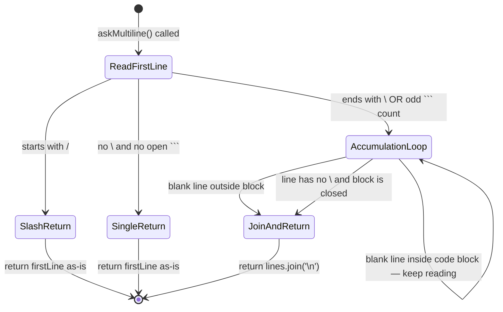
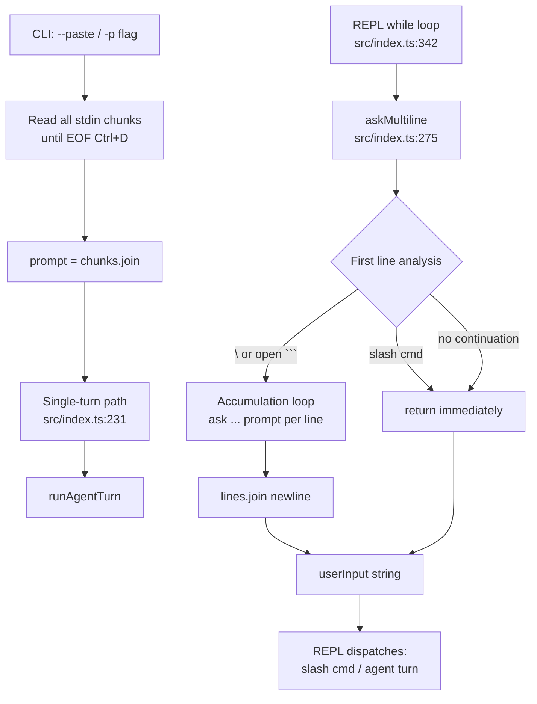

# Multiline Input Support

> Extends the REPL prompt to accumulate multiple lines of input before sending, and adds a `--paste` / `-p` flag that reads an entire prompt from stdin until EOF — solving the fundamental readline limitation where only the first line of a pasted block would be sent to the LLM.

## Table of Contents

- [Overview](#overview)
- [Architecture](#architecture)
  - [Files involved](#files-involved)
  - [Architecture flow diagram](#architecture-flow-diagram)
  - [Data flow](#data-flow)
  - [Key types / interfaces](#key-types--interfaces)
- [Core code breakdown](#core-code-breakdown)
- [Workflow](#workflow)
- [Configuration & flags](#configuration--flags)
- [Edge cases & safety](#edge-cases--safety)
- [Example usage](#example-usage)
- [Related features](#related-features)

## Overview

Node.js `readline` is line-based: `rl.question()` reads exactly one line and returns. Before this feature, if a user pasted a multi-line code snippet or a paragraph into the REPL, only the first line was captured and sent to the LLM — the remaining lines were silently discarded or leaked into the next prompt cycle.

Multiline Input Support introduces two complementary mechanisms: an interactive continuation mode inside the REPL (triggered by a trailing `\` or an unclosed triple-backtick fence), and a `--paste` / `-p` CLI flag that reads all of stdin until `Ctrl+D` (EOF) before executing a single-turn agent run. Both paths produce a plain `string` that the existing REPL loop and single-turn path consume without any modification.

## Architecture

### Files involved

| File | Role in this feature |
|---|---|
| `src/index.ts` | All feature code lives here: Commander flag declaration, `opts.paste` type, paste-mode stdin reader, `askMultiline()` function, and the REPL loop call-site |

### Architecture flow diagram





### Data flow

1. **`--paste` path**: user runs `pnpm dev --paste` or pipes via stdin. After setup wizard completes, `opts.paste` is `true`. The block at `src/index.ts:220-228` sets `process.stdin` encoding to `utf8`, iterates async over all chunks until EOF, joins them, and assigns the result to `prompt`. The existing `if (prompt)` block at line 231 then runs the single-turn agent path unchanged.

2. **REPL interactive path**: the `while(true)` loop at line 342 calls `askMultiline(prompt)` instead of the old `ask(prompt)`.

3. Inside `askMultiline` (lines 275-319):
   - Calls `ask()` once to get `firstLine`.
   - Returns immediately if `firstLine` starts with `/` (slash command guard).
   - Returns immediately if `firstLine` has no trailing `\` and no unclosed ` ``` ` (normal single-line path — zero behavior change).
   - Otherwise enters an accumulation `while(true)` loop, calling `ask(chalk.dim('  ... '))` for each subsequent line.
   - Tracks whether a code fence is open (`inBlock`) by counting ` ``` ` occurrences per line (odd count toggles the flag).
   - Stops the loop on a blank line (when outside a block) or on any line that has no `\` suffix and the block is closed.
   - Strips trailing `\` from continuation lines before pushing to the array.
   - Returns `lines.join('\n')` — a single string ready for the agent.

4. Back in the REPL loop, `userInput` now contains the full multi-line prompt. `userInput.trim()` is pushed to memory and sent to `runAgentTurn` exactly as before.

### Key types / interfaces

This feature introduces no new exported types. It operates entirely on primitive `string` values and the existing `ConfirmFn` / `CommandContext` contracts. The only interface change is the addition of `paste?: boolean` to the anonymous `opts` parameter type of `main()` at line 54 — matching the `--paste` Commander option.

## Core code breakdown

### `askMultiline` — `src/index.ts:275-319`

```ts
// Multiline Prompt Feature
async function askMultiline(initialPrompt: string): Promise<string> {

  // Step A: Read the very first line normally
  const firstLine = await ask(initialPrompt);

  // Slash commands are never multiline — dispatch immediately
  if (firstLine.trim().startsWith('/')) {
    return firstLine;
  }

  // Step B: Count backticks to know if we're inside a code block
  const backtickCount = (firstLine.match(/```/g) ?? []).length;
  const insideCodeBlock = backtickCount % 2 !== 0; // odd = block is open

  // Step C: If no continuation needed, return immediately (normal behavior)
  const hasContinuation = firstLine.endsWith('\\') || insideCodeBlock;
  if (!hasContinuation) {
    return firstLine;
  }

  // Step D: We ARE in multiline mode — accumulate lines
  const lines: string[] = [firstLine.replace(/\\$/, '')]; // strip trailing \
  let inBlock = insideCodeBlock;

  while (true) {
    const line = await ask(chalk.dim('  ... '));

    // Blank line = user wants to submit (only outside a code block)
    if (!inBlock && line.trim() === '') break;

    // Track code block open/close
    const ticks = (line.match(/```/g) ?? []).length;
    if (ticks % 2 !== 0) inBlock = !inBlock;

    // Strip trailing \ if it's a continuation marker (not inside a block)
    if (!inBlock && line.endsWith('\\')) {
      lines.push(line.slice(0, -1));
    } else {
      lines.push(line);
      // If no more continuation signals, stop
      if (!inBlock && !line.endsWith('\\')) break;
    }
  }
  return lines.join('\n');
}
```

| Lines | What it does | Why it matters |
|---|---|---|
| `firstLine = await ask(initialPrompt)` | Reads the very first line using the existing `ask()` helper | Reuses all existing readline / completer infrastructure — no duplication |
| `if (firstLine.trim().startsWith('/'))` | Returns immediately for slash commands | Prevents `/compact\` or `/model` from accidentally entering accumulation mode |
| `backtickCount % 2 !== 0` | Counts ` ``` ` occurrences in the first line; odd = an open code fence | Lets users open a code block on the first line and paste content inside it |
| `hasContinuation` guard | If neither `\` nor an open block is detected, returns `firstLine` unchanged | **Zero behavior change** for all existing single-line usage — the hot path is a fast early return |
| `lines: string[] = [firstLine.replace(/\\$/, '')]` | Seeds the accumulator, stripping the trailing backslash | The LLM never sees the `\` continuation marker |
| `await ask(chalk.dim('  ... '))` | Shows a dim continuation prompt and reads the next line | Visually signals to the user they are in multiline mode |
| `if (!inBlock && line.trim() === '') break` | Blank line outside a code block submits the accumulated input | Natural "submit" signal that works regardless of whether the user used `\` or ` ``` ` |
| `ticks % 2 !== 0 → inBlock = !inBlock` | Toggles the code-block state on each line | Correctly handles closing fences — once ` ``` ` is closed, blank-line submit is re-enabled |
| `line.slice(0, -1)` | Strips the trailing `\` before pushing | Produces clean text; continuation markers are a UI-only convention |
| `if (!inBlock && !line.endsWith('\\')) break` | Auto-terminates when the last line has no continuation signal and the block is closed | Means the user doesn't need a trailing blank line — the last non-`\` line is self-terminating |
| `lines.join('\n')` | Reassembles all accumulated lines into one string | Returns the same type (`string`) as `ask()` — the caller never changes |

**What makes this the core**: `askMultiline` is the entire feature. Without it, the REPL loop only ever receives one line of input regardless of what the user types or pastes. The function is a transparent drop-in replacement for `ask()` at the REPL call site — it returns `Promise<string>` in every branch, so the rest of the codebase (agent loop, slash commands, memory, history) requires zero changes.

### Paste-mode block — `src/index.ts:220-228`

```ts
// ── Paste mode (--paste / -p) ─────────────────────────────────────────────
if (opts.paste) {
  const chunks: string[] = [];
  process.stdin.setEncoding('utf8');
  for await (const chunk of process.stdin) {
    chunks.push(chunk as string);
  }
  prompt = chunks.join('').trim();
}
```

| Lines | What it does | Why it matters |
|---|---|---|
| `if (opts.paste)` | Guards the block behind the `--paste` / `-p` flag | Does not run at all unless explicitly requested — no risk of blocking stdin in normal REPL mode |
| `process.stdin.setEncoding('utf8')` | Switches stdin to string mode | Without this, `chunk` would be a `Buffer` and the type cast would silently produce garbage |
| `for await (const chunk of process.stdin)` | Async-iterates over all stdin data until EOF (`Ctrl+D`) | Node.js readable streams are async iterables; this is the idiomatic way to consume them fully |
| `prompt = chunks.join('').trim()` | Reassembles chunks and assigns to the `prompt` variable | The existing `if (prompt)` block at line 231 then runs the full single-turn path without any changes |

**What makes this the core**: this block bridges the gap between piped/pasted content and CLIC's existing single-turn agent path. By writing into the same `prompt` variable that the `[prompt]` Commander argument uses, it reuses the entire single-turn execution flow (history save, graph save, readline cleanup) for free.

## Workflow

### Interactive REPL — continuation mode

1. The `while(true)` REPL loop calls `askMultiline(`  ❯ `)` instead of the old `ask(...)`.
2. `askMultiline` calls `ask()` once, displaying the `  ❯ ` prompt.
3. If the user's first line starts with `/`, it is returned immediately and the REPL dispatches it as a slash command — no multiline accumulation.
4. If the first line ends with `\` or contains an unclosed ` ``` `, `askMultiline` enters the accumulation loop and prints a dim `  ... ` continuation prompt for every subsequent line.
5. The loop continues until a blank line is entered (outside a code block) or until a line arrives with no `\` suffix and no open block — whichever comes first.
6. All accumulated lines are joined with `\n` and returned as a single string.
7. The REPL loop receives this string as `userInput`, trims it, and either dispatches a slash command or pushes it to memory and calls `runAgentTurn` — exactly as with any single-line input.

### Paste mode — `--paste` / `-p`

1. User runs `pnpm dev --paste` (or pipes: `cat file.txt | pnpm dev --paste`).
2. The setup wizard (API key, model picker, role selector) runs normally.
3. After `createSingleTurnConfirmFn` is set up, the paste-mode block reads all stdin chunks until EOF.
4. The joined content is assigned to `prompt`.
5. The `if (prompt)` block at line 231 fires: a readline interface is created for `confirmFn`, the prompt is pushed to memory, `runAgentTurn` executes, history and graph are saved, and the process exits. The REPL is never entered.

## Configuration & flags

| Flag / Option | Type | Default | Where declared | Effect |
|---|---|---|---|---|
| `-p, --paste` | `boolean` | `false` | `src/index.ts:48` (Commander) | Reads all of stdin until EOF, uses content as a single-turn prompt |
| `opts.paste` | `boolean \| undefined` | `undefined` | `src/index.ts:60` (`main` opts type) | Checked at line 221 to gate the paste-mode block |

No environment variables or `src/config.ts` constants are involved. The feature has no configurable thresholds, limits, or toggles beyond the presence of the `--paste` flag.

## Edge cases & safety

| Scenario | How it is handled |
|---|---|
| Normal single-line input | `hasContinuation` is `false` → `askMultiline` returns `firstLine` immediately. Zero behavior change. |
| Slash command as first line (e.g. `/compact`) | `firstLine.trim().startsWith('/')` guard returns immediately — never enters accumulation loop |
| Slash command with accidental `\` (e.g. `/help\`) | The `/` guard fires before the `\` check — still returns immediately |
| `\` at end of line inside a code block | `inBlock` is `true`, so the `line.endsWith('\\')` stripping branch is skipped — `\` is preserved as literal content inside the fence |
| Blank line inside a code block | `if (!inBlock && line.trim() === '') break` — the `!inBlock` guard prevents premature submission while a fence is open |
| Unclosed code block (user never types closing ` ``` `) | The accumulation loop continues indefinitely until a blank line is entered (which only submits once the block is closed) — the user must close the fence or `Ctrl+C` |
| `Ctrl+C` during accumulation | `ask()` throws, the `catch` block in the REPL `while(true)` loop catches it, and if stdin is not destroyed it `continue`s to the next prompt |
| `--paste` with empty stdin (user presses `Ctrl+D` immediately) | `chunks.join('').trim()` → `''` → `prompt` is an empty string → `if (prompt)` is falsy → falls through to the REPL instead of single-turn mode |
| `--paste` combined with a positional `[prompt]` argument | The positional prompt is overwritten by the paste-mode block (`prompt = chunks.join('').trim()`) — the pasted stdin content wins |
| Plain paragraph pasted without ` ``` ` or `\` | Only the first line is captured (readline limitation) — the user must wrap content in backticks or use `--paste` |

## Example usage

### Case 1 — Normal single-line (unchanged)

```
❯ What is the capital of France?
```
`askMultiline` detects no continuation → returns immediately → LLM receives: `What is the capital of France?`

---

### Case 2 — Backslash continuation

```
❯ Refactor this function: \
  ... function add(a, b) {
  ...   return a + b;
  ... }
```

The final line `}` has no `\` and no open block → loop auto-terminates. LLM receives:

```
Refactor this function:
function add(a, b) {
  return a + b;
}
```

---

### Case 3 — Paste inside a code block

```
❯ Summarize this for me: ```
  ... This is paragraph one.
  ... It explains the background.
  ... This is paragraph two.
  ... It describes the solution.
  ... ```
  ...
```

Opening ` ``` ` on first line opens the block. Closing ` ``` ` closes it. Blank line submits. LLM receives the full paragraph.

---

### Case 4 — `--paste` flag (pipe)

```bash
cat design_doc.md | pnpm dev --paste
```

Reads entire `design_doc.md` from stdin, runs as a single agent turn, process exits when done.

---

### Case 5 — `--paste` flag (interactive)

```bash
pnpm dev --paste
# Type or paste anything, then press Ctrl+D
function foo(x) {
  return x * 2
}
^D
```

Entire block sent as one prompt.

---

### Case 6 — Slash command (never multiline)

```
❯ /compact
```

Starts with `/` → returned immediately → dispatched to command system. Never enters accumulation mode.

## Related features

- **`ask()` function** (`src/index.ts:261-272`) — the underlying single-line readline helper that `askMultiline` calls for every line it reads; `askMultiline` is built on top of it, not a replacement.
- **`slashCompleter`** (`src/commands/index.ts`) — tab-completion for slash commands; passed to the `readline.createInterface` inside `ask()`, so it works on the first line of every multiline prompt.
- **Single-turn mode** (`src/index.ts:231-242`) — the paste-mode block feeds directly into this path by writing `prompt` before the `if (prompt)` check.
- **REPL `while(true)` loop** (`src/index.ts:342-458`) — the caller of `askMultiline`; receives a plain `string` and is completely unaware of whether input was single- or multi-line.
- **`runAgentTurn`** (`src/agent.ts`) — receives the final assembled prompt string; has no knowledge of this feature.
- **`promptPrintSeperator`** (`src/ui.ts:310-312`) — prints the cyan separator lines around the prompt; called before and after `askMultiline` in the REPL loop.
- **Context Window Guard** (`src/index.ts:434-444`) — runs after `runAgentTurn` completes; unaffected by input mode.
