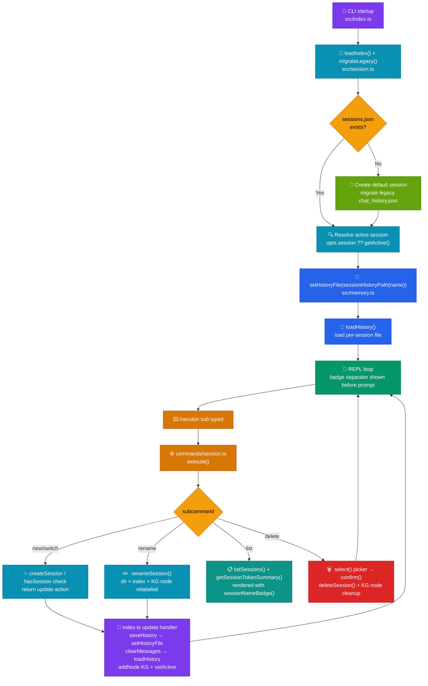

# Named Sessions

> Isolated, named workspaces — each with its own conversation history and token-graph identity — switchable mid-REPL via `/session` subcommands or the `--session` CLI flag.

## Table of Contents

- [Overview](#overview)
- [Architecture](#architecture)
  - [Files involved](#files-involved)
  - [Architecture flow diagram](#architecture-flow-diagram)
  - [Data flow](#data-flow)
  - [Key types / interfaces](#key-types--interfaces)
- [Core code breakdown](#core-code-breakdown)
- [Workflow](#workflow)
- [Configuration & flags](#configuration--flags)
- [Edge cases & safety](#edge-cases--safety)
- [Example usage](#example-usage)
- [Related features](#related-features)

---

## Overview

Before Named Sessions, CLIC kept a single global conversation in `chat_history.json`. Starting a different task required `/clear`, permanently destroying prior context — making it impossible to keep parallel workstreams (e.g. "debug-prod" vs "write-tests") or resume a previous conversation.

Named Sessions solves this by giving every session its own `sessions/<name>/chat_history.json` file and a stable Knowledge Graph node (`session_<name>`). Switching sessions saves the outgoing history, clears the in-memory message store, and loads the incoming session's history — all in under a second. The token graph remains a single shared file (`token_graph.json`), with sessions isolated by node id, so `/tokens` continues to show both per-session and all-time totals.

---

## Architecture

### Files involved

| File | Role in this feature |
|---|---|
| `src/session.ts` | Session index manager — owns `sessions.json`, all CRUD operations, and legacy migration |
| `src/commands/session.ts` | `/session` slash command — all subcommand handlers + interactive pickers |
| `src/config.ts` | `SESSIONS_DIR`, `SESSIONS_INDEX_FILE`, `DEFAULT_SESSION`, `sessionHistoryPath()` constants |
| `src/memory.ts` | Added `setHistoryFile()` / `getHistoryFile()` so load/save target can be swapped at runtime |
| `src/knowledgeGraph.ts` | Added `getSessionNodeByName()` helper; session nodes use deterministic id `session_<name>`; `addNode()` upserts properties on existing nodes so model/role stay current |
| `src/index.ts` | Startup resolution, `--session` flag, REPL update-handler that finalises a session switch |
| `src/ui.ts` | `sessionNameBadge()` (colored bg pill), `promptPrintSeperator(sessionName?)` (bottom-right badge), `/status` row, `/help` entry |
| `src/commands/types.ts` | Added `sessionName?: string` to `CommandContext` |
| `src/commands/status.ts` | Passes `ctx.sessionName` to `printStatus` |
| `src/commands/exit.ts` | Uses `getHistoryFile()` to print the real active-session path on quit |
| `.gitignore` | `sessions/` and `sessions.json` excluded from version control |

### Architecture flow diagram



### Data flow

1. **Startup** — `index.ts` calls `loadIndex()` to read `sessions.json` into memory, then `migrateLegacy()` which copies any legacy `chat_history.json` into `sessions/default/` on the first run.
2. **Session resolution** — active session name = `opts.session` (CLI flag) → `getActive()` from the index → `DEFAULT_SESSION` ("default") as final fallback.
3. **History pointer swap** — `setHistoryFile(sessionHistoryPath(name))` redirects memory.ts's `activeHistoryFile` so every subsequent `loadHistory()` / `saveHistory()` reads/writes the correct per-session file.
4. **KG node registration** — `addNode({ id: 'session_<name>', type: 'session', properties: { name, model, role } })` creates the session's Knowledge Graph node on first launch, or **updates its `model`/`role` properties** on subsequent launches; subsequent agent turns attach `HAS_TURN` edges to it.
5. **REPL prompt** — `promptPrintSeperator(sessionName)` renders the session name as a colored background badge (`sessionNameBadge()`) right-aligned on the cyan separator line **before every input** (above the `❯` prompt), giving the user a constant visual indicator of the active session.
6. **Command dispatch** — `/session <sub>` is parsed by `commands/session.ts`; subcommand handlers use `@clack/prompts` for interactive input and return a `CommandAction`.
7. **Switch finalization** — when the returned action is `{ type: 'update', updates: { sessionId, sessionName } }`, the REPL loop in `index.ts` saves the current history, swaps the file pointer, clears messages, loads the new session's history, registers its KG node, and calls `setActive()`.
8. **Persistence** — `saveHistory()` writes to `activeHistoryFile` (now `sessions/<name>/chat_history.json`); `saveIndex()` writes `sessions.json`; `saveGraph(TOKEN_GRAPH_FILE)` writes the shared token graph.

### Key types / interfaces

```typescript
// src/session.ts
export interface SessionMeta {
  name: string;          // human-readable identifier, used as directory name
  createdAt: string;     // ISO timestamp — set once on createSession()
  lastActiveAt: string;  // ISO timestamp — updated by touch() on every setActive()
}

// Internal to session.ts — the shape of sessions.json
interface SessionIndex {
  active: string;           // name of the currently active session
  sessions: SessionMeta[];  // ordered list of all known sessions
}

// src/commands/types.ts — additions for Named Sessions
export interface CommandContext {
  sessionId?: string;    // KG node id: "session_<name>"
  sessionName?: string;  // human-readable name, shown in prompt + status
  // ... other fields unchanged
}

// CommandAction — the signal a command returns to index.ts
type CommandAction =
  | { type: 'update'; updates: Partial<CommandContext> }
  // returning sessionId !== current triggers the switch finalizer in index.ts
  | { type: 'continue' | 'exit' | 'retry' };
```

---

## Core code breakdown

### `update` handler in REPL loop — `src/index.ts:395-430`

```typescript
if (result.type === 'update') {
  if (result.updates.showRaw !== undefined) showRaw = result.updates.showRaw;
  if (result.updates.kbFile !== undefined) kbFile = result.updates.kbFile;
  if (result.updates.systemPrompt !== undefined) systemPrompt = result.updates.systemPrompt;
  if (result.updates.model !== undefined && result.updates.model !== model) {
    model = result.updates.model;
    process.env.CLIC_MODEL = model;
    client = createClient(model);
  }
  // Session switch / new / rename — finalize the in-memory + file swap here.
  if (result.updates.sessionId !== undefined && result.updates.sessionId !== sessionId) {
    const newName = result.updates.sessionName ?? sessionName;
    const oldName = sessionName;
    if (hasSession(oldName)) {
      // switch / new: persist the outgoing session, then load the target's history.
      await saveHistory();
      setHistoryFile(sessionHistoryPath(newName));
      clearMessages();
      await loadHistory(opts.fullHistory ? undefined : HISTORY_LOAD_LIMIT);
      addNode({
        id: result.updates.sessionId,
        type: 'session',
        properties: { name: newName, model, role: kbFile ?? null },
        createdAt: new Date().toISOString(),
      });
      await setActive(newName);
    } else {
      // rename: directory + index + KG node already updated by the command.
      setHistoryFile(sessionHistoryPath(newName));
      await saveHistory();
    }
    sessionId = result.updates.sessionId;
    sessionName = newName;
  }
}
```

| Lines | What it does | Why it matters |
|---|---|---|
| `result.updates.sessionId !== sessionId` | Guards — only enters the session-swap block when the session actually changed | Prevents an unnecessary history flush on every `/session rename` that doesn't change the active session id |
| `await saveHistory()` (first call) | Flushes the outgoing session's in-memory messages to its file before touching anything else | Guarantees no messages are lost when switching away from a session |
| `setHistoryFile(sessionHistoryPath(newName))` | Redirects `memory.ts`'s `activeHistoryFile` to the new session's path | All subsequent `loadHistory`/`saveHistory` calls automatically target the right file |
| `clearMessages()` + `await loadHistory(...)` | Wipes the in-memory message array and loads the incoming session's history | Provides full context isolation — the LLM only sees the new session's conversation |
| `addNode({ id: result.updates.sessionId, ... })` | Registers the new session's KG node, or **refreshes its `model`/`role` properties** if the node already exists (upsert via `Object.assign`) | Ensures `/tokens` can attribute future turns to the correct session, and that the session node always reflects the current model |
| `await setActive(newName)` | Updates `sessions.json`'s `active` field and `lastActiveAt` | Persists the choice so the next launch resumes the same session |
| `else` branch (rename) | Skips history reload (same conversation) and just repoints the file path + saves | Avoids flickering context on rename — the conversation content is unchanged |
| `sessionId = ...; sessionName = ...` | Updates the two `let` REPL-loop variables that feed `CommandContext` and the prompt | Causes the prompt badge and all subsequent `ctx.sessionId` references to reflect the new session immediately |

**What makes this the core:** this block is the only place in the codebase where a session switch is actually enacted — the command module only signals intent via the `update` action; it cannot directly mutate the REPL loop's `let` variables or call `setHistoryFile`. Removing this block would mean `/session switch` and `/session new` produce the colored success message but the in-memory state, file pointer, and KG registration would never change — the user would still be on the old session.

---

### `migrateLegacy` — `src/session.ts:183-216`

```typescript
export async function migrateLegacy(): Promise<void> {
  if (index.sessions.length > 0) return;

  await fs.mkdir(path.join(SESSIONS_DIR, DEFAULT_SESSION), { recursive: true });

  const defaultHistory = sessionHistoryPath(DEFAULT_SESSION);
  let migrated = false;
  try {
    await fs.access(HISTORY_FILE);
    try {
      await fs.access(defaultHistory);
    } catch {
      const data = await fs.readFile(HISTORY_FILE, 'utf-8');
      await fs.writeFile(defaultHistory, data, 'utf-8');
      migrated = true;
    }
  } catch {
    // No legacy history — fresh start.
  }

  index = {
    active: DEFAULT_SESSION,
    sessions: [{ name: DEFAULT_SESSION, createdAt: nowISO(), lastActiveAt: nowISO() }],
  };
  await saveIndex();

  if (migrated) {
    console.log(`  📦 Migrated existing history into session "${DEFAULT_SESSION}".`);
  }
}
```

| Lines | What it does | Why it matters |
|---|---|---|
| `if (index.sessions.length > 0) return` | Short-circuits on every launch after the first | Makes migration a true one-time operation — no risk of overwriting live session data |
| `fs.access(HISTORY_FILE)` outer try | Checks whether a legacy `chat_history.json` exists at the repo root | Only migrates if there is something to migrate; fresh installs take the `catch` path silently |
| `fs.access(defaultHistory)` inner try/catch | Ensures the target file doesn't already exist before copying | Idempotent: if the default session file was somehow already created, the copy is skipped |
| `fs.readFile` / `fs.writeFile` | Copies legacy history verbatim into `sessions/default/chat_history.json` | Preserves every prior message without modification — the user loses nothing on upgrade |
| `index = { active: DEFAULT_SESSION, sessions: [...] }` + `saveIndex()` | Seeds a fresh `sessions.json` with a single `default` entry | Establishes the index contract so all subsequent `hasSession`/`getActive` calls work correctly |

---

## Workflow

### 1. Startup

On every launch, `index.ts` calls `loadIndex()` to populate the in-memory `SessionIndex` from `sessions.json`, then `migrateLegacy()`. If `sessions.json` doesn't exist yet (first run after installing Named Sessions), `migrateLegacy` copies any legacy `chat_history.json` into `sessions/default/` and writes the index — so returning users see no disruption. The active session is then resolved as `opts.session` (CLI flag) → `getActive()` → `"default"`. `setHistoryFile` redirects memory.ts and `loadHistory` fills the in-memory message array from the session's file.

### 2. In-REPL use

The user types a `/session` subcommand (or its alias `/s`). `commands/session.ts` parses the first word after `/session` as the subcommand and the rest as an optional name argument:

- **`new [name]`** — if no name is given, a `@clack/prompts` `text()` input appears. After validation and `createSession()`, the handler returns `{ type: 'update', updates: { sessionId, sessionName } }`.
- **`switch [name]`** — if no name, an interactive `select()` picker shows all non-active sessions with turn/token hints. If a name is given directly it is validated with `hasSession()`, erroring with a hint if not found (no auto-create).
- **`rename [name]`** — prompts if no name given, calls `renameSession()` which renames the directory, updates the index entry, and relabels the KG node id and all its edges in-memory.
- **`list`** — calls `listSessions()` and `getSessionTokenSummary()` for each, renders each row with `sessionNameBadge()` for the colored pill.
- **`delete [name]`** — if no name, shows a `select()` picker filtered to non-active sessions, followed by a `confirm()` prompt before calling `deleteSession()`. On confirmation, `deleteSession()` removes the session directory, filters it from the index, **and removes its KG node plus all `HAS_TURN` edges from `token_graph.json`** — keeping all-time `/tokens` totals accurate. Trying to delete the active session is blocked with a clear error.
- **bare `/session`** — shows active session name (as colored badge) plus turn/token count and available subcommands.

### 3. Switch finalization

The `update` action is returned to `index.ts`'s REPL loop. The loop detects that `result.updates.sessionId` differs from the current `sessionId`, saves the current session's history, swaps the file pointer, clears and reloads messages, registers the KG node, and updates `sessionId`/`sessionName` — causing the next prompt separator to show the new session's colored badge immediately.

### 4. Persistence

Every agent turn and slash command calls `saveHistory()` (which now writes to `sessions/<name>/chat_history.json`). Every turn also calls `saveGraph(TOKEN_GRAPH_FILE)`. On `/exit` or Ctrl+C, `saveHistory()` + `saveGraph()` are called before the process exits.

---

## Configuration & flags

| Flag / Env var | Default | Effect |
|---|---|---|
| `--session <name>` CLI flag | — | Start in a named session; creates the session if it doesn't exist |
| `AGENT_SESSIONS_DIR` env var | `sessions` | Override the base directory for per-session folders |
| `AGENT_SESSIONS_INDEX_FILE` env var | `sessions.json` | Override the sessions index file path |
| `AGENT_HISTORY_FILE` env var | `chat_history.json` | Legacy root history path (used only during `migrateLegacy`) |
| `--full-history` CLI flag | off | When switching sessions, loads the full history instead of the last `HISTORY_LOAD_LIMIT` (10) messages |

All session constants are exported from `src/config.ts:16-22`.

---

## Edge cases & safety

| Scenario | Handling |
|---|---|
| First launch (no `sessions.json`) | `migrateLegacy()` creates `sessions/default/`, copies any legacy `chat_history.json`, writes a fresh `sessions.json` |
| `--session <name>` for a non-existent session | `ensureSession(name)` creates it silently before the REPL starts |
| `/session switch <missing>` | Prints error + hint: `Create it with: /session new <name>`. Returns `continue` — no state change |
| `/session switch` with only one session | Prints `No other sessions to switch to. Create one with /session new.` |
| `/session delete <active>` | Blocked by both the command handler and `deleteSession()` which throws `Cannot delete the active session` |
| Invalid session name (spaces, slashes, etc.) | `assertValidName()` throws; error is caught and displayed. Regex: `^[A-Za-z0-9_-]+$` |
| Duplicate session name on `new` | `createSession()` throws `Session "x" already exists`; handler suggests `/session switch x` |
| `rename` when target name already exists | `renameSession()` throws; error displayed, no partial state change |
| `fs.rename` failure during rename | Falls back to `fs.mkdir` for the new path — history will be saved there on the next `saveHistory()` |
| `saveIndex()` / `saveHistory()` failure | Both silently swallow errors — session data is non-critical; the in-memory state remains valid |
| Ctrl+C mid-session (SIGINT) | The existing SIGINT handler in `index.ts` calls `saveHistory()` + `saveGraph()` then exits, using the current `activeHistoryFile` which always points at the active session |
| `/session delete <name>` completes | `deleteSession()` removes the session directory, the `sessions.json` entry, **and the KG node + all its `HAS_TURN` edges** from `token_graph.json` — no orphan ghost data in all-time `/tokens` totals |
| `token_graph.json` shared across sessions | Isolation is by KG node id (`session_<name>`), not by file — `/tokens` correctly separates per-session and all-time totals |

---

## Example usage

```
$ pnpm dev -- --session debug-prod      # start directly in a named session

# Inside REPL:
  🔖 Session:  debug-prod  (1 total)
  ──────────────────────────────────────────────  [debug-prod]
  ❯ /session list

  🔖 Sessions
  ────────────────────────────────────────────────────────
  ● debug-prod   0 turns · 0 tokens  last: 2026-08-12 10:00:01
  ────────────────────────────────────────────────────────

  ──────────────────────────────────────────────  [debug-prod]
  ❯ /session new write-tests
  ✅ Created and switched to session: write-tests

  ──────────────────────────────────────────────  [write-tests]
  ❯ /session switch          # no name → interactive picker
  ◆  Switch to session (current: write-tests):
  │  ○ debug-prod    0 turns · 0 tokens
  │  ○ default       5 turns · 3,200 tokens
  └
  ✅ Switched to session: debug-prod

  ──────────────────────────────────────────────  [debug-prod]
  ❯ /session rename prod-debug
  ✅ Renamed session: debug-prod → prod-debug

  ──────────────────────────────────────────────  [prod-debug]
  ❯ /session delete           # no name → interactive picker of non-active sessions
  ◆  Select session to delete:
  │  ○ write-tests   0 turns · 0 tokens
  └
  ◆  Delete session "write-tests" and its history? This cannot be undone.
  │  ● Yes / ○ No
  └
  🗑️  Deleted session: write-tests
```

---

## Related features

- **Memory / History** (`src/memory.ts`) — Named Sessions extends it with `setHistoryFile()` / `getHistoryFile()` to make the persistence target swappable at runtime.
- **Knowledge Graph** (`src/knowledgeGraph.ts`) — Sessions are first-class nodes in the graph; all token tracking is keyed by `session_<name>` node id. The `/tokens` command reads these nodes unchanged.
- **`/tokens` command** (`src/commands/tokens.ts`) — Shows per-session token usage via `getSessionTokenSummary(ctx.sessionId)` and all-time totals via `getGlobalTokenSummary()`.
- **`/status` command** (`src/commands/status.ts`) — Displays the active session name (as plain text) in the system info box via `printStatus({ sessionName })`.
- **UI / display** (`src/ui.ts`) — `sessionNameBadge()` provides the colored background pill rendered in the separator, startup block, and session list. `SESSION_PALETTE` (10 colors) maps session names to consistent colors via a djb2-style hash.
- **Context Guard / Auto-compact** (`src/index.ts`) — The auto-compact guard runs after every turn and calls `saveHistory()`, which correctly targets the active session's file.
