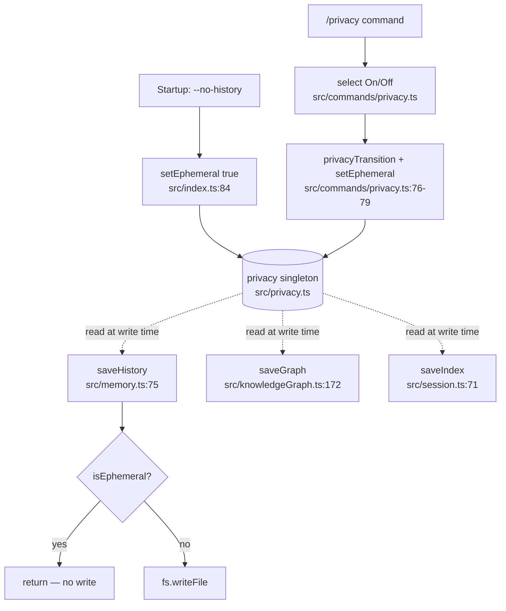

# `--no-history` / Privacy Flag

> Lets CLIC run as a **fully ephemeral session** — nothing is written to disk — via a startup `--no-history` flag or a mid-session `/privacy` arrow-key toggle, while still loading prior context read-only.

## Table of Contents

- [Overview](#overview)
- [Architecture](#architecture)
  - [Files involved](#files-involved)
  - [Architecture flow diagram](#architecture-flow-diagram)
  - [Data flow](#data-flow)
  - [Key types / interfaces](#key-types--interfaces)
- [Core code breakdown](#core-code-breakdown)
- [Workflow](#workflow)
- [Configuration & flags](#configuration--flags)
- [Edge cases & safety](#edge-cases--safety)
- [Example usage](#example-usage)
- [Related features](#related-features)

## Overview

By default CLIC persists three kinds of state to disk: chat history (`sessions/<name>/chat_history.json`), the token Knowledge Graph (`token_graph.json`), and the session index (`sessions.json`). For sensitive or throwaway work there was no way to opt out. This feature adds an **ephemeral mode** in which every disk-write is suppressed while reads still work, so prior context loads once at startup but nothing new is ever written.

The design uses a single runtime flag (`src/privacy.ts`) checked at the **write boundary** of each persistence function, rather than guarding the many individual call sites in the REPL. This makes the guarantee structural: every write path — single-turn, `--paste`, SIGINT handlers, auto-compact, `/session` switches — is neutralized automatically. The flag can be set at launch (`--no-history`) or toggled mid-session (`/privacy`).

## Architecture

### Files involved

| File | Role in this feature |
|---|---|
| `src/privacy.ts` | Dependency-free singleton holding the ephemeral flag; exports `setEphemeral()` / `isEphemeral()` |
| `src/memory.ts` | `saveHistory()` early-returns when `isEphemeral()` (the guarded chat-history writer) |
| `src/knowledgeGraph.ts` | `saveGraph()` early-returns when `isEphemeral()` |
| `src/session.ts` | `saveIndex()` early-returns when ephemeral; `createSession()` skips `mkdir` when ephemeral |
| `src/index.ts` | Declares `--no-history`, calls `setEphemeral()`, skips disk-mutating setup steps, prints the privacy banner |
| `src/commands/privacy.ts` | `/privacy` slash command: interactive on/off picker + pure `privacyTransition()` helper |
| `src/commands/index.ts` | Registers `privacyCmd` in the command registry |
| `src/commands/status.ts` | `/status` prints the current privacy state via `isEphemeral()` |

### Architecture flow diagram



### Data flow

**Startup path (`--no-history`):**
1. Commander maps `--no-history` → `opts.history === false` (`src/index.ts:61,76`).
2. `main()` computes `const ephemeral = opts.history === false` and calls `setEphemeral(ephemeral)` (`src/index.ts:83-84`).
3. `loadGraph()` and `loadIndex()` still run — reads are always allowed.
4. `migrateLegacy()`, `ensureSession()`, `setActive()` are **skipped** when ephemeral (`src/index.ts:217-224`) — these would otherwise write to disk.
5. `setHistoryFile(...)` + `loadHistory(...)` load prior context read-only (`src/index.ts:227-228`).
6. A `🔒 Privacy` banner prints (`src/index.ts:235-240`).
7. For the rest of the session, every `saveHistory()` / `saveGraph()` / `saveIndex()` call is a no-op.

**Mid-session path (`/privacy`):**
1. User types `/privacy`; the registry routes to `privacyCmd.execute` (`src/commands/index.ts`).
2. `execute` reads `current = isEphemeral()` and shows a `select` picker with `initialValue` set to the current mode.
3. On choice, `to = choice === 'on'`; `privacyTransition(current, to)` computes whether it changed and the warning lines.
4. If changed, `setEphemeral(to)` flips the singleton (`src/commands/privacy.ts:78`); warnings print.
5. The next `saveHistory()`/`saveGraph()`/`saveIndex()` immediately reflects the new state (the flag is read live at each write).

### Key types / interfaces

The privacy singleton's public contract (`src/privacy.ts`):

```ts
export function setEphemeral(value: boolean): void; // flip ephemeral mode for this session
export function isEphemeral(): boolean;             // callers skip disk writes when true
```

The `/privacy` command's pure decision helper (`src/commands/privacy.ts`):

```ts
export function privacyTransition(
  from: boolean,   // current ephemeral state
  to: boolean,     // requested state
): { changed: boolean; lines: string[] }; // whether it changed + chalk-formatted messages to print
```

The command itself conforms to `SlashCommand` (`src/commands/types.ts`) and returns `{ type: 'continue' }` — privacy state is NOT part of `CommandContext`, so no `update` action or `index.ts` handler branch is required.

## Core code breakdown

### `saveHistory` — `src/memory.ts:75-83`

```ts
export async function saveHistory(): Promise<void> {
  if (isEphemeral()) return; // privacy mode — keep history in memory only
  try {
    await fs.mkdir(path.dirname(activeHistoryFile), { recursive: true });
    await fs.writeFile(activeHistoryFile, JSON.stringify(messages, null, 2), 'utf-8');
  } catch {
    // Silently fail — history is not critical
  }
}
```

| Lines | What it does | Why it matters |
|---|---|---|
| 76 | Early-returns the instant `isEphemeral()` is true, before any filesystem call | This single guard is the entire privacy guarantee for chat history — every REPL save path funnels through here |
| 78 | Ensures the session directory exists before writing | Only reached in non-ephemeral mode |
| 79 | Serializes the **whole** in-memory `messages[]` array to the active history file | Writing the full array (not a delta) is what makes the toggle-off edge case below possible |

`saveGraph` (`src/knowledgeGraph.ts:172-173`) and `saveIndex` (`src/session.ts:71-72`) use the identical `if (isEphemeral()) return;` pattern as their first line.

**What makes this the core:** `saveHistory()` is the sole writer of the chat-history file (verified: no other code path calls `fs.writeFile` against `activeHistoryFile`). Because the guard is its first statement and reads the singleton live, flipping `setEphemeral(true)` anywhere — startup or mid-session — instantly stops all history persistence. Remove this one line and the entire `--no-history` / `/privacy` feature stops protecting chat history.

### `privacyTransition` — `src/commands/privacy.ts:25-52`

```ts
export function privacyTransition(from: boolean, to: boolean): { changed: boolean; lines: string[] } {
  if (from === to) {
    return {
      changed: false,
      lines: [chalk.dim(`  Privacy already ${to ? 'ON — nothing is being written to disk' : 'OFF — writing to disk normally'}.`)],
    };
  }
  if (to) {
    // OFF → ON
    return {
      changed: true,
      lines: [
        chalk.magenta.bold('  🔒 Privacy: ON — history, token graph, and session index will NOT be written from now on.'),
        chalk.yellow('  ⚠️  Turns already saved to disk earlier this session remain on disk — this does not erase them.'),
      ],
    };
  }
  // ON → OFF
  return {
    changed: true,
    lines: [
      chalk.green('  🔓 Privacy: OFF — disk writes resumed.'),
      chalk.yellow('  ⚠️  The full in-memory history — including turns recorded while privacy was ON — will be written on the next turn.'),
    ],
  };
}
```

| Lines | What it does | Why it matters |
|---|---|---|
| 26–31 | No-op transition (same state chosen) → `changed: false` + an "already X" line | Prevents redundant warnings and lets `execute` avoid calling `setEphemeral` needlessly |
| 33–41 | OFF→ON branch → enable warning + reminder that earlier disk writes are NOT erased | Honest about the partial protection of a mid-session enable |
| 43–51 | ON→OFF branch → resume message + warning that the full in-memory history (incl. private span) will be written next | Surfaces the toggle-off edge case documented below |

**What makes this the core:** it isolates all the transition/warning logic as a pure function so the interactive picker in `execute` stays thin and the behavior is unit-testable headless (the `select()` UI itself is not tested, mirroring `/model` and `/role`). The command's actual state change is one line — `if (changed) setEphemeral(to)` (`src/commands/privacy.ts:78`).

## Workflow

1. **Trigger:** either the `--no-history` CLI flag at launch, or the `/privacy` slash command mid-session.
2. **Startup:** `setEphemeral(true)` is called before any session setup; `index.ts` then loads context read-only and skips the three disk-mutating setup calls (`migrateLegacy`, `ensureSession`, `setActive`), printing a `🔒 Privacy` banner.
3. **Mid-session:** `/privacy` opens an arrow-key `@clack/prompts` `select` initialized to the current mode. The chosen value drives `privacyTransition()`, which reports whether the state changed and returns loud warnings; `setEphemeral()` is called only on an actual change.
4. **Effect:** on every subsequent turn (and on exit, SIGINT, auto-compact, and `/session` switches), the guarded `saveHistory()` / `saveGraph()` / `saveIndex()` calls read `isEphemeral()` live and return early, so nothing is written.
5. **Visibility:** `/status` prints the current privacy state so the user can confirm which mode is active.

## Configuration & flags

| Flag / option | Where read | Default | Effect |
|---|---|---|---|
| `--no-history` | `src/index.ts:61` (commander → `opts.history`) | history enabled | `opts.history === false` → `setEphemeral(true)`; fully ephemeral session |
| `/privacy` command | `src/commands/privacy.ts` | mode carried by the singleton | Interactive on/off toggle mid-session |
| `--session <name>` (combined) | `src/index.ts:60,237-239` | — | With `--no-history`, warns and loads that session read-only, writing nothing |

There is no environment variable for privacy; it is purely a runtime flag held in the `src/privacy.ts` module singleton.

## Edge cases & safety

- **Reads always allowed:** `loadHistory()`, `loadGraph()`, and `loadIndex()` are never guarded, so prior context loads once at startup even in ephemeral mode.
- **Combined with `--session`:** the named session is loaded read-only; a dim warning notes nothing will be saved (`src/index.ts:237-239`).
- **`createSession()` under ephemeral:** the `fs.mkdir` for the session directory is skipped (`src/session.ts:115`) so no empty directory is created; `saveIndex()` is a no-op.
- **Every write path covered:** because the guard lives inside the three save functions, single-turn mode, `--paste`, the SIGINT save handlers, auto-compact, and `/session` switch/rename all become no-ops automatically — no per-call-site guarding needed.
- **KNOWN LIMITATION — mid-session toggle is only partial protection:** `pushMessage()` (`src/memory.ts:45-47`) is unconditional, and `saveHistory()` serializes the **entire** `messages[]` array (`src/memory.ts:79`). Turns typed while privacy is ON are still accumulated in memory. Therefore:
  - Turning privacy **ON** does not erase turns already written to disk earlier in the session.
  - Turning privacy **OFF** causes the next save to persist the *full* in-memory history — **including the turns recorded while privacy was ON**. The `/privacy` off-transition warns about this explicitly (`src/commands/privacy.ts:43-51`), but the private span is not currently excluded from persistence. (Full-launch `--no-history` has no such gap because the flag is never turned off during the run.)
- **Failure handling:** all three save functions wrap their writes in `try/catch` and fail silently — an unwritable disk never crashes a turn.

## Example usage

Launch fully ephemeral:

```bash
pnpm dev --no-history
#   🔒 Privacy: History, token graph, and session index will NOT be written to disk.
```

Toggle mid-session:

```text
> /privacy
Privacy mode (current: OFF):
  ○ Off — normal        History, token graph & session index are saved to disk
❯ ● On — ephemeral      Nothing written to disk — for sensitive/throwaway work

  🔒 Privacy: ON — history, token graph, and session index will NOT be written from now on.
  ⚠️  Turns already saved to disk earlier this session remain on disk — this does not erase them.

> /status
  ...
  🔒 Privacy: ON — nothing is written to disk (ephemeral session)
```

## Related features

- **Named Sessions** (`src/session.ts`, `docs/features/named-sessions.md`) — privacy suppresses `saveIndex()` and per-session directory creation; combining `--no-history --session <name>` loads read-only.
- **Auto Context-Window Guard / Auto-Compact** (`docs/features/Auto-Context-Window-Guard-Auto-Compact.md`) — auto-compaction's `saveHistory()` calls are neutralized under privacy.
- **Token Knowledge Graph** (`src/knowledgeGraph.ts`) — `saveGraph()` shares the identical ephemeral guard.
- **Slash command system** (`src/commands/index.ts`, `types.ts`) — `/privacy` and the `/status` privacy line are built on it; mirrors the `/model` and `/role` interactive pickers.
