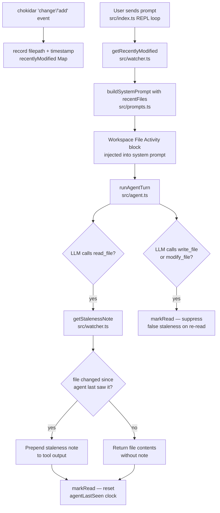

# Workspace File Watching

> Gives CLIC's agent ambient awareness of files edited externally in an IDE — surfacing a rolling list of recently-modified files in the system prompt each turn, and prepending an inline staleness note when the agent reads a file that changed since it last saw it.

## Table of Contents

- [Overview](#overview)
- [Architecture](#architecture)
  - [Files involved](#files-involved)
  - [Architecture flow diagram](#architecture-flow-diagram)
  - [Data flow](#data-flow)
  - [Key types / interfaces](#key-types--interfaces)
- [Core code breakdown](#core-code-breakdown)
- [Workflow](#workflow)
- [Configuration & flags](#configuration--flags)
- [Edge cases & safety](#edge-cases--safety)
- [Example usage](#example-usage)
- [Related features](#related-features)

## Overview

When a user edits files in their IDE while CLIC is running, the agent is unaware — it may read a stale version of a file and act on outdated information, or miss context about which files the user is actively working on. This feature closes both gaps.

A singleton `chokidar` file watcher monitors the CWD for external changes. Two signals are derived from it: (1) an **ambient context block** injected into the system prompt every turn listing files modified in the last 15 minutes, so the agent can proactively reference them; and (2) an **inline staleness note** prepended to `read_file` output when the file changed externally since the agent last read or wrote it, warning the agent that its view may be outdated.

The feature is always-on by default and can be disabled with `--no-watch` for large repositories, NFS mounts, or Docker environments where `inotify` is unreliable.

## Architecture

### Files involved

| File | Role in this feature |
|---|---|
| `src/watcher.ts` | Singleton module — owns the two state Maps, the chokidar instance, all pure helper functions, and all stateful exports |
| `src/prompts.ts` | Consumes `getRecentlyModified()` output to append a `Workspace File Activity` block to the system prompt |
| `src/tools/readFile.ts` | Calls `getStalenessNote(filepath)` then `markRead(filepath)` on every successful read |
| `src/tools/writeFile.ts` | Calls `markRead(filepath)` after a successful write to suppress false staleness warnings |
| `src/tools/modifyFile.ts` | Calls `markRead(filepath)` after a successful modify for the same reason |
| `src/index.ts` | Wires startup (`startWatcher`), per-turn prompt refresh (`getRecentlyModified`), and shutdown (`stopWatcher`) on all exit paths |

### Architecture flow diagram



### Data flow

1. **Startup** — after the setup wizard, `index.ts` calls `startWatcher(process.cwd())` (unless `--no-watch`). chokidar begins watching the CWD at depth 4, excluding `node_modules`, `.git`, `dist`, `build`, `coverage`, log files, and generated JSON files.
2. **External edit detected** — whenever a file changes outside CLIC, chokidar fires a `change` or `add` event. The `record` callback stores `path.resolve(filepath) → Date.now()` in the module-level `recentlyModified` Map.
3. **User sends a prompt** — immediately after `pushMessage`, `index.ts` calls `buildSystemPrompt(knowledgeBase, getRecentlyModified())`.
4. **`getRecentlyModified()`** — trims expired entries from `recentlyModified`, converts absolute paths to CWD-relative, and delegates to `selectRecent()` which filters to the 15-minute window, sorts most-recent first, and returns up to 50 entries with human-readable `ago` strings.
5. **`buildSystemPrompt`** — when `recentFiles.length > 0`, appends a `Workspace File Activity` block to the system prompt showing up to 5 files with `...and N more` if there are more.
6. **Agent reads a file** — `readFile.execute` calls `getStalenessNote(filepath)` which computes `computeStalenessNote(relPath, recentlyModified.get(abs), agentLastSeen.get(abs), Date.now())`. If the file was externally modified after the agent last saw it, a note string is returned and prepended to the tool output.
7. **`markRead`** — called after every agent read, write, or modify. Sets `agentLastSeen.set(path.resolve(filepath), Date.now())`. This resets the staleness clock so subsequent reads of the same file do not repeat the warning.
8. **Agent writes or modifies a file** — `writeFile` and `modifyFile` call `markRead(filepath)` after the successful `fs.writeFile`, preventing a false staleness note if the file is re-read immediately after the agent's own write.
9. **Shutdown** — `stopWatcher()` is called on all four exit paths (single-turn return, idle SIGINT, `/exit` command, stdin-destroyed break), closing the chokidar watcher and nulling the instance.

### Key types / interfaces

```typescript
// Return shape of getRecentlyModified() — consumed by buildSystemPrompt
Array<{ path: string; ago: string }>
// path: CWD-relative filepath (e.g. "src/server.ts")
// ago:  human-readable elapsed string ("just now" | "N min ago" | "N hr ago")

// Internal state Maps (module-level, not exported)
const recentlyModified = new Map<string, number>(); // abs filepath → last external change timestamp (ms)
const agentLastSeen    = new Map<string, number>(); // abs filepath → last agent read/write timestamp (ms)
```

**Pure helper signatures (exported for testing):**

```typescript
formatAgo(elapsedMs: number): string
// < 60_000 ms  → "just now"
// < 3_600_000  → "N min ago"
// else         → "N hr ago"

computeStalenessNote(
  relPath: string,
  modifiedTs: number | undefined,
  lastSeenTs: number | undefined,
  nowTs: number,
): string | null
// Returns note string iff modifiedTs !== undefined && lastSeenTs !== undefined && modifiedTs > lastSeenTs

selectRecent(
  entries: Array<[string, number]>,
  nowTs: number,
  windowMs: number,
  cap: number,
): Array<{ path: string; ago: string }>
// Filters window, sorts most-recent first, slices to cap, maps to {path, ago}
```

## Core code breakdown

### `startWatcher` — `src/watcher.ts:62-99`

```typescript
export function startWatcher(cwd: string): void {
  if (watcherInstance) return; // no-op if already running
  watchRoot = cwd;
  try {
    const chokidar = require('chokidar');
    watcherInstance = chokidar.watch(cwd, {
      ignored: [
        '**/node_modules/**',
        '**/.git/**',
        '**/dist/**',
        '**/build/**',
        '**/.next/**',
        '**/coverage/**',
        '**/*.log',
        '**/chat_history.json',
        '**/token_graph.json',
        '**/sessions/**',
        '**/*.bak',
      ],
      depth: 4,
      ignoreInitial: true,
      persistent: true,
      usePolling: false,
    });
    const record = (fp: string) => { recentlyModified.set(path.resolve(fp), Date.now()); };
    watcherInstance!
      .on('change', record)
      .on('add', record)
      .on('error', () => { /* swallow — degrade gracefully */ });
    console.log(chalk.dim('  ✅ File watcher: Active (CWD, depth 4, 15-min window)'));
  } catch {
    watcherInstance = null;
    console.log(chalk.dim('  ⚡ File watcher: unavailable — continuing without watching.'));
  }
}
```

| Lines | What it does | Why it matters |
|---|---|---|
| 63 | Guard: returns if `watcherInstance` is already set | Prevents duplicate watchers if `startWatcher` is called twice |
| 64 | Sets module-level `watchRoot` to the passed CWD | All relative-path calculations in `getStalenessNote` and `getRecentlyModified` use this as the base |
| 69 | `require('chokidar')` via synchronous `createRequire` inside try/catch | Static ESM `import` would throw at module load (uncatchable). `createRequire` keeps the throw inside the try/catch so a missing or broken chokidar degrades gracefully instead of crashing CLIC |
| 71–83 | Configures chokidar with 10 `ignored` glob patterns, `depth: 4`, `ignoreInitial: true` | Ignores generated/dependency files that the agent never needs to know about; `ignoreInitial` prevents a flood of events for every file on startup |
| 86 | `usePolling: false` | Relies on native OS `inotify`/`FSEvents` for efficiency; can be changed if polling is needed for NFS/Docker (though `--no-watch` is the preferred escape hatch) |
| 89–92 | `record` lambda stores `path.resolve(fp) → Date.now()` on `change` and `add` events; `error` is swallowed | Single callback handles both new files and modifications; absolute path used as key for consistent Map lookups regardless of how the filepath arrives |
| 95–98 | catch block: nulls `watcherInstance`, prints a dim warning | Ensures the app continues fully functional even if chokidar is unavailable — all stateful exports return safe defaults when `watcherInstance` is null |

**What makes this the core:** `startWatcher` is the engine that populates `recentlyModified` — without it, both the ambient context block and the staleness note would always be empty/null. Every other export in the watcher module is a read path over data this function collects.

---

### `getStalenessNote` — `src/watcher.ts:112-120`

```typescript
export function getStalenessNote(filepath: string): string | null {
  try {
    const abs = path.resolve(filepath);
    const rel = path.relative(watchRoot, abs) || abs;
    return computeStalenessNote(rel, recentlyModified.get(abs), agentLastSeen.get(abs), Date.now());
  } catch {
    return null;
  }
}
```

| Lines | What it does | Why it matters |
|---|---|---|
| 114 | Resolves to absolute path for Map lookup | Map keys are always absolute; tools may pass relative or `~`-prefixed paths |
| 115 | Computes CWD-relative display path; falls back to absolute if outside CWD | The note shown to the LLM uses the short form (`src/a.ts`) not a long absolute path |
| 116 | Delegates to pure `computeStalenessNote` with both Map values and `Date.now()` | Separating stateful lookup from pure logic allows the pure function to be unit-tested without Map manipulation |
| 117–118 | Catch returns null | Tool output is never disrupted by a watcher error |

**What makes this the core:** this is the decision point for the inline staleness warning — the LLM only sees the note if `modifiedTs > lastSeenTs`, meaning the file changed after the agent last touched it. It is the one place where both Maps are consulted simultaneously to compute the causal relationship between an external edit and the agent's knowledge state.

## Workflow

### Ambient context (per-turn system-prompt injection)

1. The user types a prompt in the REPL.
2. Immediately after `pushMessage`, `index.ts` calls `buildSystemPrompt(knowledgeBase, getRecentlyModified())`.
3. `getRecentlyModified()` trims any entries older than 15 minutes, converts paths to CWD-relative, and returns up to 50 entries sorted most-recent first with `ago` strings.
4. `buildSystemPrompt` slices the first 5 for display, renders each as `• src/file.ts      (2 min ago)`, appends `...and N more` if there are additional entries, and wraps everything in a `Workspace File Activity` separator block.
5. The enriched system prompt is passed into `runAgentTurn`. The LLM sees the block and can reference those files proactively — even before the user mentions them.
6. When no files have been externally modified in the last 15 minutes, `recentFiles` is empty and the block is never appended — zero token cost at idle.

The same per-turn refresh also happens in single-turn mode (before `runAgentTurn`) and in the `/retry` branch (after `trimToLastUserMessage`).

### Inline staleness note (per-read)

1. The LLM calls `read_file` with a filepath.
2. `readFile.execute` resolves the path and reads the file successfully.
3. Before returning, it calls `getStalenessNote(filepath)`. If the file was externally modified after `agentLastSeen` records the agent's last access, `getStalenessNote` returns:  
   `[Note: src/a.ts was modified externally 3 min ago — this may differ from your last read]`
4. `markRead(filepath)` is then called, setting `agentLastSeen` to `Date.now()`. This resets the staleness clock — a second read of the same file in the same turn does not repeat the note.
5. The tool result is assembled: if a note exists it is prepended (`${staleNote}\n\n${body}`), otherwise `body` is returned directly.

### No-false-positive guard (write/modify paths)

After any `write_file` or `modify_file` succeeds, `markRead(filepath)` is called before returning. This stamps `agentLastSeen` with the current time, ensuring that if the agent immediately reads the file it just wrote, the watcher's `recentlyModified` entry (which may not yet have updated, or may lag) does not falsely trigger a staleness note.

## Configuration & flags

| Option | Default | Description |
|---|---|---|
| `--no-watch` CLI flag | watch enabled | Disables the watcher entirely. Commander maps this to `opts.watch === false` in `main()`. Prints `⚡ File watcher: Disabled (--no-watch)` at startup. Recommended for large repos, NFS mounts, or Docker environments |
| `DEFAULT_WINDOW_MS` | `900_000` (15 min) | Rolling window in milliseconds. Entries older than this are trimmed from `recentlyModified` on each `getRecentlyModified()` call. Defined as a constant in `src/watcher.ts:17` |
| `LIST_CAP` | `50` | Maximum entries returned by `getRecentlyModified()`. The prompt builder shows only the first 5 with `...and N more`. Defined in `src/watcher.ts:18` |
| chokidar `depth` | `4` | Maximum directory traversal depth from CWD. Prevents the watcher from crawling deeply nested trees |
| chokidar `usePolling` | `false` | Uses native OS filesystem events. Set to `true` in a fork if polling is needed for NFS/Docker (the `--no-watch` flag is the preferred escape hatch) |

The watcher startup is unconditional unless `opts.watch !== false`. There is no environment variable to control it — only the CLI flag.

## Edge cases & safety

**chokidar unavailable:** `startWatcher` uses synchronous `createRequire` inside a try/catch. If chokidar is missing or broken, the catch nulls `watcherInstance` and prints a dim warning. All other exports (`getStalenessNote`, `getRecentlyModified`, `markRead`) are wrapped in their own try/catch and return safe defaults (`null`, `[]`, no-op). CLIC is fully functional without the watcher.

**Agent's own writes triggering staleness:** `write_file` and `modify_file` both call `markRead(filepath)` after a successful write. This updates `agentLastSeen` to the current timestamp, ensuring a subsequent `read_file` finds `agentLastSeen > recentlyModified` and returns no note.

**Order of operations in `readFile`:** `getStalenessNote` is called **before** `markRead`. Reversing this order would reset `agentLastSeen` first, causing `computeStalenessNote` to always find `modifiedTs <= lastSeenTs` and the note would never fire.

**Files outside CWD:** `path.relative(watchRoot, abs)` returns an empty string when the absolute path equals `watchRoot`, and a `../`-prefixed relative path for files outside. The `|| abs` fallback in `getStalenessNote` ensures the absolute path is used in those cases so the note is still meaningful.

**watcher errors:** chokidar `error` events are swallowed silently. The watcher remains running for other paths; the affected path simply stops being tracked.

**Memory bounds:** `getRecentlyModified()` trims entries older than `windowMs` on every call. `LIST_CAP = 50` caps the returned array. The `recentlyModified` Map is bounded to active-window files plus any not yet trimmed.

**Double-start guard:** `startWatcher` returns immediately if `watcherInstance` is already set, preventing duplicate watchers.

**Clean shutdown:** `stopWatcher()` calls `watcher.close()` in a try/catch (ignoring errors) and nulls `watcherInstance`. It is called on all four exit paths in `index.ts` — single-turn return, idle SIGINT, `/exit` command, and stdin-destroyed break.

**`--no-watch` with `buildSystemPrompt`:** when the watcher is disabled, `getRecentlyModified()` always returns `[]` (empty Map). `buildSystemPrompt` skips the activity block entirely. The staleness note path also returns `null` because `recentlyModified` is always empty.

## Example usage

### Ambient workspace context

```
# In IDE: edit src/server.ts and src/config.ts, then switch to CLIC

❯ what's the purpose of the current session?

# System prompt (invisible to user) contains:
# ─── Workspace File Activity ─────────────────────────────────────
# The following files were recently modified externally (in your editor/IDE):
#   • src/server.ts          (1 min ago)
#   • src/config.ts          (3 min ago)
# These may be relevant to the current task.
# ─────────────────────────────────────────────────────────────────

🤖 I can see you've recently edited src/server.ts and src/config.ts.
   Would you like me to read those to understand the current state?
```

### Inline staleness note

```
❯ read src/server.ts          # agent reads the file — markRead stamps agentLastSeen

# User edits src/server.ts in IDE

❯ can you update the port number in server.ts?

# Agent calls read_file again → getStalenessNote fires:
# [Note: src/server.ts was modified externally 2 min ago — this may differ from your last read]
#
# [File 'src/server.ts' (87 lines)]:
# ... file contents ...
```

### Disabling for large repos

```bash
pnpm dev -- --no-watch
#   ⚡ File watcher: Disabled (--no-watch)
```

## Related features

- **`buildSystemPrompt` / Role & KB system** (`src/prompts.ts`) — the workspace activity block is injected by `buildSystemPrompt` alongside the knowledge-base persona block; both are optional and append to the same prompt string.
- **`read_file` tool** (`src/tools/readFile.ts`) — sole consumer of `getStalenessNote`; the staleness note is prepended to its output before returning to the LLM.
- **`write_file` / `modify_file` tools** (`src/tools/writeFile.ts`, `src/tools/modifyFile.ts`) — call `markRead` after successful writes to prevent false positives.
- **Context Window Guard / Auto-Compact** (`src/index.ts`, `src/commands/compact.ts`) — when many files are listed in the activity block, the system prompt grows slightly; this is bounded to 5 displayed entries (`...and N more`) to keep token cost predictable.
- **Session management** (`src/index.ts`) — the watcher lifecycle is tied to the `main()` function lifetime, not to individual sessions; switching sessions does not restart or reset the watcher.
- **`--yolo` flag** (`src/index.ts`) — orthogonal to the watcher; YOLO auto-approves tool confirmations but does not affect watcher behaviour.
