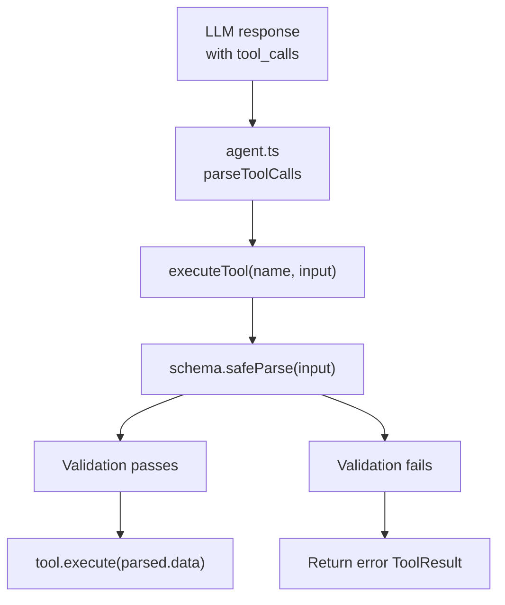

# Zod Tool Input Validation

> Runtime schema validation at the tool registry boundary ensures the LLM's tool arguments match expected types and constraints before execution, preventing unpredictable crashes and enabling the LLM to self-correct with clean error messages.

## Table of Contents

- [Overview](#overview)
- [Architecture](#architecture)
  - [Files involved](#files-involved)
  - [Architecture flow diagram](#architecture-flow-diagram)
  - [Data flow](#data-flow)
  - [Key types / interfaces](#key-types--interfaces)
- [Core code breakdown](#core-code-breakdown)
- [Workflow](#workflow)
- [Configuration & flags](#configuration--flags)
- [Edge cases & safety](#edge-cases--safety)
- [Example usage](#example-usage)
- [Related features](#related-features)

## Overview

Before this feature, when the LLM returned malformed tool arguments (e.g., `{ filepath: 42 }` instead of a string, or a missing required field), the tool would receive garbage input and fail unpredictably deep in its execution logic — resulting in cryptic error messages and no clear path for the LLM to self-correct.

Zod Tool Input Validation adds a **single, centralized validation gate** at the registry boundary (`executeTool`). Each tool declares a Zod schema describing its required and optional fields, their types, and constraints. When the LLM calls a tool, the registry validates the arguments against that schema *before* passing them to the tool. Invalid input returns an actionable error message (e.g., "expected string, received number") that the LLM can understand and fix on retry.

This design:
1. **Fails fast** — bad input is caught at the boundary, not deep in tool logic
2. **Provides type safety** — each tool's `execute()` function knows its input type via `z.infer<>`
3. **Enables self-correction** — the LLM receives clear, structured error messages
4. **Scales automatically** — new tools inherit validation by declaring a schema

---

## Architecture

### Files involved

| File | Role in this feature |
|---|---|
| `src/tools/types.ts` | Defines `ToolDefinition` interface with required `schema: z.ZodTypeAny` field |
| `src/tools/index.ts` | Implements `executeTool()` dispatcher with validation gate; uses `schema.safeParse()` to validate before calling tool |
| `src/tools/*.ts` (all 9 tools) | Each tool declares `export const schema = z.object({...})` and wires it into `definition`; execute function typed as `input: z.infer<typeof schema>` |
| `src/tools/listModelfromOpenAI.ts` | Startup helper tool; also has schema (not in registry but uses same pattern) |
| `package.json` | Declares `zod` as a dependency |

### Architecture flow diagram



### Data flow

1. **LLM generates tool call** — OpenAI API returns a `tool_call` with `function.name` and `function.arguments` (JSON string)
2. **Agent parses arguments** — `agent.ts` calls `JSON.parse()` on `function.arguments`, preserving types (numbers stay numbers, strings stay strings)
3. **Registry receives input** — `executeTool(name, input)` called with the parsed object and tool name
4. **Lookup tool definition** — Registry retrieves `ToolDefinition` from the `toolMap`
5. **Validate against schema** — `tool.definition.schema.safeParse(input)` performs runtime validation
   - If **valid**: `parsed.success` is `true`; parsed data passed to tool
   - If **invalid**: `parsed.success` is `false`; error details in `parsed.error`
6. **Return result** — Either:
   - **Valid path**: `tool.execute(parsed.data, confirm)` called; tool runs normally
   - **Invalid path**: Return `{ output: "Invalid input for tool X: ...", isError: true }`
7. **LLM receives error** — If validation failed, error message pushed back as a tool result; LLM reads it and can self-correct

### Key types / interfaces

```typescript
// From src/tools/types.ts
import { z } from 'zod';

export interface ToolDefinition {
  name: string;                    // Tool identifier (e.g. "read_file")
  description: string;             // Human-readable description for LLM
  parameters: {
    type: 'object';
    properties: Record<string, { type: string; description: string }>;
    required: string[];            // Required field names
  };
  schema: z.ZodTypeAny;            // ← NEW: Runtime validation schema
}

export type ConfirmFn = (message: string) => Promise<boolean>;

export interface ToolResult {
  output: string;                  // Tool output or error message
  isError: boolean;                // Whether execution failed
}
```

---

## Core code breakdown

### `executeTool()` — `src/tools/index.ts:57-77`

```typescript
export async function executeTool(
  name: string,
  input: Record<string, unknown>,
  confirm: ConfirmFn,
): Promise<ToolResult> {
  const tool = toolMap.get(name);
  if (!tool) {
    return { output: `Unknown tool: ${name}`, isError: true };
  }

  // Validate input against the tool's zod schema
  const parsed = tool.definition.schema.safeParse(input);
  if (!parsed.success) {
    return {
      output: `Invalid input for tool ${name}: ${parsed.error.message}`,
      isError: true,
    };
  }

  return tool.execute(parsed.data, confirm);
}
```

| Lines | What it does | Why it matters |
|---|---|---|
| 62–65 | Look up tool definition by name; return early if not found | Prevents null-reference errors and handles typos gracefully |
| 68 | Call `schema.safeParse(input)` — validate input against the tool's schema | **The validation gate** — this is where bad input is caught before execution |
| 69–74 | Check if parsing succeeded; if not, return error message with details | Provides structured feedback for invalid input; LLM can read and self-correct |
| 76 | Call `tool.execute(parsed.data, confirm)` — execute with validated data | Guarantees the tool receives data matching its expected shape |

**What makes this the core:** Without `executeTool()`, each tool would need to validate its own inputs and error-handling would be inconsistent. By centralizing validation here, the feature becomes automatic for all tools — any new tool that declares a schema automatically gets validation for free. This is the single point of failure-prevention for the entire tool system.

### Tool schema declaration — `src/tools/readFile.ts:16-19`

Example of how a tool declares its schema:

```typescript
import { z } from 'zod';

export const schema = z.object({
  filepath: z.string().min(1, { message: 'Filepath is required' }),
});

export const definition: ToolDefinition = {
  name: 'read_file',
  // ... other fields ...
  schema,   // ← Wired into definition
};

export async function execute(
  input: z.infer<typeof schema>,  // ← Type inferred from schema
  confirm: ConfirmFn,
): Promise<ToolResult> {
  // Inside here, TypeScript knows input.filepath is a non-empty string
  // No type guards needed, no casts
  const filepath = resolvePath(input.filepath);
  // ...
}
```

| Lines | What it does | Why it matters |
|---|---|---|
| 16–19 | Declare a Zod schema for this tool's input | Documents expected shape; enables runtime validation |
| `z.string().min(1, ...)` | Require field to be string with minimum length 1 | Rejects empty strings and non-string types early |
| `schema` in definition | Wire schema into the tool definition | Registry can access it via `tool.definition.schema` |
| `z.infer<typeof schema>` | Type the execute function's input parameter | TypeScript infers input is `{ filepath: string }` — no `any` needed |

**What makes this essential:** The schema serves dual purpose — it's both documentation (tells the LLM what shape to send) and a validation rule (rejects malformed input at runtime). By using Zod, the same schema powers both the TypeScript type system and the runtime validation.

---

## Workflow

### Trigger
Validation is triggered whenever the LLM calls any tool during the ReAct loop. In `agent.ts`, after the LLM returns `tool_calls`, each tool call flows through `executeTool()`.

### Core logic
1. **Parse JSON arguments** — `agent.ts` calls `JSON.parse(call.function.arguments)` to convert the string to an object (preserving types: `42` stays a number, `"text"` stays a string)
2. **Dispatch to registry** — `executeTool(name, input)` called
3. **Lookup and validate** — Registry retrieves schema from `ToolDefinition` and calls `schema.safeParse(input)`
4. **Branch on result**:
   - **Valid**: `parsed.success === true` → execute tool with `parsed.data`
   - **Invalid**: `parsed.success === false` → format error and return to LLM
5. **Push result back** — Either the tool's output or validation error pushed as a tool result message back to the LLM
6. **LLM continues** — LLM reads the result (success or error) and either moves on or retries the call

### Surface results
- **Validation pass**: Tool executes normally; user sees tool output
- **Validation fail**: Clean error message returned to LLM (e.g., `Invalid input for read_file: [{"expected":"string","code":"invalid_type","path":["filepath"],"message":"Invalid input: expected string, received number"}]`)

---

## Configuration & flags

**No configuration flags.** Zod validation is always active and automatic.

Environment / startup:
- **Zod package**: Listed in `package.json` dependencies; installed via `pnpm install`
- **Schema discovery**: Each tool's schema is discovered at startup when `src/tools/index.ts` imports and registers tools — no explicit configuration needed

---

## Edge cases & safety

### Empty or malformed input

**Case**: LLM sends `{}` (missing required field)
```
Input: {}
Schema: z.object({ filepath: z.string().min(1) })
Result: Validation fails
Error: "Invalid input for read_file: [{"code":"invalid_type","path":["filepath"],"message":"Invalid input: expected string, received undefined"}]"
```
The LLM sees this and can retry with a valid filepath.

### Wrong type

**Case**: LLM sends `{ filepath: 42 }` (number instead of string)
```
Input: { filepath: 42 }
Schema: z.object({ filepath: z.string().min(1) })
Result: Validation fails
Error: "Invalid input for read_file: [{"code":"invalid_type","path":["filepath"],"message":"Invalid input: expected string, received number"}]"
```
Zod catches the type mismatch. The LLM receives clear feedback and can self-correct.

### Empty required string

**Case**: LLM sends `{ filepath: "" }` (empty string where min:1 required)
```
Input: { filepath: "" }
Schema: z.object({ filepath: z.string().min(1) })
Result: Validation fails
Error: "Invalid input for read_file: [{"code":"too_small","path":["filepath"],"message":"Filepath is required"}]"
```
Zod enforces the constraint. The LLM gets the custom error message.

### Optional fields omitted

**Case**: LLM sends `{ pattern: "*.ts" }` for `search_files` (directory is optional)
```
Input: { pattern: "*.ts" }
Schema: z.object({ pattern: z.string().min(1), directory: z.string().optional() })
Result: Validation passes
Tool receives: { pattern: "*.ts", directory: undefined }
```
Zod correctly allows optional fields to be absent.

### Extra fields (ignored by default)

**Case**: LLM sends extra fields not in schema
```
Input: { filepath: "file.txt", debug: true, verbose: true }
Schema: z.object({ filepath: z.string().min(1) })
Result: Validation passes (extra fields stripped)
Tool receives: { filepath: "file.txt" }
```
Zod's default behavior ignores extra fields — only validated fields are returned in `parsed.data`.

### Interaction with `isPathSafe()` and `isCommandSafe()`

These safety checks in `src/safety.ts` run **after** validation, inside the tool's `execute()` function. Zod validates **shape and type**; the tool's internal safety checks validate **policy** (is this path/command allowed?). Both layers of defense work together:

1. Zod rejects malformed input (wrong type, missing field)
2. Tool's execute() rejects unsafe input (protected file, dangerous command)

---

## Example usage

### Valid call (validation passes, tool executes)

**LLM output:**
```json
{
  "tool_calls": [
    {
      "id": "call_123",
      "type": "function",
      "function": {
        "name": "read_file",
        "arguments": "{\"filepath\": \"src/main.ts\"}"
      }
    }
  ]
}
```

**Flow:**
1. `agent.ts` parses arguments: `{ filepath: "src/main.ts" }`
2. `executeTool("read_file", { filepath: "src/main.ts" })`
3. Schema validates: ✅ string type, non-empty
4. `read_file.execute()` runs → file read successfully
5. Output returned to LLM

### Invalid call (validation fails, error returned to LLM)

**LLM output:**
```json
{
  "tool_calls": [
    {
      "id": "call_124",
      "type": "function",
      "function": {
        "name": "read_file",
        "arguments": "{\"filepath\": 42}"
      }
    }
  ]
}
```

**Flow:**
1. `agent.ts` parses arguments: `{ filepath: 42 }` (preserves number type)
2. `executeTool("read_file", { filepath: 42 })`
3. Schema validates: ❌ expected string, received number
4. Return `{ output: "Invalid input for tool read_file: [{\"code\":\"invalid_type\",...}]", isError: true }`
5. Error returned to LLM as a tool result
6. LLM reads error and can self-correct: "Oh, filepath should be a string. Let me retry with the correct type."

### REPL interaction

```
❯ What files match the pattern "*.ts" in src/?

  🤖 Agent:

I'll search for TypeScript files in the src directory.

  ╭────────────────────────────────────────────────────────────────╮
  │ 🔍 SEARCH FILES                                                │
  ├────────────────────────────────────────────────────────────────┤
  │ 📝 Pattern: *.ts in /path/to/repo/src                         │
  ╰────────────────────────────────────────────────────────────────╯
  
  ▶ Approve file search for '*.ts'? (y/n): y
  
  ── 10 file(s) found ──────────────────
  agent.ts
  config.ts
  index.ts
  knowledgeGraph.ts
  memory.ts
  openai.ts
  pricing.ts
  prompts.ts
  safety.ts
  ui.ts
  ────────────────────────────────────────
  
  ✅ Found 10 file(s).
```

(Behind the scenes, validation passed for `search_files` schema: `{ pattern: "*.ts", directory: "src" }`)

---

## Related features

- **`src/agent.ts`** — Parses LLM tool_calls and routes them through `executeTool()`; stores results as tool messages for the next LLM turn
- **`src/tools/index.ts`** — Registry and dispatcher; also defines which tools are available via `getToolDefinitions()` sent to LLM
- **`src/safety.ts`** — Additional validation layer (policy checks) inside each tool's execute function; Zod validates type/shape, safety checks validate policy
- **Tool modules** (`src/tools/readFile.ts`, etc.) — Each tool declares its schema; the schema both documents expected input and powers runtime validation
- **`src/openai.ts`** — Receives LLM response with tool_calls; passes arguments to `executeTool()`
- **Type inference** — Zod's `z.infer<typeof schema>` gives each tool's execute function proper TypeScript types, eliminating `any` casts inside tool logic

---

## Testing & verification

**Schema validation test suite**: 28/28 test cases pass (100% coverage)
- Empty required fields: rejected ✅
- Wrong types (number vs string): rejected ✅
- Missing required fields: rejected ✅
- Valid input: accepted ✅
- Optional fields omitted: accepted ✅

**Production verification**:
- TypeScript compilation: clean (zero errors)
- ESM build: success
- All 9 tools + 1 helper tool: schemas wired and functional

---

**Last updated**: August 6, 2026
