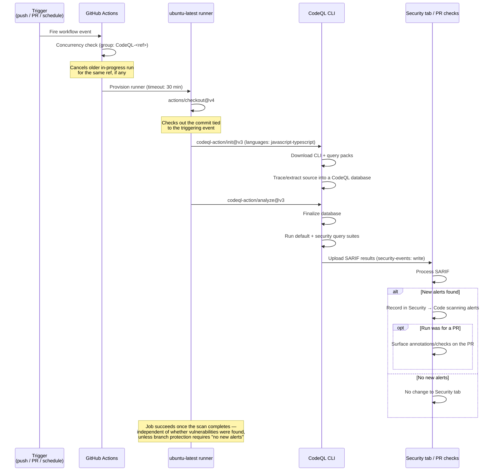
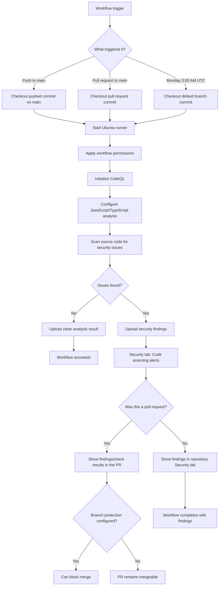

# CodeQL — Automated Security Scanning

> CodeQL is GitHub's semantic code analysis engine. This workflow scans CLIC's JavaScript/TypeScript source for security vulnerabilities on every push, every pull request, and once a week — without any manual intervention.

## Table of Contents

- [Overview](#overview)
- [How it works](#how-it-works)
- [Full lifecycle — step by step](#full-lifecycle--step-by-step)
- [Workflow: codeql.yml](#workflow-codeqlyml)
  - [Triggers](#triggers)
  - [Concurrency](#concurrency)
  - [Permissions](#permissions)
  - [Job configuration](#job-configuration)
  - [Steps breakdown](#steps-breakdown)
- [Flow diagram](#flow-diagram)
- [Where results show up](#where-results-show-up)
- [Configuration reference](#configuration-reference)
- [Edge cases & safety](#edge-cases--safety)
- [What CodeQL is NOT](#what-codeql-is-not)
- [Recommended response strategy for CLIC](#recommended-response-strategy-for-clic)
- [Future enhancements](#future-enhancements)

---

## Overview

Before this workflow existed, security vulnerabilities (unsafe shell execution, path traversal, prototype pollution, injection flaws, etc.) could only be caught through manual code review or a third-party audit. CodeQL closes this gap by treating source code as queryable data — it builds a database representation of the codebase and runs hundreds of pre-written security queries against it automatically.

This matters particularly for CLIC because the codebase:

| Area | Why it's a CodeQL-relevant surface |
|---|---|
| `src/tools/runCommand.ts`, `src/terminal.ts` | Executes shell commands via `node-pty`/`execa` — a classic command-injection surface |
| `src/safety.ts` | Hand-written blocklist (`isCommandSafe`, `isPathSafe`) — exactly the kind of logic CodeQL's taint-tracking queries are designed to stress-test |
| `src/tools/readFile.ts`, `writeFile.ts`, `modifyFile.ts` | File-system path handling — potential path traversal |
| `src/tools/webSearch.ts`, `githubExtractor.ts` | Outbound network calls — SSRF-adjacent patterns |

CodeQL does not know about CLIC's specific business logic — it runs generic, well-tested security queries (SQL injection, command injection, path traversal, insecure randomness, hardcoded credentials, etc.) across the `javascript-typescript` language pack, which covers both `.ts` and `.js` files.

---

## How it works

CodeQL is **not** a linter and does not run `tsc` or your test suite. It works in two distinct phases, both driven by the official `github/codeql-action`:

```
Phase 1 — Build a database (init + autobuild/compile)
    │
    ├── Extracts an intermediate representation of the source code
    └── Stores it as a queryable CodeQL database (not visible in the repo)

Phase 2 — Query the database (analyze)
    │
    ├── Runs GitHub's curated default query suite
    ├── Each query looks for a specific vulnerability pattern
    └── Any match becomes an "alert" uploaded to GitHub
```

For interpreted languages like JavaScript/TypeScript, CodeQL does not need to compile the project — it parses the source directly, so no build step (`pnpm build`) is required in this workflow.

---

## Full lifecycle — step by step



---

## Workflow: codeql.yml

### Triggers

```yaml
on:
  push:
    branches: [main]
  pull_request:
    branches: [main]
  schedule:
    - cron: '0 3 * * 1'   # Weekly Monday 3am
```

| Trigger | When it fires | Why |
|---|---|---|
| `push` to `main` | Every direct push/merge to `main` | Catches vulnerabilities the moment they land on the trunk |
| `pull_request` to `main` | Every PR open/update/reopen targeting `main` | Catches vulnerabilities **before** they merge |
| `schedule` (`0 3 * * 1`) | Every Monday at 3:00 AM UTC | Re-scans `main` even if no one pushed — catches new findings when GitHub ships new/updated CodeQL queries, not just new code |

The scheduled run exists because CodeQL's query packs are updated independently of your code. A query added this month could flag a pattern that has been sitting in `main` for a year.

### Concurrency

```yaml
concurrency:
  group: ${{ github.workflow }}-${{ github.ref }}
  cancel-in-progress: true
```

Same pattern as `ci.yml` — groups runs by workflow name + branch/PR ref, and cancels a stale in-progress scan when a newer commit arrives on the same ref. This avoids wasting runner minutes analyzing a commit that's already been superseded.

### Permissions

```yaml
permissions:
  contents: read
  security-events: write
```

| Permission | Why it's needed |
|---|---|
| `contents: read` | Required to check out the repository — least-privilege, no write access to code |
| `security-events: write` | Required for `codeql-action/analyze` to upload SARIF results to GitHub's Code Scanning API |

No other permissions are granted — the workflow cannot push commits, open PRs, or modify repository settings.

### Job configuration

```yaml
jobs:
  analyze:
    runs-on: ubuntu-latest
    timeout-minutes: 30
```

A single job named `analyze` runs on `ubuntu-latest`. Unlike `ci.yml`, there is no matrix here — CodeQL analyzes one snapshot of the source per run; there's no per-Node-version variance to test. `timeout-minutes: 30` bounds worst-case runtime (CodeQL extraction can be slower than a typical build/test cycle, especially on a cold cache).

### Steps breakdown

```yaml
- name: Check out repository
  uses: actions/checkout@v4
```
Checks out the commit tied to the triggering event (the push commit, the PR's merge commit, or `main`'s HEAD for the scheduled run).

```yaml
- name: Initialize CodeQL
  uses: github/codeql-action/init@v3
  with:
    languages: javascript-typescript
```
Downloads the CodeQL CLI and the `javascript-typescript` query/extractor pack, then starts building the CodeQL database from the checked-out source. Because JS/TS is interpreted, this step does **not** require `pnpm install` or a build — CodeQL's JS/TS extractor parses source files directly.

```yaml
- name: Perform CodeQL analysis
  uses: github/codeql-action/analyze@v3
  with:
    category: '/language:javascript-typescript'
```
Finalizes the database and runs CodeQL's query suites against it, then uploads the resulting SARIF file to GitHub. The `category` tag namespaces these results so they don't collide with alerts from any other language/workflow that might scan the same repo in the future.

---

## Flow diagram



---

## Where results show up

| Trigger | Result location |
|---|---|
| Push to `main` | `Security → Code scanning alerts` |
| Pull request | Same Security tab **plus** inline annotations/checks on the PR's "Checks" tab |
| Scheduled (weekly) | `Security → Code scanning alerts` (no PR to annotate) |

Each alert includes: the vulnerability class (e.g. "Command injection", "Path injection"), the exact file/line, a data-flow trace from source to sink, and a severity rating. Alerts persist until the underlying code is fixed, the alert is dismissed as a false positive, or the code is removed.

---

## Configuration reference

| Setting | Value | Source |
|---|---|---|
| Language pack | `javascript-typescript` | `codeql.yml` `init` step |
| Category tag | `/language:javascript-typescript` | `codeql.yml` `analyze` step |
| Runner | `ubuntu-latest` | `codeql.yml` `jobs.analyze.runs-on` |
| Job timeout | 30 minutes | `codeql.yml` `timeout-minutes` |
| Scan frequency (push/PR) | Every push/PR to `main` | `codeql.yml` `on.push` / `on.pull_request` |
| Scan frequency (scheduled) | Weekly, Monday 3:00 AM UTC | `codeql.yml` `on.schedule` cron |
| Permissions | `contents: read`, `security-events: write` | `codeql.yml` `permissions` |
| Build step required? | No — JS/TS extractor parses source directly | N/A |

---

## Edge cases & safety

**No build step means no `pnpm install`**
Because CodeQL's JavaScript/TypeScript extractor works directly on source files, this workflow never installs dependencies or runs `tsup`/`tsc`. A broken `pnpm-lock.yaml` or a failing build in `ci.yml` has no effect on whether CodeQL can run.

**CodeQL does not fail the build on findings by default**
Finding a vulnerability does **not** turn the `analyze` job red — the job succeeds as long as the scan itself completes without error. Blocking a merge on new alerts requires explicitly enabling that under repository **Settings → Branches → Branch protection rules → Require status checks** (and selecting the CodeQL check).

**Concurrency and force-pushes**
Same behavior as `ci.yml` — if a branch is force-pushed, `github.ref` is unchanged, so the newer run correctly cancels the stale one instead of running both to completion.

**Scheduled run has no PR context**
The weekly cron run has no pull request to annotate, so any new findings only appear in the Security tab — there is no "check" surface for that specific run. This is why it is important to periodically check **Security → Code scanning alerts** directly rather than relying solely on PR annotations.

**False positives**
CodeQL's queries are generic; a flagged pattern may be intentional and safe in context (e.g. a deliberately permissive `run_command` tool gated behind `confirm()` and `isCommandSafe()`). Alerts can be reviewed and dismissed with a reason (`false positive`, `won't fix`, `used in tests`) directly in the Security tab — this does not change the source code.

---

## What CodeQL is NOT

- It is **not** a replacement for `ci.yml` — it does not typecheck, build, or run the test suite
- It does **not** automatically fix vulnerabilities or open PRs (that is Dependabot's job, and only for dependency versions — not source-code logic)
- It does **not** block merges by default — that requires explicit branch protection configuration
- It does **not** scan third-party dependency code for vulnerabilities — that is covered by Dependabot/GitHub's dependency graph, not this workflow
- It does **not** run on feature branches without a PR — only `main` pushes, PRs into `main`, and the weekly schedule

---

## Recommended response strategy for CLIC

| Alert severity | Recommended action |
|---|---|
| **Critical / High** | Fix before merging the PR that introduced it; treat as a blocking issue even without branch protection enforcing it |
| **Medium** | Review in the next PR review cycle; fix or dismiss with a documented reason |
| **Low / Recommendation** | Batch-review monthly; dismiss confidently-safe patterns (e.g. guarded `run_command` paths) with a reason |
| **Alert in `src/safety.ts` or `src/tools/runCommand.ts`** | Always investigate first — these are the highest-value files for CodeQL to flag given CLIC's shell-execution surface |

---

## Future enhancements

| Enhancement | When to add |
|---|---|
| Require CodeQL check in branch protection | Once alert volume is low and stable — turns findings into hard merge gates |
| Add a custom CodeQL config file (`.github/codeql/codeql-config.yml`) | To exclude generated/test fixture paths or add custom query packs |
| `security-extended` / `security-and-quality` query suites | To widen coverage beyond the default suite once baseline alerts are triaged |
| Add `github-actions` ecosystem scanning | To catch unsafe patterns in the workflow YAML files themselves |
| Slack/email notification on new alerts | Once the team grows beyond relying on the Security tab being checked manually |
