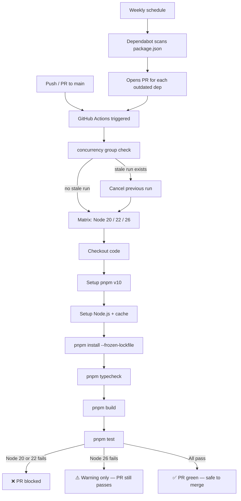

# GitHub Actions CI Pipeline

> Production-ready CI pipeline and automated dependency management for CLIC, validating every push and PR against Node.js 20, 22, and 26 before it reaches `main`.

## Table of Contents

- [Overview](#overview)
- [Architecture](#architecture)
  - [Files involved](#files-involved)
  - [Architecture flow diagram](#architecture-flow-diagram)
  - [Pipeline stages](#pipeline-stages)
- [Workflow: ci.yml](#workflow-ciyml)
  - [Triggers](#triggers)
  - [Concurrency](#concurrency)
  - [Matrix strategy](#matrix-strategy)
  - [Steps breakdown](#steps-breakdown)
- [Workflow: dependabot.yml](#workflow-dependabotyml)
- [Configuration reference](#configuration-reference)
- [Edge cases & safety](#edge-cases--safety)
- [Example: what a passing PR looks like](#example-what-a-passing-pr-looks-like)
- [Future workflows](#future-workflows)

---

## Overview

Before this infrastructure was in place, broken code could be merged to `main` undetected — type errors, build failures, and test regressions were only caught locally (if at all). This pipeline automates three gates on every PR:

1. **Type correctness** — `tsc --noEmit` must pass
2. **Build** — `tsup` must produce a clean `dist/`
3. **Tests** — the full Zod input-validation suite must pass

All three gates run in parallel across Node.js 20, 22, and 26. Separately, Dependabot opens weekly PRs to keep dependencies patched — those PRs also run through the same CI gates automatically.

---

## Architecture

### Files involved

| File | Role |
|---|---|
| `.github/workflows/ci.yml` | Main CI pipeline — triggered on push/PR to `main` |
| `.github/dependabot.yml` | Automated weekly dependency update PRs |
| `package.json` | Defines the `typecheck`, `build`, and `test` scripts the pipeline calls |
| `pnpm-lock.yaml` | Lockfile consumed by `--frozen-lockfile`; Dependabot updates this |

### Architecture flow diagram



### Pipeline stages

| Stage | Command | Fails on... |
|---|---|---|
| Typecheck | `pnpm typecheck` → `tsc --noEmit` | Any TypeScript type error |
| Build | `pnpm build` → `tsup src/index.ts --format esm --clean` | Compile error, missing import |
| Test | `pnpm test` → `tsx test/index.ts` | Any failing Zod validation test |

---

## Workflow: ci.yml

### Triggers

```yaml
on:
  push:
    branches: [main]
  pull_request:
    branches: [main]
```

The pipeline fires on:
- Every direct push to `main` (e.g. hotfix, merge commit)
- Every PR that targets `main` — on open, update, and reopen

It does **not** run on pushes to feature branches without a PR. This is intentional — CI is enforced at the merge gate, not during exploratory work.

### Concurrency

```yaml
concurrency:
  group: ${{ github.workflow }}-${{ github.ref }}
  cancel-in-progress: true
```

Groups runs by workflow name + branch/PR ref. When a second push arrives on the same PR, the first in-progress run is immediately cancelled. This prevents:

- Stacked, redundant runs consuming CI minutes
- False results from an outdated commit being reported on a newer PR state

Example group keys:
```
CI-refs/pull/42/merge     ← all runs for PR #42
CI-refs/heads/main        ← all direct pushes to main
```

### Matrix strategy

```yaml
strategy:
  fail-fast: false
  matrix:
    node-version: [20, 22, 26]
    include:
      - node-version: 26
        experimental: true

continue-on-error: ${{ matrix.experimental == true }}
```

| Setting | Value | Reason |
|---|---|---|
| `fail-fast` | `false` | All three Node versions always run to completion — full cross-version signal even when one fails |
| Node 20 | Hard gate | LTS — production target, failure blocks the PR |
| Node 22 | Hard gate | LTS — production target, failure blocks the PR |
| Node 26 | Canary | New release (April 2026); `node-pty` prebuilds may be absent — failure is a warning, not a blocker |

The `experimental: true` key is injected by `include` only on the Node 26 job. `continue-on-error` reads it at runtime — evaluates to `false` for Node 20/22, `true` for Node 26.

### Steps breakdown

```yaml
- uses: actions/checkout@v4
```
Checks out the repository at the PR's HEAD commit.

```yaml
- uses: pnpm/action-setup@v4
  with:
    version: 10
```
Installs pnpm v10, matching the `"pnpm": ">=10"` engine requirement in `package.json`. Must run before `setup-node` so the cache key is correct.

```yaml
- uses: actions/setup-node@v4
  with:
    node-version: ${{ matrix.node-version }}
    cache: pnpm
```
Sets the Node.js version for this matrix job and enables pnpm's module cache. Subsequent runs on the same branch reuse the cached `node_modules`, cutting install time significantly.

```yaml
- run: pnpm install --frozen-lockfile
```
Installs exact versions from `pnpm-lock.yaml`. `--frozen-lockfile` causes pnpm to error if the lockfile is out of sync with `package.json` — prevents silent dependency drift in CI. Also triggers native compilation for `node-pty` if no matching prebuild is available.

```yaml
- run: pnpm typecheck   # tsc --noEmit
- run: pnpm build       # tsup src/index.ts --format esm --clean
- run: pnpm test        # tsx test/index.ts
```
Run sequentially within each job. A failure at any step marks that matrix job as failed. The overall workflow is green only if all non-experimental jobs pass.

**Timeout guard:**
```yaml
timeout-minutes: 15
```
`node-pty` opens real PTY shells in the terminal tests. Without a timeout, a hung PTY process would consume GitHub's 6-hour hard limit. 15 minutes is generous for the full suite while still bounding runaway jobs.

---

## Workflow: dependabot.yml

```yaml
version: 2
updates:
  - package-ecosystem: npm
    directory: "/"
    schedule:
      interval: weekly
    groups:
      dev-dependencies:
        dependency-type: development
```

Dependabot watches `package.json` and `pnpm-lock.yaml` at the repo root and opens automated PRs once per week.

**Grouping strategy:**

| Dependency type | PR behaviour |
|---|---|
| `devDependencies` (`typescript`, `tsup`, `tsx`, `@types/node`) | Grouped into one PR per update cycle — reduces noise |
| `dependencies` (`openai`, `node-pty`, `zod`, `chokidar`, etc.) | Individual PRs — allows focused review per package |

Production dependencies get individual PRs because a `zod` v4→v5 migration has different risk than a `chalk` patch bump. Dev dependency updates are lower risk and can be batch-merged.

Every Dependabot PR runs through the full `ci.yml` pipeline automatically — a dependency update that breaks a type check, build, or test will show as a failing CI check on the PR before you review it.

---

## Configuration reference

| Setting | Value | Source |
|---|---|---|
| pnpm version | `10` | `ci.yml` + `package.json` `engines.pnpm` |
| Node versions tested | `20`, `22`, `26` | `ci.yml` matrix |
| Node 26 blocking | No (`continue-on-error: true`) | `ci.yml` matrix `include` |
| Job timeout | 15 minutes | `ci.yml` `timeout-minutes` |
| Dependency scan frequency | Weekly | `dependabot.yml` `schedule.interval` |
| Lockfile mode | Frozen (`--frozen-lockfile`) | `ci.yml` install step |
| Permissions | `contents: read` (least privilege) | `ci.yml` `permissions` |

---

## Edge cases & safety

**`node-pty` native compilation on Node 26**
If no prebuild exists for Node 26, pnpm falls back to compiling from source via `node-gyp`. `ubuntu-latest` has `build-essential` and `python3` available, so compilation usually succeeds — but it is slower and occasionally fails on new Node releases. The `continue-on-error: true` flag on the Node 26 job ensures this never blocks a PR.

**Hung PTY processes in tests**
`test/terminal.test.ts` opens real PTY shells via `node-pty`. If a shell hangs waiting for input, the test process never exits. `timeout-minutes: 15` at the job level ensures GitHub forcibly kills the runner after 15 minutes, freeing the queue.

**Lockfile drift**
If a developer runs `pnpm install` without committing the updated lockfile, `--frozen-lockfile` causes the CI install step to fail immediately with a clear error. This surfaces the problem at the gate rather than letting mismatched dependencies reach production.

**Concurrency and force-pushes**
If a branch is force-pushed, the `github.ref` stays the same, so the new run cancels the previous one correctly. The SHA used for checkout is the latest HEAD at the time the job starts — always the correct commit.

**Dependabot PR failures**
If a Dependabot PR causes a CI failure, the PR is left open with a failing check. No auto-merge is configured — a human must review, fix if needed, and merge manually.

---

## Example: what a passing PR looks like

After opening a PR targeting `main`, the GitHub Checks tab shows:

```
CI / validate (20)   ✅  2m 14s
CI / validate (22)   ✅  2m 08s
CI / validate (26)   ✅  2m 31s   (or ⚠️ if node-pty prebuild missing)
```

All three jobs ran in parallel. Node 20 and 22 passing means the PR is safe to merge. Node 26 result is informational.

A Dependabot PR looks identical — same three checks, same merge requirement.

---

## Future workflows

The following are planned for future infrastructure PRs when the project reaches the relevant milestone:

| Workflow | File | Trigger condition |
|---|---|---|
| Release & npm publish | `release.yml` | Ready to publish CLIC to npm |
| CodeQL security scanning | `codeql.yml` | Open source credibility, GitHub security alerts |
| Stale issue management | `stale.yml` | Issues/PRs pile up unattended |
| PR auto-labeler | `pr-labeler.yml` | Multiple contributors, PRs need organisation |
